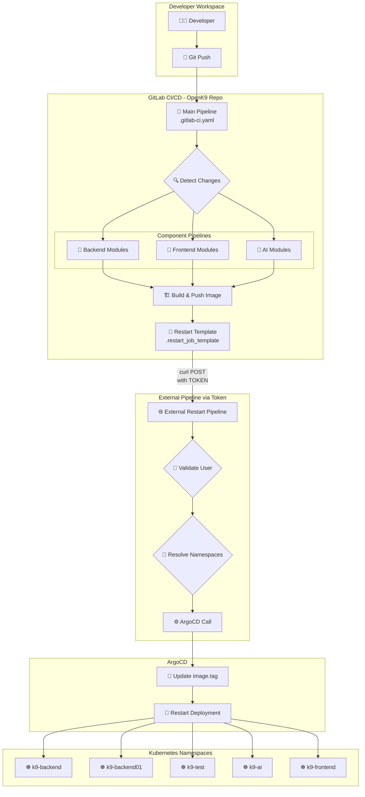
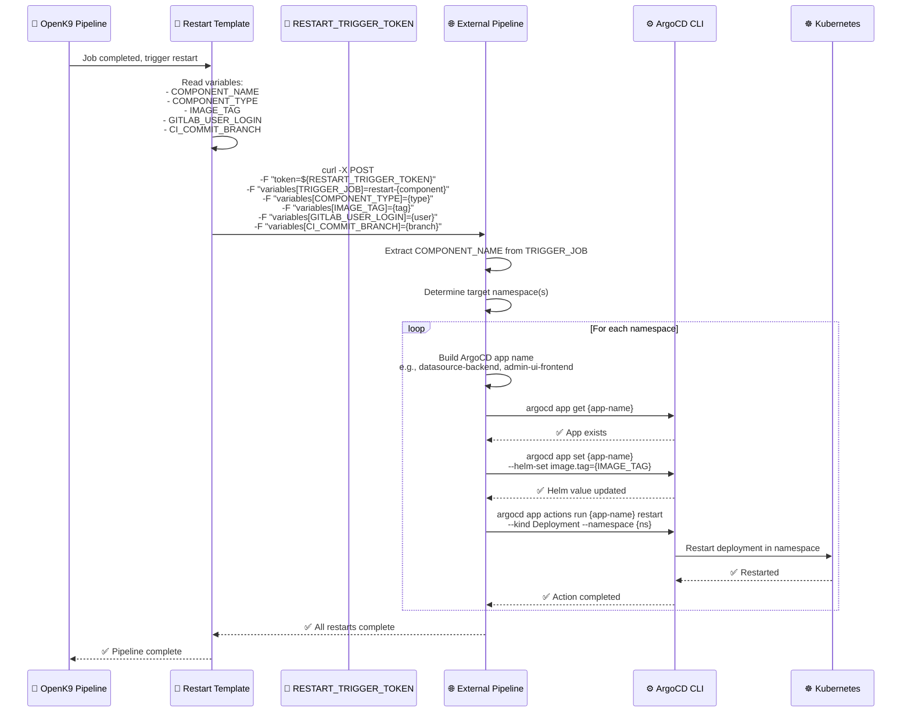
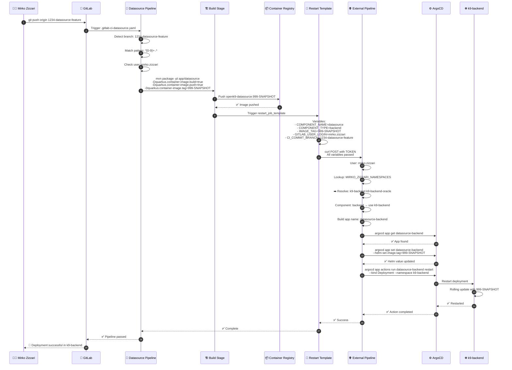
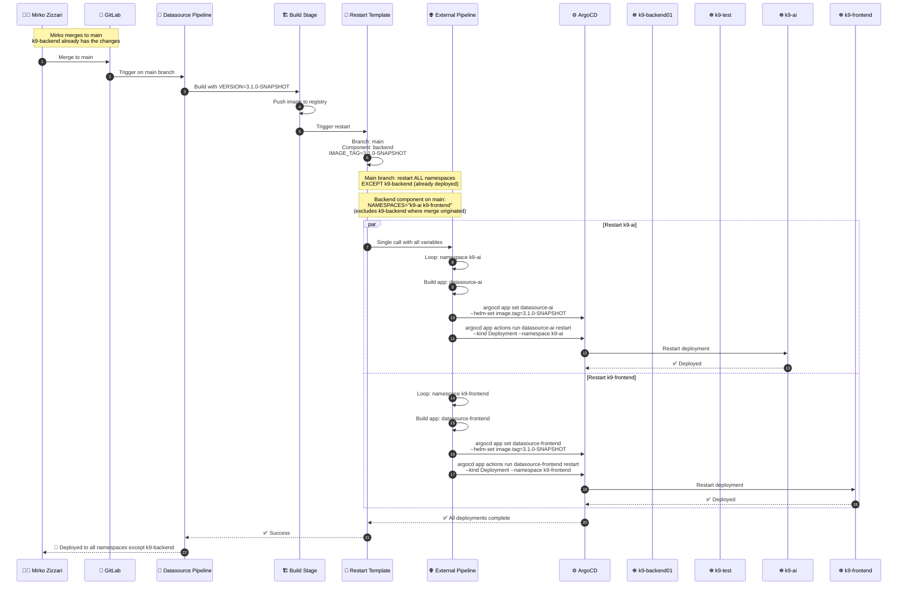
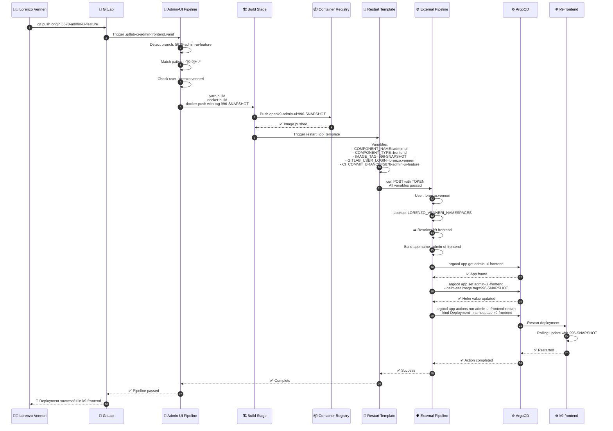
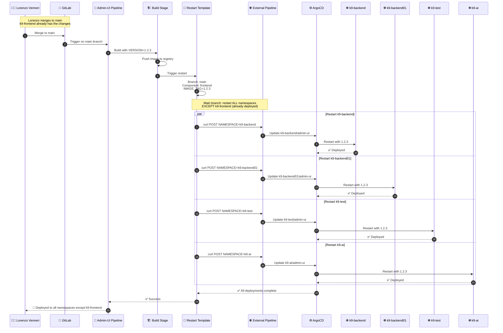
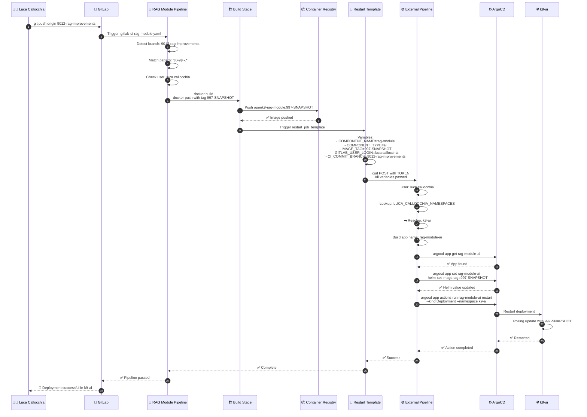
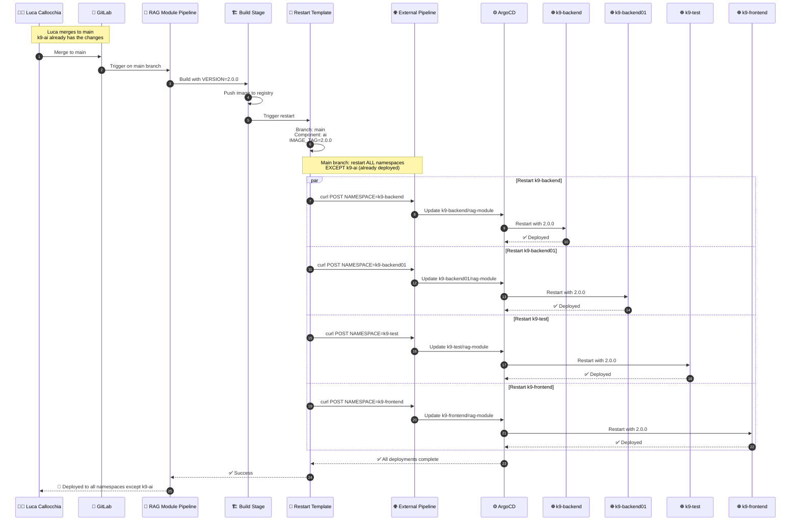
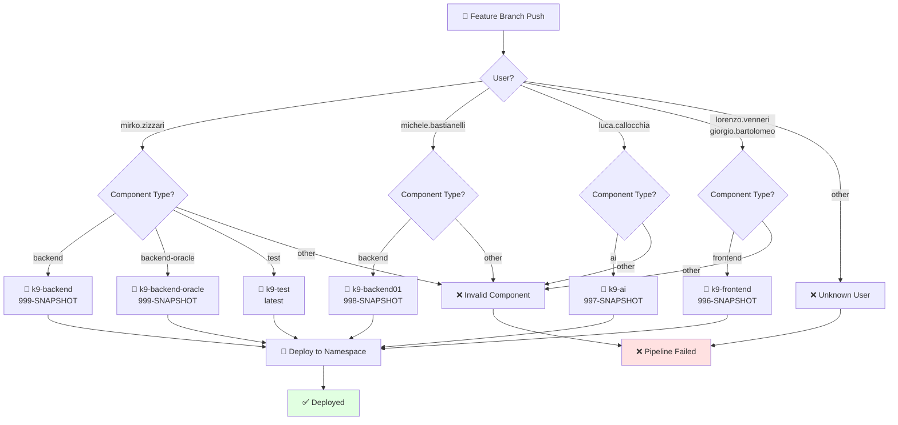
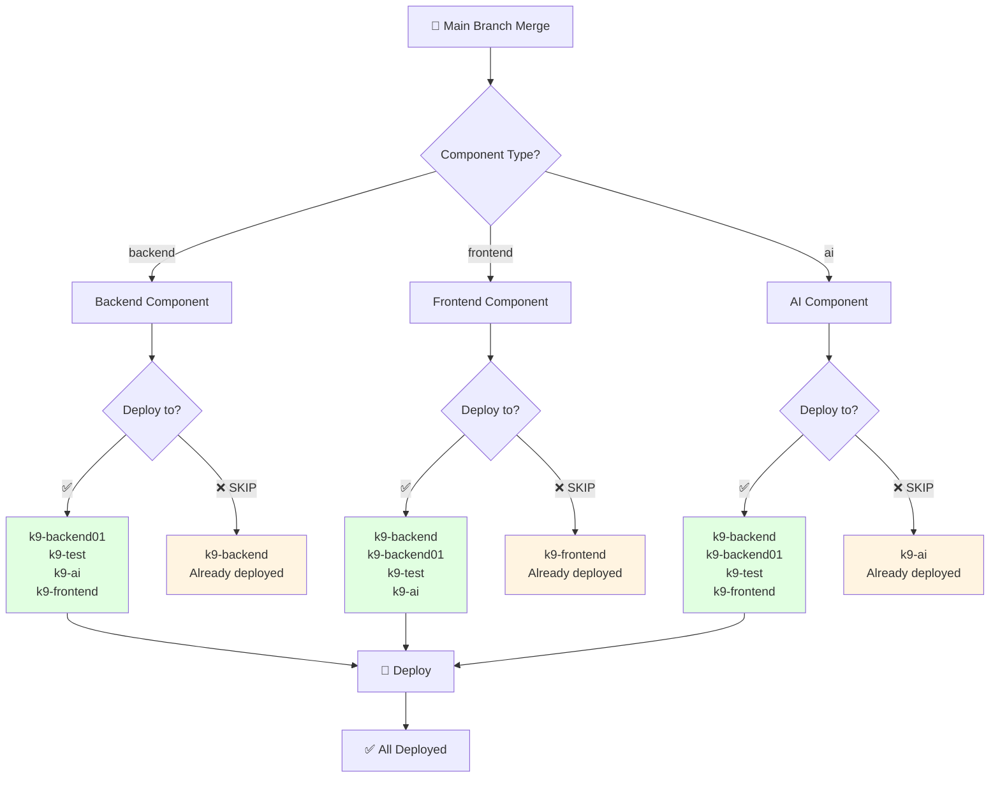

# 🚀 OpenK9 Deployment Process - Detailed Flows

## 📋 Overview

Questo documento fornisce diagrammi dettagliati dei flussi di deployment in OpenK9, con focus su:
- Pipeline CI/CD e trigger esterni
- Logica di restart tramite ArgoCD
- Flussi specifici per utente (Mirko, Lorenzo, Luca)

---

## 🏗️ Architettura Pipeline Generale



---

## 🔄 Restart Template Logic

### Come Funziona il Restart




---

## 🌿 Feature Branch: Mirko Zizzari (Backend Developer)

### Scenario: Mirko sviluppa feature su datasource



### Mirko: Main Branch Merge




---

## 🎨 Feature Branch: Lorenzo Venneri (Frontend Developer)

### Scenario: Lorenzo sviluppa feature su admin-ui



### Lorenzo: Main Branch Merge




---

## 🤖 Feature Branch: Luca Callocchia (AI Developer)

### Scenario: Luca sviluppa feature su rag-module



### Luca: Main Branch Merge




---

## 🔄 Namespace Resolution Logic

### Feature Branch Decision Tree



### Main Branch Namespace Exclusion Logic




---


### Image Tags per Scenario

| Scenario | Backend | Frontend | AI |
|----------|---------|----------|-----|
| **Feature - Mirko** | 999-SNAPSHOT | - | - |
| **Feature - Michele** | 998-SNAPSHOT | - | - |
| **Feature - Lorenzo/Giorgio** | - | 996-SNAPSHOT | - |
| **Feature - Luca** | - | - | 997-SNAPSHOT |
| **Main Branch** | from .version | from version.env | from config.env |
| **Git Tag** | tag name | tag name | tag name |

### Pipeline Variables Passate all'External Pipeline

```bash
# Variabili passate da OpenK9 Pipeline
TRIGGER_JOB=restart-{component-name}     # e.g., restart-datasource
COMPONENT_TYPE={backend|frontend|ai}     # Component category
IMAGE_TAG={tag}                          # Image tag to deploy
GITLAB_USER_LOGIN={username}             # GitLab user who triggered
CI_COMMIT_BRANCH={branch-name}           # Source branch

# External Pipeline estrae:
COMPONENT_NAME="${TRIGGER_JOB#restart-}" # Rimuove "restart-" prefix

# External Pipeline determina namespace:
# - Feature branch: lookup USER_NAMESPACES variable
# - Main branch: determina da COMPONENT_TYPE (esclude namespace di origine)
```

### External Pipeline: Namespace Resolution Logic

```bash
# Feature Branch
if [[ "$CI_COMMIT_BRANCH" =~ ^[0-9]+-.*$ ]]; then
  USER_VAR=$(echo "${GITLAB_USER_LOGIN}" | tr '.-' '_' | tr '[:lower:]' '[:upper:]')_NAMESPACES
  USER_NAMESPACES=$(eval echo \$${USER_VAR})
  # e.g., MIRKO_ZIZZARI_NAMESPACES="k9-backend k9-backend-oracle"
  NAMESPACES="$USER_NAMESPACES"
fi

# Main Branch
if [[ "$CI_COMMIT_BRANCH" == "main" ]]; then
  case "$COMPONENT_TYPE" in
    "backend")
      NAMESPACES="k9-ai k9-frontend"  # Excludes k9-backend
      ;;
    "frontend")
      NAMESPACES="k9-backend k9-backend01 k9-test k9-ai"  # Excludes k9-frontend
      ;;
    "ai")
      NAMESPACES="k9-backend k9-backend01 k9-test k9-frontend"  # Excludes k9-ai
      ;;
  esac
fi

# ArgoCD App Name Generation
get_argocd_app_name() {
  local component=$1
  local target_ns=$2
  
  case "$target_ns" in
    "k9-backend") echo "${component}-backend" ;;
    "k9-backend01") echo "${component}-backend01" ;;
    "k9-backend-oracle") echo "${component}-oracle" ;;
    "k9-ai") echo "${component}-ai" ;;
    "k9-frontend") echo "${component}-frontend" ;;
  esac
}

# Restart Loop
for ns in $NAMESPACES; do
  ARGOCD_APP_NAME=$(get_argocd_app_name "$COMPONENT_NAME" "$ns")
  
  argocd app set "$ARGOCD_APP_NAME" --helm-set image.tag=$IMAGE_TAG
  argocd app actions run "$ARGOCD_APP_NAME" restart \
    --kind Deployment --namespace "$ns"
done
```

---

## 🔗 Related Documentation

- [Main Deployment Process](DEPLOYMENT-PROCESS.md) - Overview semplificato
- [Pipeline Architecture](README.md) - Struttura pipeline
- [GitLab CI Templates](.gitlab-templates.yaml) - Template riutilizzabili
- [Component Pipelines](.gitlab/) - Pipeline specifiche per componente

---

**Last Updated**: December 3, 2025 s 

