# 🚀 OpenK9 Deployment Process Guide

## 📋 Overview

This document explains the complete deployment process in OpenK9, from code commit to application restart, for different users and branch types.

## 👥 User Roles & Permissions

| User | Role | Allowed Components | Target Namespaces |
|------|------|-------------------|-------------------|
| **mirko.zizzari** | Backend Lead | `backend`, `backend-oracle`, `test` | `k9-backend`, `k9-backend-oracle`, `k9-test` |
| **michele.bastianelli** | Backend Developer | `backend` | `k9-backend01` |
| **luca.callocchia** | AI Developer | `ai` | `k9-ai` |
| **lorenzo.venneri** | Frontend Developer | `frontend` | `k9-frontend` |
| **giorgio.bartolomeo** | Frontend Developer | `frontend` | `k9-frontend` |

## 🌿 Branch Types & Deployment Strategy

### **1. Feature Branches** (`123-feature-name`)
- **Pattern**: `^[0-9]+-.*$`
- **Deployment**: Single namespace based on user permissions
- **Image Tags**: Component-specific snapshots
- **Trigger**: Manual push by developer

### **2. Main Branch** (`main`)
- **Deployment**: Multiple namespaces based on component type
- **Image Tags**: Semantic versioning from `.version` files
- **Trigger**: Merge to main, manual push

### **3. Tags** (`v1.2.3`)
- **Deployment**: Production-ready, multiple namespaces
- **Image Tags**: Tag name
- **Trigger**: Git tag creation

---

## 🔄 Complete Deployment Flows

## 🌿 **Feature Branch Flow**

### **Scenario 1: Mirko develops Tika feature**

```mermaid
graph TD
    A[👨‍💻 Mirko pushes to 456-tika-improvements] --> B[🎯 OpenK9 Pipeline Triggered]
    B --> C{🔍 Branch Detection}
    C --> D[📋 Feature Branch: 456-tika-improvements]
    D --> E[🏗️ Build Stage]
    E --> F[🔧 tika-no-ocr built with tag 999-SNAPSHOT]
    F --> G[📦 Image pushed to registry]
    G --> H[🔄 Restart Template Triggered]
    H --> I[🌐 External Pipeline Called]
    I --> J{👤 User Check: mirko.zizzari}
    J --> K{📦 Component: backend}
    K --> L[🎯 Target: k9-backend namespace]
    L --> M[🔧 ArgoCD Update: k9-backend/tika-no-ocr]
    M --> N[🏷️ Set image.tag=999-SNAPSHOT]
    N --> O[🔄 Restart Deployment]
    O --> P[✅ tika-no-ocr running in k9-backend]
```



**Step-by-step:**
1. **Push**: Mirko pushes to `456-tika-improvements`
2. **Trigger**: OpenK9 pipeline detects feature branch pattern
3. **Build**: `tika-no-ocr` component built with `999-SNAPSHOT` tag
4. **Registry**: Image pushed to container registry
5. **Restart Call**: Template calls external pipeline with:
   ```bash
   TRIGGER_JOB=restart-tika-no-ocr
   COMPONENT_TYPE=backend
   OPENK9_USER=mirko.zizzari
   IMAGE_TAG=999-SNAPSHOT
   CI_COMMIT_BRANCH=456-tika-improvements
   ```
6. **Namespace Resolution**: External pipeline determines `k9-backend` for Mirko + backend
7. **ArgoCD Update**: Updates `k9-backend/tika-no-ocr` with new image tag
8. **Restart**: Restarts only the deployment in `k9-backend` namespace

---

### **Scenario 2: Lorenzo develops Frontend feature**

```mermaid
graph TD
    A[👨‍💻 Lorenzo pushes to 789-ui-improvements] --> B[🎯 OpenK9 Pipeline Triggered]
    B --> C{🔍 Branch Detection}
    C --> D[📋 Feature Branch: 789-ui-improvements]
    D --> E[🏗️ Build Stage]
    E --> F[🔧 admin-ui built with tag 996-SNAPSHOT]
    F --> G[📦 Image pushed to registry]
    G --> H[🔄 Restart Template Triggered]
    H --> I[🌐 External Pipeline Called]
    I --> J{👤 User Check: lorenzo.venneri}
    J --> K{📦 Component: frontend}
    K --> L[🎯 Target: k9-frontend namespace]
    L --> M[🔧 ArgoCD Update: k9-frontend/admin-ui]
    M --> N[🏷️ Set image.tag=996-SNAPSHOT]
    N --> O[🔄 Restart Deployment]
    O --> P[✅ admin-ui running in k9-frontend]
```



**Key Differences:**
- **Component Type**: `frontend` instead of `backend`
- **Image Tag**: `996-SNAPSHOT` (frontend-specific)
- **Target Namespace**: `k9-frontend` (Lorenzo's permission)
- **Validation**: Pipeline validates Lorenzo can only deploy frontend components

---

## 🚀 **Main Branch Flow**

### **Scenario 3: Production deployment of Tika**

```mermaid
graph TD
    A[🔀 Merge to main branch] --> B[🎯 OpenK9 Pipeline Triggered]
    B --> C{🔍 Branch Detection}
    C --> D[📋 Main Branch Detected]
    D --> E[🏗️ Build Stage]
    E --> F[📋 Read .version file]
    F --> G[🔧 tika-no-ocr built with tag 1.2.3]
    G --> H[📦 Image pushed to registry]
    H --> I[🔄 Restart Template Triggered]
    I --> J[🌐 Multiple External Pipeline Calls]
    J --> K[🎯 k9-backend: ArgoCD Update]
    J --> L[🎯 k9-backend01: ArgoCD Update]
    J --> M[🎯 k9-test: ArgoCD Update]
    K --> N[🔄 Restart in k9-backend]
    L --> O[🔄 Restart in k9-backend01]
    M --> P[🔄 Restart in k9-test]
    N --> Q[✅ Production Ready]
    O --> Q
    P --> Q
```



**Multi-Environment Deployment:**
1. **Trigger**: Code merged to `main` branch
2. **Versioning**: Reads version from `.version` file (e.g., `1.2.3`)
3. **Build**: Creates production image with semantic version
4. **Multi-Call**: Template makes **3 separate calls** to external pipeline:
   ```bash
   # Call 1: k9-backend
   curl -X POST -F "variables[NAMESPACE]=k9-backend" ...
   
   # Call 2: k9-backend01  
   curl -X POST -F "variables[NAMESPACE]=k9-backend01" ...
   
   # Call 3: k9-test
   curl -X POST -F "variables[NAMESPACE]=k9-test" ...
   ```
5. **Parallel Deployment**: Each call updates the respective namespace
6. **Result**: `tika-no-ocr:1.2.3` running in all backend environments

---

## 🏷️ **Tag Flow**

### **Scenario 4: Release tag deployment**

```mermaid
graph TD
    A[🏷️ Git tag v2.0.0 created] --> B[🎯 OpenK9 Pipeline Triggered]
    B --> C{🔍 Tag Detection}
    C --> D[📋 Tag: v2.0.0]
    D --> E[🏗️ Build Stage]
    E --> F[🔧 All components built with tag v2.0.0]
    F --> G[📦 Images pushed to registry]
    G --> H[🔄 Restart Template Triggered]
    H --> I[🌐 Multiple External Pipeline Calls]
    I --> J[🎯 Multi-namespace deployment]
    J --> K[✅ Release v2.0.0 deployed everywhere]
```



**Release Process:**
- **Image Tag**: Uses the git tag name directly (`v2.0.0`)
- **Scope**: All modified components are built and deployed
- **Target**: Production namespaces based on component types
- **Validation**: Full end-to-end deployment

---

## 🔧 **Component-Specific Behaviors**

### **Backend Components** (`api-gateway`, `datasource`, `searcher`, `tenant-manager`, `tika-no-ocr`, etc.)

| Branch Type | User | Target Namespaces | Image Tag |
|-------------|------|-------------------|-----------|
| Feature | mirko.zizzari | `k9-backend` | `999-SNAPSHOT` |
| Feature | michele.bastianelli | `k9-backend01` | `998-SNAPSHOT` |
| Main/Tag | Any | `k9-backend`, `k9-backend01`, `k9-test` | Version/Tag |

**Note**: API Gateway uses Maven/Jib instead of Quarkus for containerization.

### **Frontend Components** (`admin-ui`, `tenant-ui`, etc.)

| Branch Type | User | Target Namespaces | Image Tag |
|-------------|------|-------------------|-----------|
| Feature | lorenzo.venneri, giorgio.bartolomeo | `k9-frontend` | `996-SNAPSHOT` |
| Main/Tag | Any | `k9-frontend` | Version/Tag |

### **AI Components** (`embedding-*`, `rag-*`, etc.)

| Branch Type | User | Target Namespaces | Image Tag |
|-------------|------|-------------------|-----------|
| Feature | luca.callocchia | `k9-ai` | `997-SNAPSHOT` |
| Main/Tag | Any | `k9-ai` | Version/Tag |

---

## 🔍 **Pipeline Decision Logic**

### **User Permission Validation**
```bash
# Feature Branch Logic
if [[ "$CI_COMMIT_BRANCH" =~ ^[0-9]+-.*$ ]]; then
  case "$OPENK9_USER" in
    "mirko.zizzari")
      case "$COMPONENT_TYPE" in
        "backend") NAMESPACE="k9-backend" ;;
        "backend-oracle") NAMESPACE="k9-backend-oracle" ;;
        "test") NAMESPACE="k9-test" ;;
      esac ;;
    "lorenzo.venneri"|"giorgio.bartolomeo")
      if [[ "$COMPONENT_TYPE" == "frontend" ]]; then
        NAMESPACE="k9-frontend"
      else
        echo "⚠️ Frontend developers can only deploy frontend components"
        exit 1
      fi ;;
  esac
fi
```

### **Component Type Detection**
```bash
# Fallback logic when COMPONENT_TYPE not specified
case "$COMPONENT_NAME" in
  # Frontend components
  *-ui|admin-ui|tenant-ui|search-frontend)
    NAMESPACES="k9-frontend" ;;
  # Backend components  
  api-gateway|datasource|searcher|ingestion|tika-no-ocr|entity-manager|tenant-manager)
    NAMESPACES="k9-backend k9-backend01 k9-test" ;;
  # AI components
  *-ai|embedding-*|rag-*)
    NAMESPACES="k9-ai" ;;
esac
```

---

## 🚨 **Error Scenarios & Troubleshooting**

### **Common Issues**

#### **1. Permission Denied**
```bash
⚠️ User luca.callocchia can only deploy 'ai' components, got 'backend'
```
**Solution**: User tried to deploy wrong component type

#### **2. App Not Found**
```bash
❌ App k9-backend/unknown-component not found!
💡 Available apps in namespace k9-backend:
   k9-backend/datasource
   k9-backend/tika-no-ocr
```
**Solution**: Component doesn't exist in target namespace

#### **3. Unknown User**
```bash
⛔ Unknown OpenK9 user 'new.developer' for feature branch deployment
💡 Available users: mirko.zizzari, michele.bastianelli, luca.callocchia...
```
**Solution**: Add user to pipeline configuration

### **Debug Commands**
```bash
# Check ArgoCD apps in namespace
argocd app list --output name | grep "^k9-backend/"

# Verify app exists
argocd app get "k9-backend/tika-no-ocr"

# Check current image tag
argocd app get "k9-backend/tika-no-ocr" -o yaml | grep image.tag
```

---

## 📊 **Pipeline Variables Reference**

### **OpenK9 → External Pipeline**
| Variable | Description | Example |
|----------|-------------|---------|
| `TRIGGER_JOB` | Component to restart | `restart-tika-no-ocr` |
| `COMPONENT_TYPE` | Component category | `backend`, `frontend`, `ai` |
| `OPENK9_USER` | Original GitLab user | `mirko.zizzari` |
| `IMAGE_TAG` | Docker image tag | `999-SNAPSHOT`, `1.2.3` |
| `CI_COMMIT_BRANCH` | Source branch | `456-tika-improvements`, `main` |
| `NAMESPACE` | Target namespace (main only) | `k9-backend` |

### **Image Tag Strategy**
| Component Type | Feature Branch | Main Branch | Tag |
|----------------|----------------|-------------|-----|
| Backend | `999-SNAPSHOT` | From `.version` | Git tag |
| Frontend | `996-SNAPSHOT` | From `version.env` | Git tag |
| AI | `997-SNAPSHOT` | From `config.env` | Git tag |
| Test | `latest` | `latest` | Git tag |

---

## 🎯 **Best Practices**

### **For Developers**
1. **🌿 Use descriptive branch names**: `123-fix-tika-memory-leak`
2. **🧪 Test in your namespace first**: Feature branches deploy to your dev environment
3. **📝 Update version files**: Before merging to main
4. **🔍 Check pipeline logs**: Verify successful deployment

### **For DevOps**
1. **👥 Manage user permissions**: Update pipeline when team changes
2. **🏷️ Monitor image tags**: Ensure proper versioning
3. **📊 Track deployments**: Use ArgoCD UI for deployment status
4. **🚨 Handle failures gracefully**: Partial failures in multi-namespace deployments

### **For Releases**
1. **🏷️ Create semantic tags**: `v1.2.3`, `v2.0.0-rc1`
2. **📋 Update changelogs**: Document changes
3. **🧪 Test in staging**: Use `k9-test` namespace
4. **📢 Communicate deployments**: Notify team of production changes

---

## 🔗 **Related Documentation**
- [Pipeline Architecture](README.md)
- [GitLab CI Templates](.gitlab-templates.yaml)
- [Component Configuration](.gitlab-ci.yaml)
- [ArgoCD Applications](https://argocd.openk9.io) 