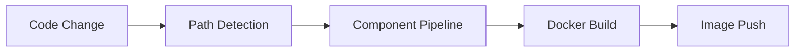
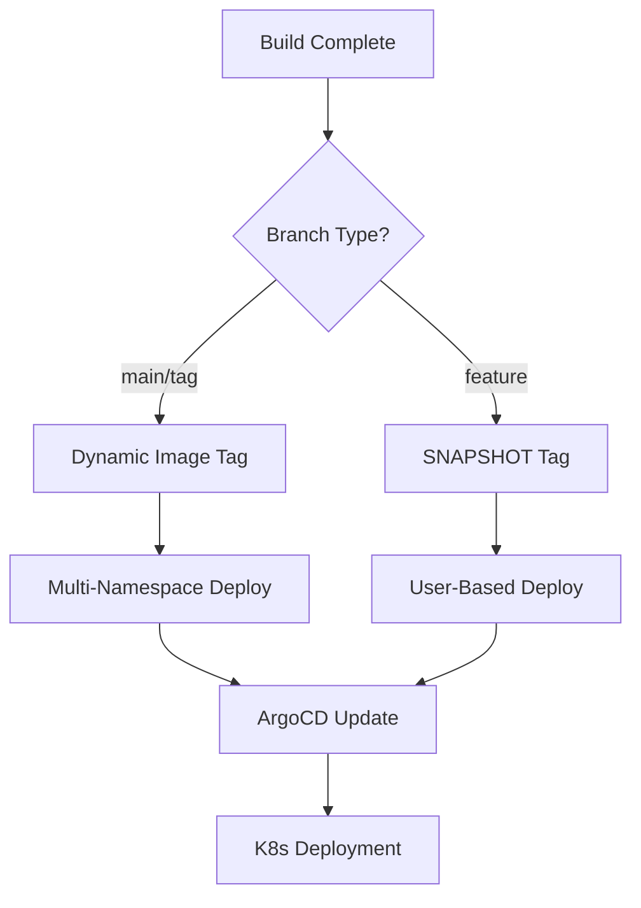

# 🚀 OpenK9 GitLab CI/CD Pipeline Architecture

## 📋 Overview

This document describes the complete CI/CD pipeline architecture for the OpenK9 project. The pipeline is designed with a **multi-stage, component-based architecture** that supports parallel builds, automated deployments, and comprehensive quality checks.

## 🏗️ Pipeline Architecture

### 📁 File Structure
```
.gitlab/
├── .gitlab-ci.yaml                    # Main orchestrator pipeline
├── .gitlab-templates.yaml             # Shared job templates (with advanced restart logic)
├── README.md                          # This documentation
├── helm-charts-pipeline/              # Helm chart deployment pipelines
│   ├── .gitlab-ci-01-base-core.yaml
│   ├── .gitlab-ci-02-file-handling.yaml
│   ├── .gitlab-ci-03-gen-ai.yaml
│   ├── .gitlab-ci-04-knowledge-handling.yaml
│   └── .gitlab-ci-06-utilities.yaml
└── Component-specific pipelines:
    ├── .gitlab-ci-datasource.yaml
    ├── .gitlab-ci-searcher.yaml
    ├── .gitlab-ci-ingestion.yaml
    ├── .gitlab-ci-k8s-client.yaml
    ├── .gitlab-ci-file-manager.yaml
    ├── .gitlab-ci-tenant-manager.yaml
    ├── .gitlab-ci-tika-no-ocr.yaml
    ├── .gitlab-ci-entity-manager.yaml
    ├── .gitlab-ci-resources-validator.yaml
    ├── .gitlab-ci-search-frontend.yaml
    ├── .gitlab-ci-admin-frontend.yaml
    ├── .gitlab-ci-tenant-frontend.yaml
    ├── .gitlab-ci-rag-module.yaml
    └── .gitlab-ci-embedding-module.yaml
```

## 🔄 Pipeline Stages

### 1. **trigger** - Component Selection
- **Purpose**: Determines which components need to be built based on file changes
- **Triggers**: Child pipelines for specific components
- **Logic**: Path-based change detection

### 2. **build** - Container Image Creation
- **Purpose**: Builds Docker images for each component
- **Environment**: Maven 3.9.6 + Eclipse Temurin 21
- **Artifacts**: Docker images pushed to registry

### 3. **container-scanning** - Security Analysis
- **Purpose**: Scans built images for vulnerabilities
- **Tool**: GitLab Container Scanning
- **Output**: Security reports and SBOM

### 4. **restart** - Deployment Orchestration
- **Purpose**: Triggers deployment in target environments
- **Mechanism**: Cross-project pipeline trigger with advanced logic
- **Target**: External deployment project

### 5. **quality** - Code Quality Analysis
- **Purpose**: SonarQube analysis for code quality
- **Scope**: Full project analysis
- **Reports**: Quality gate results

### 6. **dependency-check** - Dependency Vulnerability Scanning
- **Purpose**: OWASP dependency vulnerability analysis
- **Tool**: Maven dependency-check plugin
- **Output**: Dependency vulnerability reports

### 7. **build-verifier** - Build Verification
- **Purpose**: Additional build verification steps
- **Scope**: Post-build validation

### 8. **publish** - Artifact Publishing
- **Purpose**: Publishes artifacts to repositories
- **Target**: Maven/NPM repositories

### 9. **push** - Final Push Operations
- **Purpose**: Final deployment push operations
- **Scope**: Production deployments

## 🎯 Component Categories

### 🔧 Backend Components (Java/Quarkus)
| Component | Purpose | Registry Image | Deployment Namespaces |
|-----------|---------|----------------|----------------------|
| **datasource** | Data source management | `openk9-datasource` | k9-backend, k9-backend01, k9-test |
| **searcher** | Search engine service | `openk9-searcher` | k9-backend, k9-backend01, k9-test |
| **ingestion** | Data ingestion pipeline | `openk9-ingestion` | k9-backend, k9-backend01, k9-test |
| **k8s-client** | Kubernetes client service | `openk9-k8s-client` | k9-backend, k9-backend01, k9-test |
| **file-manager** | File management service | `openk9-file-manager` | k9-backend, k9-backend01, k9-test |
| **tenant-manager** | Multi-tenancy management | `openk9-tenant-manager` | k9-backend, k9-backend01, k9-test |
| **tika-no-ocr** | Document processing (no OCR) | `openk9-tika-no-ocr` | k9-backend, k9-backend01, k9-test |
| **entity-manager** | Entity management service | `openk9-entity-manager` | k9-backend, k9-backend01, k9-test |
| **resources-validator** | Resource validation service | `openk9-resources-validator` | k9-backend, k9-backend01, k9-test |

### 🤖 AI Components (Python)
| Component | Purpose | Registry Image | Deployment Namespaces |
|-----------|---------|----------------|----------------------|
| **rag-module** | RAG (Retrieval Augmented Generation) | `openk9-rag-module` | k9-ai |
| **embedding-module** | Vector embeddings service | `openk9-embedding-module` | k9-ai |

### 🌐 Frontend Components (Node.js/React)
| Component | Purpose | Registry Image | Deployment Namespaces |
|-----------|---------|----------------|----------------------|
| **search-frontend** | Search interface | `openk9-search-frontend` | k9-frontend |
| **admin-frontend** | Administration interface | `openk9-admin-ui` | k9-frontend |
| **tenant-frontend** | Tenant management interface | `openk9-tenant-ui` | k9-frontend |

## 🚦 Trigger Rules & Branch Strategy

### 📊 Execution Matrix

| Branch Type | Condition | Backend | Frontend | AI | Deployment |
|-------------|-----------|---------|----------|----|-----------| 
| **main** | Always | ✅ Auto | 🔄 Manual | ✅ Auto | 🌍 Multi-env |
| **tags** | Always | ✅ Auto | 🔄 Manual | ✅ Auto | 🌍 Multi-env |
| **MR approved** | Changes detected | ✅ Auto | 🔄 Manual | ✅ Auto | 🌍 Multi-env |
| **Feature branch** (^\d+-.*$) | Changes detected | ✅ Auto | ✅ Auto* | ✅ Auto | 🎯 Single-env |

*Frontend developers only on feature branches

### 🔐 User-Specific Rules (Feature Branches)

#### Backend Developers
- **mirko.zizzari**: k9-backend, k9-backend-oracle, k9-test
- **michele.bastianelli**: k9-backend01

#### AI Developer  
- **luca.callocchia**: k9-ai

#### Frontend Developers
- **lorenzo.venneri**, **giorgio.bartolomeo**: k9-frontend

## 🛠️ Shared Templates

### `.build_template`
- **Base Image**: `maven:3.9.6-eclipse-temurin-21`
- **Cache**: Job-specific Maven repository (`${CI_JOB_NAME}-${CI_COMMIT_REF_SLUG}`)
- **Variables**: Docker host, Maven options
- **Artifacts**: Built JAR files (2 days retention)

### `.container-scanning-template`
- **Security Scanning**: Vulnerability analysis
- **Reports**: Container scanning + SBOM generation
- **Integration**: GitLab Security Dashboard

### `.dependency_check_frontend_template`
- **Frontend Security**: NPM/Yarn dependency scanning
- **Tool**: GitLab NPM Audit analyzer
- **Scope**: js-packages/**/*

### 🔄 `.restart_job_template` (ADVANCED LOGIC)

#### 🎯 **Main Branch/Tag Deployment**
**Dynamic Image Tag Resolution:**
- **Frontend**: `version.env` → `VERSION=...`
- **Backend**: `.version` → version number only
- **AI**: `config.env` → `VERSION=...`
- **Fallback**: `dev-SNAPSHOT`

**Multi-Environment Deployment:**
```bash
# Backend components → 3 namespaces
k9-backend + k9-backend01 + k9-test

# Frontend components → 1 namespace  
k9-frontend

# AI components → 1 namespace
k9-ai

# Oracle backend → 1 namespace
k9-backend-oracle

# Test components → 1 namespace
k9-test
```

#### 🌿 **Feature Branch Deployment**
**User-Based Namespace Determination:**
- Passes `COMPONENT_TYPE` + `GITLAB_USER_LOGIN` to target pipeline
- Target pipeline determines namespace based on user permissions
- Uses SNAPSHOT tags per component type

**SNAPSHOT Tag Strategy:**
- **Backend**: `999-SNAPSHOT`
- **AI**: `997-SNAPSHOT`  
- **Frontend**: `996-SNAPSHOT`
- **Test**: `latest`

## 🔄 Deployment Flow

### 1. **Build Phase**


### 2. **Advanced Restart Logic**


### 🎯 Restart Mechanism Examples

#### Main Branch (Multi-Environment):
```bash
# Backend component - 3 calls
for ns in k9-backend k9-backend01 k9-test; do
  curl -X POST \
    -F "token=${RESTART_TRIGGER_TOKEN}" \
    -F "variables[TRIGGER_JOB]=restart-${COMPONENT_NAME}" \
    -F "variables[NAMESPACE]=$ns" \
    -F "variables[IMAGE_TAG]=$IMAGE_TAG" \
    -F "variables[COMPONENT_TYPE]=backend" \
    -F "ref=master" \
    "${RESTART_TRIGGER_URL}"
done
```

#### Feature Branch (User-Based):
```bash
# Single call with user context
curl -X POST \
  -F "token=${RESTART_TRIGGER_TOKEN}" \
  -F "variables[TRIGGER_JOB]=restart-${COMPONENT_NAME}" \
  -F "variables[COMPONENT_TYPE]=backend" \
  -F "variables[IMAGE_TAG]=999-SNAPSHOT" \
  -F "variables[GITLAB_USER_LOGIN]=$GITLAB_USER_LOGIN" \
  -F "variables[CI_COMMIT_BRANCH]=$CI_COMMIT_BRANCH" \
  -F "ref=master" \
  "${RESTART_TRIGGER_URL}"
```

## 🏷️ Image Tagging Strategy

| Branch Type | Backend | AI | Frontend | Test |
|-------------|---------|----|---------|----- |
| **main/tags** | `${VERSION}` (from .version) | `${VERSION}` (from config.env) | `${VERSION}` (from version.env) | `latest` |
| **feature** | `999-SNAPSHOT` | `997-SNAPSHOT` | `996-SNAPSHOT` | `latest` |

## 📈 Quality & Security

### 🔍 Code Quality (SonarQube)
- **Trigger**: main, MR, tags
- **Analysis**: Full project scan
- **Quality Gate**: Enforced (allow_failure: true)

### 🛡️ Security Scanning
- **Container Scanning**: All built images
- **Dependency Check**: Maven dependencies (OWASP)
- **Frontend Dependencies**: NPM/Yarn audit

### 📊 Artifacts & Reports
- **Container Scanning**: `gl-container-scanning-report.json`
- **Dependency Check**: `core/target/dependency-check-report.html`
- **SBOM**: `gl-sbom-*.cdx.json`

## 🚫 Pipeline Blocking Rules

### ⛔ First Push Protection
All pipelines include protection against first push on new branches:
```yaml
- if: '$CI_PIPELINE_SOURCE == "push" && $CI_COMMIT_BEFORE_SHA == "0000000000000000000000000000000000000000"'
  when: never
```

### 🔄 Dependency Management
- **RAG Module**: `allow_failure: true` (doesn't block embedding)
- **Embedding Module**: `needs: ["Trigger Rag Module"]` (sequential execution)

## 🌐 Language & Comments

### 📝 Mixed Language Structure
The pipeline uses a **mixed language approach**:
- **English**: Main CI file triggers, templates, and documentation
- **Italian**: Some legacy components and specific user rules
- **Standardization**: Ongoing migration to English for consistency

### 🔄 Comment Translation Status
- ✅ **Fully English**: Main pipeline stages, restart template
- 🔄 **Mixed**: Some component triggers (File-Manager, Tenant-Manager)
- 🎯 **Target**: Full English standardization

## 🎛️ Configuration Variables

### 🔐 Required Variables
- `RESTART_TRIGGER_TOKEN`: Authentication for deployment pipeline
- `RESTART_TRIGGER_URL`: Target deployment pipeline URL
- `SONAR_TOKEN`: SonarQube authentication
- `CI_REGISTRY_*`: Container registry credentials

### 📋 Pipeline Variables
- `MAVEN_OPTS`: Maven JVM options
- `DOCKER_HOST`: Docker daemon endpoint
- `CS_ANALYZER_IMAGE`: Container scanning image
- `COMPONENT_NAME`: Component identifier
- `COMPONENT_TYPE`: Component category (backend/frontend/ai/test/backend-oracle)

### 🔧 Cache Strategy
- **Key**: `${CI_JOB_NAME}-${CI_COMMIT_REF_SLUG}`
- **Scope**: Job-specific with branch differentiation
- **Policy**: `pull-push` for optimal performance

## 📚 Best Practices

### ✅ Do's
- Use path-based change detection for efficiency
- Implement proper caching strategies per job
- Follow semantic versioning for releases
- Include comprehensive security scanning
- Use allow_failure for non-critical jobs
- Leverage user-based namespace determination

### ❌ Don'ts
- Don't skip first-push protection
- Don't hardcode sensitive values
- Don't create circular dependencies
- Don't ignore quality gate failures in production
- Don't mix deployment strategies within same branch type

## 🔧 Troubleshooting

### 🚨 Common Issues

1. **Pipeline doesn't trigger**: Check path changes and branch naming (^\d+-.*$ pattern)
2. **Build fails**: Verify Maven dependencies and Docker configuration
3. **Deployment fails**: Check restart trigger URL and authentication
4. **Quality gate fails**: Review SonarQube issues and fix code quality
5. **Wrong namespace**: Verify user permissions and component type mapping
6. **Image tag issues**: Check version files (`.version`, `version.env`, `config.env`)

### 🔍 Debug Commands
```bash
# Check version files
cat .version                # Backend components
cat version.env             # Frontend components  
cat config.env              # AI components

# Verify branch pattern
echo "$CI_COMMIT_BRANCH" | grep -E "^[0-9]+-.*$"

# Check user permissions
echo "User: $GITLAB_USER_LOGIN, Component: $COMPONENT_TYPE"
```

### 📞 Support
- **CI/CD Issues**: Check GitLab pipeline logs and restart template output
- **Build Issues**: Verify Maven configuration and dependencies
- **Deployment Issues**: Check ArgoCD and Kubernetes logs
- **User Access**: Verify user-specific rules and namespace permissions

---

> **Note**: This pipeline architecture supports the OpenK9 microservices ecosystem with automated CI/CD, comprehensive testing, secure deployment practices, and advanced restart logic. The system uses sophisticated namespace determination based on branch type, user permissions, and component categories. The sequence of jobs is defined PRIMARY by `.gitlab-ci.yaml`. If child pipelines have dependencies that are not respected in the main pipeline, the entire system can break. 