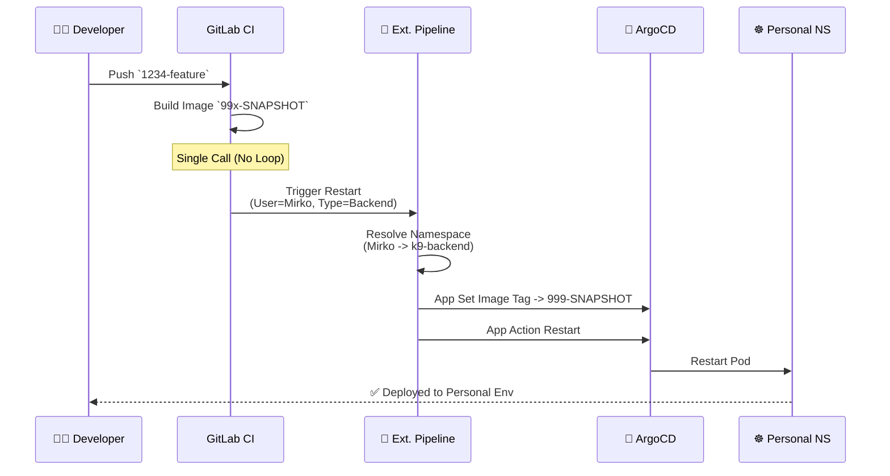
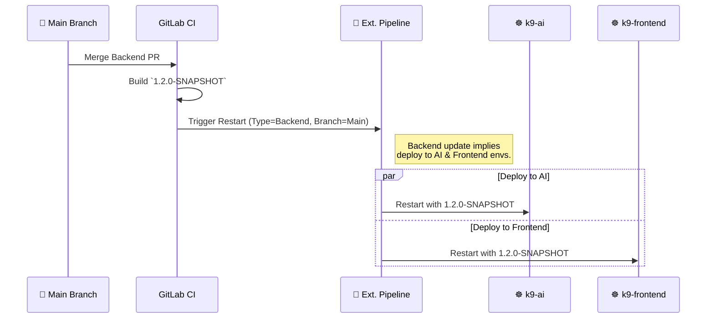
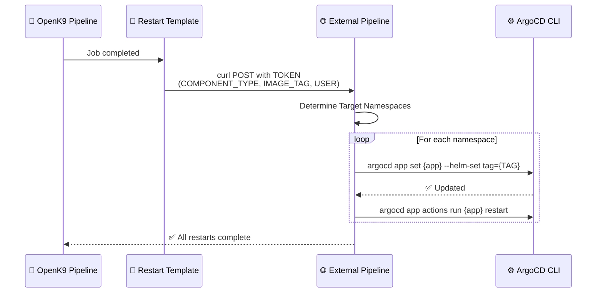

# 🚀 OpenK9 CI/CD Pipeline Documentation

> **Status:** Active & Stable  
> **Last Updated:** February 2026  
> **Maintainer:** DevOps Team

---

## 📚 Table of Contents

- [Overview](#overview)
- [File Structure](#file-structure)
- [Pipeline Architecture](#pipeline-architecture)
  - [Parent Pipeline](#parent-pipeline)
  - [Child Pipelines](#child-pipelines)
  - [Shared Templates](#shared-templates)
- [Trigger Rules](#trigger-rules)
  - [Anti-Spam Filter](#anti-spam-filter)
  - [Branch-Based Triggers](#branch-based-triggers)
  - [Change Detection](#change-detection)
- [Build Process](#build-process)
  - [Backend Java (Maven + JIB)](#backend-java-maven--jib)
  - [Frontend & AI (Kaniko)](#frontend--ai-kaniko)
- [Cache Strategy](#cache-strategy)
  - [Maven Cache](#maven-cache)
  - [Docker Layer Cache (Kaniko)](#docker-layer-cache-kaniko)
  - [Frontend Node Modules Cache](#frontend-node-modules-cache)
- [Security Scans](#security-scans)
- [Deployment](#deployment)
  - [Branch Strategy](#branch-strategy)
  - [Namespace Matrix](#namespace-matrix)
  - [Image Tagging](#image-tagging)
- [Visual Flows](#visual-flows)

---

# Overview

OpenK9 uses a **Parent-Child CI/CD pipeline** on GitLab. The parent pipeline acts as an orchestrator: it detects which components changed and triggers only the relevant child pipelines. Each child pipeline is fully independent and handles the build, test, security scan, and deployment of a single component.

---

# File Structure

```
.gitlab/
├── README.md                          ← this document
├── .gitlab-ci.yml                     ← parent pipeline (orchestrator)
├── .gitlab-templates.yaml             ← shared templates (DRY)
├── ci/
│   ├── backend.yaml                   ← backend change detection triggers
│   ├── frontend.yaml                  ← frontend change detection triggers
│   ├── ai.yaml                        ← AI module change detection triggers
│   ├── child-rules.yaml               ← shared job rules (MR, main, tag, feature)
│   └── quality.yaml                   ← SonarQube quality gate
├── .gitlab-ci-datasource.yaml         ← child pipeline: datasource
├── .gitlab-ci-searcher.yaml           ← child pipeline: searcher
├── .gitlab-ci-ingestion.yaml          ← child pipeline: ingestion
├── .gitlab-ci-entity-manager.yaml     ← child pipeline: entity-manager
├── .gitlab-ci-tenant-manager.yaml     ← child pipeline: tenant-manager
├── .gitlab-ci-resources-validator.yaml
├── .gitlab-ci-k8s-client.yaml
├── .gitlab-ci-file-manager.yaml
├── .gitlab-ci-api-gateway.yaml
├── .gitlab-ci-tika.yaml
├── .gitlab-ci-admin-frontend.yaml
├── .gitlab-ci-search-frontend.yaml
├── .gitlab-ci-tenant-frontend.yaml
├── .gitlab-ci-talk-to.yaml
├── .gitlab-ci-rag-module.yaml
├── .gitlab-ci-embedding-module.yaml
├── .gitlab-ci-chunk-evaluation-module.yaml
├── .gitlab-ci-docling-processor.yaml
└── .gitlab-ci-connectors.yaml
```

---

# Pipeline Architecture

## Parent Pipeline

The parent pipeline (`.gitlab-ci.yml`) is the entry point for every push or MR. It does **not** build anything directly. Its job is to:

1. Check what changed (file paths)
2. Decide which child pipelines to trigger
3. Pass context variables (branch, tag, user) to the children

## Child Pipelines

Each component has its own YAML file. A child pipeline typically has these stages:

| Stage | Jobs |
|---|---|
| `build` | Build Docker image (or Maven build on MR) |
| `build-verifier` | Compile-only check on MR (no Docker push) |
| `container-scanning` | Trivy/GitLab container scan |
| `dependency-check` | OWASP (backend) or npm audit (frontend) |
| `restart` | Trigger ArgoCD restart via external pipeline |

## Shared Templates

All reusable logic lives in `.gitlab-templates.yaml`. Child pipelines `!reference` these templates to avoid duplication.

| Template | Used by | Purpose |
|---|---|---|
| `.build_template` | Backend Java jobs on `main` / feature | Full Maven build + Docker push. Cache policy: `pull-push` |
| `.maven-verifier-template` | Backend **Build Verifier** jobs on MR | Maven compile only, no Docker push. Cache policy: `pull` (read-only — prevents MR code from overwriting shared cache) |
| `.dependency_check_backend_template` | All backend components | OWASP dependency-check |
| `.dependency_check_frontend_template` | All frontend components | npm audit, scoped via `DS_PROJECT_DIR` |

---

# Trigger Rules

## Anti-Spam Filter

When a developer creates a new branch, GitLab generates a push event with the special SHA `0000000000000000000000000000000000000000`. The parent pipeline detects this and **blocks all child triggers** to avoid launching a massive "pipeline storm" on an empty branch.

## Branch-Based Triggers

| Event | What runs |
|---|---|
| Push to feature branch (`^[0-9]+-.*`) | Build + push image with personal tag (`99x-SNAPSHOT`) + ArgoCD restart to personal namespace |
| Merge Request opened/updated | Build Verifier (compile only, no push) + dependency check |
| Push to `main` | Build + push image with `x.y.z-SNAPSHOT` + ArgoCD restart to all shared envs |
| Tag push (`v*`) | Full rebuild of **all** components regardless of changes, tagged `vX.Y.Z` |

## Change Detection

On `main` and feature branches, each child pipeline is only triggered if its relevant files changed:

```yaml
# Example: datasource child is triggered only if these paths changed
changes:
  - core/datasource/**/*
  - core/common/**/*
  - pom.xml
```

Tag pushes (`v*`) bypass all `changes:` filters to force a full system rebuild.

---

# Build Process

## Backend Java (Maven + JIB)

Backend components (datasource, searcher, ingestion, etc.) use **Maven + JIB** to build and push Docker images directly — no Dockerfile needed, no Docker daemon required.

**On `main` / feature branch** (`.build_template`):
```bash
mvn clean package \
  -Dquarkus.container-image.push=true \
  -Dquarkus.container-image.tag=$VERSION \
  -Dmaven.repo.local=$CI_PROJECT_DIR/.m2/repository
```

**On MR** (`.maven-verifier-template`):
```bash
mvn clean package \
  -Dquarkus.container-image.push=false   # compile only, no Docker push
  -Dmaven.repo.local=$CI_PROJECT_DIR/.m2/repository
```

## Frontend & AI (Kaniko)

Frontend (admin-ui, search-frontend, tenant-ui, talk-to) and AI modules (rag-module, embedding-module, etc.) use **Kaniko** to build and push Docker images inside the CI container without a Docker daemon.

Every Kaniko call uses these flags:

```bash
/kaniko/executor \
  --cache=true \
  --cache-repo=kaniko-cache-registry.openk9.io/kaniko-cache \
  --cache-ttl=168h \
  --snapshot-mode=redo \
  --compressed-caching=false \
  --context "..." \
  --dockerfile "..." \
  --destination "registry.smc.it:49083/openk9/<component>:<tag>"
```

| Flag | Why it's there |
|---|---|
| `--cache=true` + `--cache-repo` | Reuses cached Docker layers from previous builds (e.g. `yarn install` result). See [Docker Layer Cache](#docker-layer-cache-kaniko) |
| `--snapshot-mode=redo` | Uses file mtime instead of sha256 checksums to detect changes. Reduces "Taking snapshot of full filesystem" from ~900s to ~5s after a `yarn install` |
| `--compressed-caching=false` | Prevents Kaniko from compressing multi-GB layers (PyTorch, node_modules) in RAM before pushing, which caused OOM → `Killed` (exit code 137) on AI images |

---

# Cache Strategy

## Maven Cache

Maven downloads `.jar` dependencies on first run and caches them in `.m2/repository`. The GitLab Runner saves and restores this folder between jobs using the `cache:` block.

| Job type | Cache key | Policy | Effect |
|---|---|---|---|
| `main` / feature build | `$COMPONENT-mvn` | `pull-push` | Saves updated cache after build |
| MR Build Verifier | `$COMPONENT-mvn` | `pull` only | Reads existing cache, never writes — protects shared cache from unreviewed MR code |

Each component has its own key (`datasource-mvn`, `searcher-mvn`, etc.) to avoid cross-component cache conflicts.

> The runner currently stores Maven cache on local disk (`rci.smc.it`). To share it across multiple runner instances, configure `[runners.cache] Type = "s3"` in the runner's `config.toml` pointing to `minio.openk9.io`.

## Docker Layer Cache (Kaniko)

A dedicated `registry:2` container is deployed in the `k9-requirements` Kubernetes namespace. It stores Docker build layers in the existing MinIO instance under a dedicated bucket.

```
Kaniko (CI job on runner VM)
      │ HTTPS — Docker Registry API (push/pull layers)
      ▼
kaniko-cache-registry.openk9.io   ← Ingress → registry:2 pod (k9-requirements)
      │ S3 API — internal ClusterIP
      ▼
MinIO (minio.k9-requirements.svc.cluster.local:9000)
      └── bucket: kaniko-cache   ← 7-day TTL lifecycle (auto-cleanup)
```

**How it works:**
- First build: Kaniko pushes every layer to the cache registry. No speedup yet.
- Subsequent builds: if a Dockerfile instruction and its inputs are unchanged, Kaniko pulls the cached layer and skips re-execution. A `yarn install` that took 15 min becomes a 10-second pull.

**Inspecting the cache:**
```bash
curl -s https://kaniko-cache-registry.openk9.io/v2/_catalog
curl -s https://kaniko-cache-registry.openk9.io/v2/kaniko-cache/tags/list
```

**Why not use the SMC Nexus registry for cache?**  
Kaniko would accumulate thousands of anonymous cache layers in Nexus with no automatic cleanup, polluting the production registry. The dedicated MinIO-backed registry keeps cache completely separate and self-cleaning (7-day TTL).

## Frontend Node Modules Cache

Build Verifier jobs for frontend components cache `node_modules` and `.yarn-cache` per component and branch:

```yaml
cache:
  key: "${CI_JOB_NAME}-${CI_COMMIT_REF_SLUG}"
  paths:
    - js-packages/<component>/node_modules
    - .yarn-cache
  policy: pull-push
```

**Dependency Check jobs** set `DS_PROJECT_DIR` to point the `npm-audit` analyzer at the specific component subdirectory. Without this, the analyzer detects the monorepo root, triggers a full workspace `yarn install`, exhausts memory, and crashes with a segfault.

---

# Security Scans

## Container Scanning
Every build job is followed by a container scanning job (Trivy via GitLab analyzer). It scans the pushed image for known CVEs and uploads results to GitLab Security Dashboard. Failures are `allow_failure: true` (non-blocking).

## Dependency Check — Backend (OWASP)
Runs `dependency-check` against the Maven project to detect known vulnerable JARs. Results are uploaded as a GitLab artifact.

## Dependency Check — Frontend (npm audit)
Runs `npm audit` via the GitLab `npm-audit` analyzer. Scoped to the individual component directory via `DS_PROJECT_DIR`.

## SonarQube
Quality analysis runs on `main` and MR pipelines via the `quality.yaml` include. It analyzes source code for bugs, vulnerabilities, and code smells and posts results back to the GitLab MR.

---

# Deployment

## Branch Strategy

| Branch | Build | Docker Push | Deploy to |
|---|---|---|---|
| Feature (`^[0-9]+-.*`) | ✅ | ✅ personal tag (`99x-SNAPSHOT`) | Developer personal namespace |
| Merge Request | ✅ compile only | ❌ | Nothing |
| `main` | ✅ | ✅ `x.y.z-SNAPSHOT` | All shared integration envs |
| Tag (`v*`) | ✅ full rebuild | ✅ `vX.Y.Z` | Production/stable |

## Namespace Matrix

### Feature Branch — User-Based Routing

| User | Role | Tag | Namespace |
|---|---|---|---|
| `mirko.zizzari` | Backend Lead | `999-SNAPSHOT` | `k9-backend` |
| `michele.bastianelli` | Backend Dev | `998-SNAPSHOT` | `k9-backend01` |
| `luca.callocchia` | AI Dev | `997-SNAPSHOT` | `k9-ai` |
| `lorenzo.venneri` | Frontend Dev | `996-SNAPSHOT` | `k9-frontend` |
| `giorgio.bartolomeo` | Frontend Dev | `996-SNAPSHOT` | `k9-frontend` |

### Main Branch — Component-Based Routing

When a component is merged to `main`, it restarts all namespaces that depend on it (excluding its own origin namespace to avoid redundant restarts).

| Component updated | Restarts in |
|---|---|
| Backend | `k9-ai`, `k9-frontend` |
| Frontend | `k9-backend`, `k9-backend01`, `k9-ai`, `k9-test` |
| AI | `k9-backend`, `k9-frontend`, `k9-test` |

## Image Tagging

| Branch | Tag format | Example |
|---|---|---|
| `main` | `x.y.z-SNAPSHOT` (from `pom.xml` / `package.json`) | `2026.1.0-SNAPSHOT` |
| Feature (backend user) | `999-SNAPSHOT` / `998-SNAPSHOT` | `999-SNAPSHOT` |
| Feature (frontend user) | `996-SNAPSHOT` | `996-SNAPSHOT` |
| Feature (AI user) | `997-SNAPSHOT` | `997-SNAPSHOT` |
| Tag `v*` | exact tag | `v3.1.0` |

---

# Visual Flows

## Feature Branch Flow


```mermaid
sequenceDiagram
    participant Dev as 👨‍💻 Developer
    participant Git as GitLab CI
    participant Ext as 🔄 Ext. Pipeline
    participant Argo as 🐙 ArgoCD
    participant K8s as ☸️ Personal NS

    Dev->>Git: Push `1234-feature`
    Git->>Git: Build Image `99x-SNAPSHOT`
    
    Note over Git: Single Call (No Loop)
    Git->>Ext: Trigger Restart<br/>(User=Mirko, Type=Backend)
    
    Ext->>Ext: Resolve Namespace<br/>(Mirko -> k9-backend)
    
    Ext->>Argo: App Set Image Tag -> 999-SNAPSHOT
    Ext->>Argo: App Action Restart
    
    Argo->>K8s: Restart Pod
    K8s-->>Dev: ✅ Deployed to Personal Env
```

## Main Branch Flow


```mermaid
sequenceDiagram
    participant Main as 🚀 Main Branch
    participant CI as GitLab CI
    participant Ext as 🔄 Ext. Pipeline
    participant NS_AI as ☸️ k9-ai
    participant NS_FE as ☸️ k9-frontend

    Main->>CI: Merge Backend PR
    CI->>CI: Build `1.2.0-SNAPSHOT`
    CI->>Ext: Trigger Restart (Type=Backend, Branch=Main)
    
    Note right of Ext: Backend update implies<br/>deploy to AI & Frontend envs.
    
    par Deploy to AI
        Ext->>NS_AI: Restart with 1.2.0-SNAPSHOT
    and Deploy to Frontend
        Ext->>NS_FE: Restart with 1.2.0-SNAPSHOT
    end
```

## Restart Logic (Detailed)

This sequence explains the delegation to the external trigger pipeline.


```mermaid
sequenceDiagram
    participant Pipeline as 🎯 OpenK9 Pipeline
    participant Template as 🔄 Restart Template
    participant External as 🌐 External Pipeline
    participant ArgoCD as ⚙️ ArgoCD CLI
    
    Pipeline->>Template: Job completed
    Template->>External: curl POST with TOKEN<br/>(COMPONENT_TYPE, IMAGE_TAG, USER)
    
    External->>External: Determine Target Namespaces
    
    loop For each namespace
        External->>ArgoCD: argocd app set {app} --helm-set tag={TAG}
        ArgoCD-->>External: ✅ Updated
        External->>ArgoCD: argocd app actions run {app} restart
    end
    
    External-->>Pipeline: ✅ All restarts complete
```
