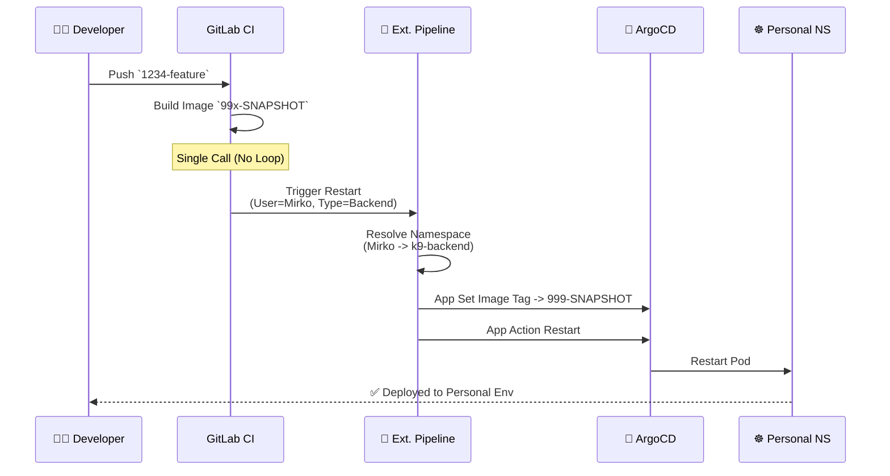
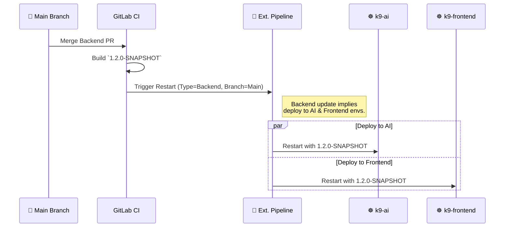
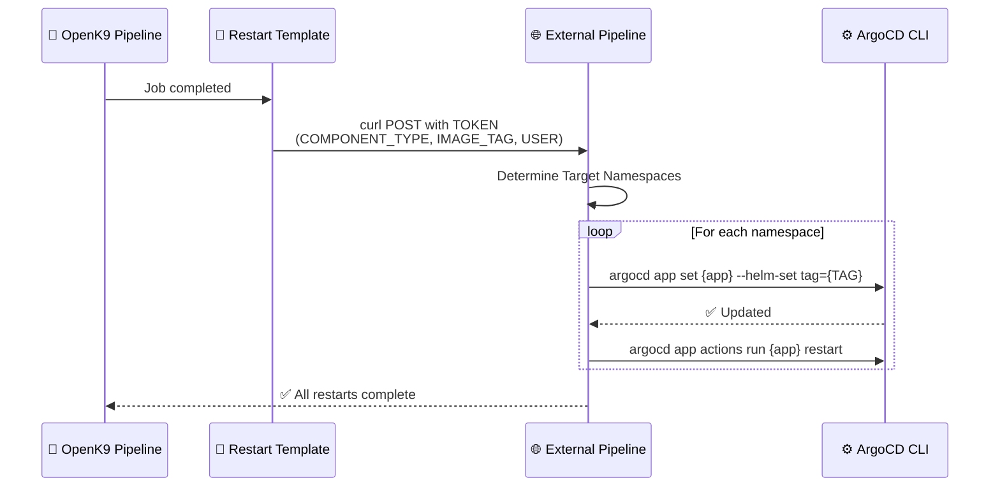

# 🚀 OpenK9 CI/CD Pipeline Documentation

> **Status:** Active & Stable  
> **Last Updated:** February 2026  
> **Maintainer:** DevOps Team

Complete technical documentation for OpenK9's GitLab CI/CD pipeline architecture, deployment processes, and operational procedures.

---

## 📚 Table of Contents

### 🏗️ [Architecture & Design](#architecture--design)
- [Pipeline Layers](#pipeline-layers)
- [Smart Trigger Logic](#smart-trigger-logic)
- [Shared Templates](#shared-templates)

### 🆕 [Recent Improvements (Feb 2026)](#recent-improvements)
- [Performance Fixes](#performance-fixes)
- [Logic Fixes](#logic-fixes)

### 🔄 [Deployment Workflow](#deployment-workflow)
- [Branch Strategy](#branch-strategy)
- [Namespace Matrix](#namespace-matrix)
- [Image Tagging](#image-tagging)

### 📊 [Visual Flows](#visual-flows)
- [Feature Branch Flow](#feature-branch-flow)
- [Main Branch Flow](#main-branch-flow)
- [Restart Logic](#restart-logic)

---

# Architecture & Design

## Pipeline Layers

The pipeline follows a **Parent-Child architecture**: 
1.  **Orchestrator & Smart Triggers**: The entry point routes logic into domain-specific trigger files (`backend.yaml`, `frontend.yaml`, etc.).
    - **Anti-Spam Filter**: Automatically blocks execution globally on initial branch creation (SHA `0000000...`) to prevent massive "pipeline storms".
    - **Merge Request Validation**: Triggers downstream pipelines specifically to run unit tests and offline compilations (e.g. `yarn build` or `mvn package --no-push`). This strictly isolates the Docker registry from untested or incomplete code.
2.  **Component Pipelines**: Independent child pipelines that isolate builds, container scanning, and component-specific restart logic via ArgoCD.
3.  **Shared Templates (`.gitlab-templates.yaml`)**: A strictly **DRY (Don't Repeat Yourself)** repository for reusable logic (Maven/Kaniko builds, security scans) and global variables (e.g. `CS_ANALYZER_IMAGE`).

---

# 🆕 Recent Improvements (Feb 2026)

### Performance & Stability
- **Build Resilience**: Implemented `yarn install` with timeouts (10m), registry fallbacks, and aggressive caching.
- **Node Memory**: Incremented to 8GB (`NODE_OPTIONS`) for frontend builds.
- **Maven Clean**: Automated local repository purging for internal artifacts.

### Logic Optimizations
- **No Duplicate Restarts**: Main branch deployments now trigger a **single** external call.
- **Child Pipeline Fix**: Removed redundant `changes:` filters in downstream jobs to prevent "empty pipeline" errors.

---

# Deployment Workflow

## Branch Strategy

| Branch Pattern | Type | Trigger | Deployment Target | Pipeline Behavior / Tag Strategy |
|----------------|------|---------|-------------------|----------------------------------|
| `^[0-9]+-.*` | Feature | Push | **Developer Namespace** (Personal) | Pushes static `99x-SNAPSHOT` tags based on user ID |
| `*` (Any MR) | Pull Request | Merge Request | **None** (Test Phase Only) | Compiles code (`yarn build` / `mvn package`) to validate logic. **Docker push is skipped**. |
| `main` | Integration | Merge | **ALL Integration Envs** (Shared) | Deploys `x.y.z-SNAPSHOT` only for components triggering the `changes` filter. |
| `v*` | Release | Tag | **Production/Stable** | Bypasses `changes` filters to force a **Full System Rebuild** of all containers with tag `v1.2.3`. |

## Namespace Matrix

The deployment target depends on **WHO** pushes (Feature) or **WHAT** is pushed (Main).

### 1. Feature Branch (User-Based Routing)
*Deploys to the developer's assigned namespace.*

| User | Role | Namespace | Tag Info |
|------|------|-----------|----------|
| `mirko.zizzari` | Backend Lead | `k9-backend` | `999-SNAPSHOT` |
| `michele.bastianelli` | Backend Dev | `k9-backend01` | `998-SNAPSHOT` |
| `lorenzo.venneri` | Frontend Dev | `k9-frontend` | `996-SNAPSHOT` |
| `luca.callocchia` | AI Dev | `k9-ai` | `997-SNAPSHOT` |
| `giorgio.bartolomeo` | Frontend Dev | `k9-frontend` | `996-SNAPSHOT` |

### 2. Main Branch (Component-Based Routing)
*Updates all environments dependent on the modified component.*

| Component Type | Origin (Skipped) | Targets (Deployed) | Reason |
|----------------|------------------|--------------------|--------|
| **Backend** | `k9-backend` | `k9-ai`, `k9-frontend` | AI/FE need latest BE. |
| **Frontend** | `k9-frontend` | `k9-backend`, `k9-backend01`, `k9-ai`, `k9-test` | Everyone needs latest UI. |
| **AI** | `k9-ai` | `k9-backend`, `k9-frontend`, `k9-test` | BE/FE need latest AI. |

---

# Visual Flows

## Feature Branch Flow
*Developer works in isolation. Pipeline makes a single call, external system maps User->Namespace.*

```mermaid
sequenceDiagram
    participant Dev as 👨‍💻 Developer
    participant Git as GitLab CI
    participant Ext as 🔄 Ext. Pipeline
    participant Argo as 🐙 ArgoCD
    participant K8s as ☸️ Personal NS

    Dev->>Git: Push `1234-feature`
    Git->>Git: Build Image `99x-SNAPSHOT`
    
    Note over Git: Single Call (No Loop)
    Git->>Ext: Trigger Restart<br/>(User=Mirko, Type=Backend)
    
    Ext->>Ext: Resolve Namespace<br/>(Mirko -> k9-backend)
    
    Ext->>Argo: App Set Image Tag -> 999-SNAPSHOT
    Ext->>Argo: App Action Restart
    
    Argo->>K8s: Restart Pod
    K8s-->>Dev: ✅ Deployed to Personal Env
```

## Main Branch Flow
*Integration update propagates. Single external call handles multi-destination logic.*

```mermaid
sequenceDiagram
    participant Main as 🚀 Main Branch
    participant CI as GitLab CI
    participant Ext as 🔄 Ext. Pipeline
    participant NS_AI as ☸️ k9-ai
    participant NS_FE as ☸️ k9-frontend

    Main->>CI: Merge Backend PR
    CI->>CI: Build `1.2.0-SNAPSHOT`
    CI->>Ext: Trigger Restart (Type=Backend, Branch=Main)
    
    Note right of Ext: Backend update implies<br/>deploy to AI & Frontend envs.
    
    par Deploy to AI
        Ext->>NS_AI: Restart with 1.2.0-SNAPSHOT
    and Deploy to Frontend
        Ext->>NS_FE: Restart with 1.2.0-SNAPSHOT
    end
```

## Restart Logic (Detailed)

This sequence explains the delegation to the external trigger pipeline.

```mermaid
sequenceDiagram
    participant Pipeline as 🎯 OpenK9 Pipeline
    participant Template as 🔄 Restart Template
    participant External as 🌐 External Pipeline
    participant ArgoCD as ⚙️ ArgoCD CLI
    
    Pipeline->>Template: Job completed
    Template->>External: curl POST with TOKEN<br/>(COMPONENT_TYPE, IMAGE_TAG, USER)
    
    External->>External: Determine Target Namespaces
    
    loop For each namespace
        External->>ArgoCD: argocd app set {app} --helm-set tag={TAG}
        ArgoCD-->>External: ✅ Updated
        External->>ArgoCD: argocd app actions run {app} restart
    end
    
    External-->>Pipeline: ✅ All restarts complete
```
