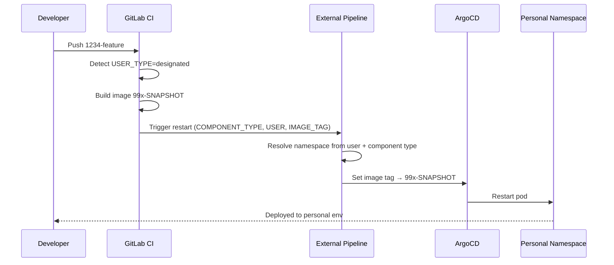
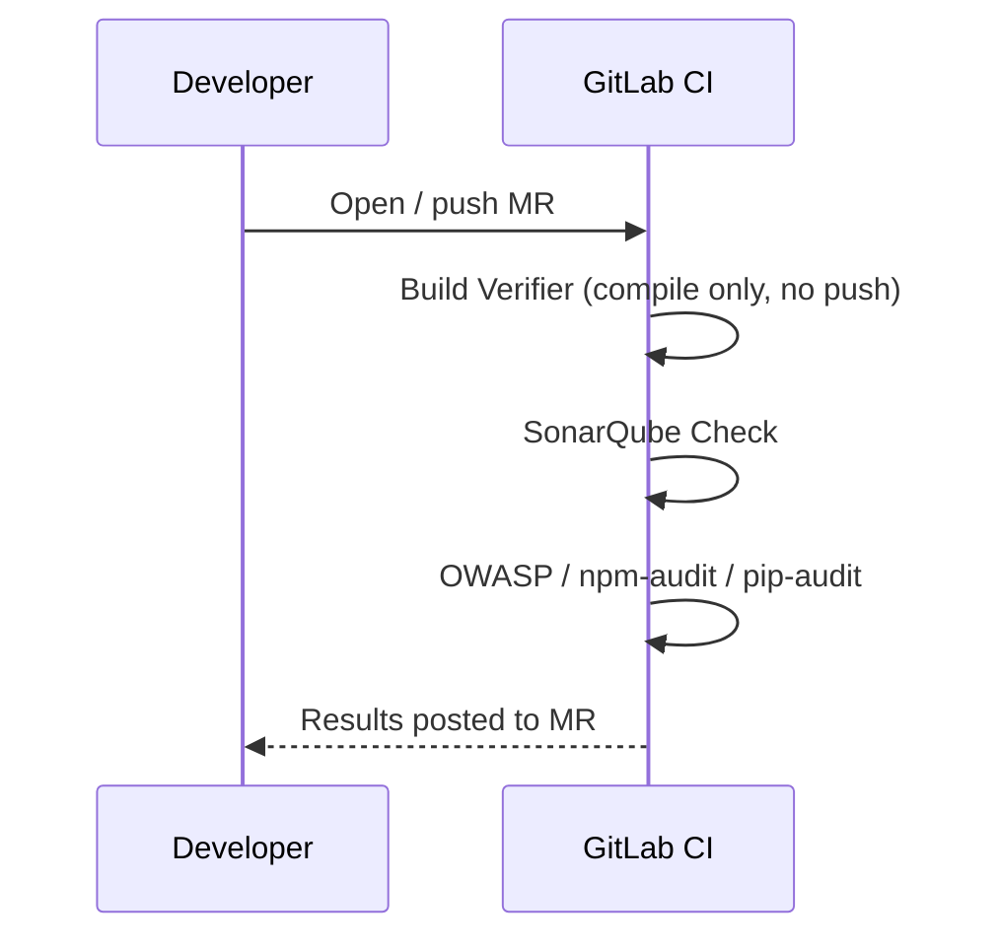
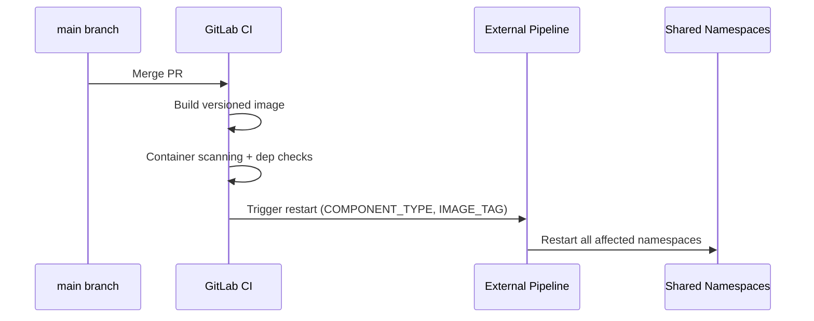
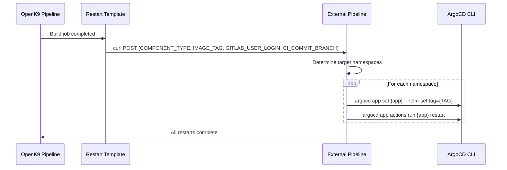

# OpenK9 CI/CD Pipeline Documentation

> **Status:** Active & Stable
> **Last Updated:** June 2026
> **Maintainer:** DevOps Team

---

## Table of Contents

- [Overview](#overview)
- [File Structure](#file-structure)
- [Pipeline Architecture](#pipeline-architecture)
  - [Parent Pipeline](#parent-pipeline)
  - [Child Pipelines](#child-pipelines)
  - [Shared Templates](#shared-templates)
- [Trigger Rules](#trigger-rules)
  - [Anti-Spam Filter](#anti-spam-filter)
  - [Branch-Based Triggers](#branch-based-triggers)
  - [Designated vs Generic Users](#designated-vs-generic-users)
  - [Change Detection](#change-detection)
- [Release Branch Workflow](#release-branch-workflow)
  - [Versioning Convention](#versioning-convention)
  - [Reusable Rules](#reusable-rules)
  - [Docker Hub Publication (Skopeo)](#docker-hub-publication-skopeo)
  - [Porting Branches](#porting-branches)
- [Build Process](#build-process)
  - [Backend Java (Maven + Quarkus / JIB)](#backend-java-maven--quarkus--jib)
  - [Frontend & AI (Kaniko)](#frontend--ai-kaniko)
- [Cache Strategy](#cache-strategy)
  - [Maven Cache](#maven-cache)
  - [Docker Layer Cache (Kaniko)](#docker-layer-cache-kaniko)
  - [Frontend Node Modules Cache](#frontend-node-modules-cache)
- [Security Scans](#security-scans)
- [Deployment](#deployment)
  - [Branch Strategy](#branch-strategy)
  - [Namespace Matrix](#namespace-matrix)
  - [Image Tagging](#image-tagging)
- [Visual Flows](#visual-flows)

---

## Overview

OpenK9 uses a **Parent-Child CI/CD pipeline** on GitLab. The parent pipeline acts as an orchestrator: it detects which components changed and triggers only the relevant child pipelines. Each child pipeline is fully independent and handles the build, security scan, and deployment of a single component.

---

## File Structure

```
.gitlab/
├── README.md                          ← this document
├── .gitlab-ci.yaml                    ← parent pipeline (orchestrator)
├── .gitlab-templates.yaml             ← shared templates (DRY)
├── ci/
│   ├── backend.yaml                   ← backend change detection triggers
│   ├── frontend.yaml                  ← frontend change detection triggers
│   ├── ai.yaml                        ← AI module change detection triggers
│   ├── enrichers.yaml                 ← enricher change detection triggers
│   ├── common.yaml                    ← connectors + Helm chart triggers
│   ├── child-rules.yaml               ← shared job rules (MR, main, tag, feature, release)
│   └── quality.yaml                   ← SonarQube, OWASP, pip-audit dep checks
├── pipeline-tests/                    ← local test suites for parent + child rules
│   ├── test-pipeline-rules.py         ← parent triggers (which domain fires)
│   ├── test-child-rules.py            ← child job rules (Build vs Build Release vs Copy)
│   └── README.md
├── helm-charts-pipeline/              ← Helm chart packaging pipelines (manual, main/tag only)
│   ├── .gitlab-ci-01-base-core.yaml
│   ├── .gitlab-ci-02-file-handling.yaml
│   ├── .gitlab-ci-03-gen-ai.yaml
│   ├── .gitlab-ci-05-connectors.yaml
│   └── .gitlab-ci-06-utilities.yaml
│
│   # Backend child pipelines
├── .gitlab-ci-datasource.yaml
├── .gitlab-ci-searcher.yaml
├── .gitlab-ci-ingestion.yaml
├── .gitlab-ci-tenant-manager.yaml
├── .gitlab-ci-resources-validator.yaml
├── .gitlab-ci-k8s-client.yaml
├── .gitlab-ci-file-manager.yaml
├── .gitlab-ci-api-gateway.yaml
├── .gitlab-ci-tika.yaml
│
│   # Frontend child pipelines
├── .gitlab-ci-admin-frontend.yaml
├── .gitlab-ci-search-frontend.yaml
├── .gitlab-ci-tenant-frontend.yaml
├── .gitlab-ci-talk-to.yaml
├── .gitlab-ci-openk9-chatbot.yaml     ← NPM publish only, no Docker image
│
│   # AI / enricher child pipelines
├── .gitlab-ci-rag-module.yaml
├── .gitlab-ci-agentic-rag-module.yaml
├── .gitlab-ci-embedding-module.yaml
├── .gitlab-ci-chunk-evaluation-module.yaml
├── .gitlab-ci-docling-processor.yaml
│
│   # Connectors child pipeline
└── .gitlab-ci-connectors.yaml        ← all 6 connectors in one file (main / tag / MR / release branch / porting MR)
```

---

## Pipeline Architecture

### Parent Pipeline

The parent pipeline (`.gitlab-ci.yaml`) is the entry point for every push or MR. It does **not** build anything directly. Its job is to:

1. Check what changed (file paths via `changes:`)
2. Decide which child pipelines to trigger
3. Pass context variables (`USER_TYPE`, branch, user login) to the children

Stages defined in the parent (used across all child pipelines):

```
trigger → build → restart → quality → container-scanning → dependency-check → build-verifier → publish → push
```

### Child Pipelines

Each component has its own YAML file included via `trigger:`. A child pipeline declares only the stages it uses. Typical stage layout per component type:

| Stage | Backend | Frontend | AI / Enricher | Connectors |
|---|---|---|---|---|
| `build` | Maven build + push | Kaniko build + push | Kaniko build + push | Kaniko build + push |
| `build-verifier` | Maven compile only (MR) | Node build (MR) | — | — |
| `container-scanning` | Trivy scan | Trivy scan | Trivy scan | Trivy scan |
| `dependency-check` | OWASP (via quality.yaml) | npm-audit | pip-audit (via quality.yaml) | — |
| `restart` | ArgoCD restart | ArgoCD restart | ArgoCD restart | — |
| `publish` | — | NPM publish (chatbot only) | — | — |
| `push` | — | — | — | — |

Child pipelines always `include`:
- `/.gitlab/.gitlab-templates.yaml` — shared build/restart/scan templates
- `/.gitlab/ci/child-rules.yaml` — shared job-level rules

### Shared Templates

All reusable logic lives in `.gitlab-templates.yaml`. Child pipelines use `!reference` to avoid duplication.

| Template | Used by | Purpose |
|---|---|---|
| `.build_template` | Backend Java jobs | Maven build base: image, cache (`pull-push`), artifacts |
| `.maven-build-logic` | Backend Quarkus jobs | Full build script with branch-conditional push logic |
| `.maven-build-verifier-logic` | Backend MR jobs | Compile-only script, no Docker push |
| `.maven-verifier-template` | Backend Build Verifier jobs | Extends `.build_template`, overrides cache to `pull` (read-only on MR) |
| `.springboot-build-logic` | API Gateway (Spring Boot + JIB) | JIB-based build + push with branch-conditional logic |
| `.springboot-verifier-logic` | API Gateway MR jobs | Compile-only, no push |
| `.springboot-verifier-template` | API Gateway Build Verifier | Pull-only cache on MR |
| `.container-scanning-template` | Backend container scanning | Trivy scan via `$CS_ANALYZER_IMAGE` (v8), `allow_failure: true` |
| `.dependency_check_frontend_template` | Frontend dep check jobs | npm-audit analyzer, scoped via `DS_PROJECT_DIR` |
| `.restart_job_template` | All restart jobs | Curl trigger to external ArgoCD pipeline with context-aware tag/namespace |

---

## Trigger Rules

### Anti-Spam Filter

When a developer creates a new branch, GitLab generates a push event with the special SHA `0000000000000000000000000000000000000000`. The parent pipeline detects this and **blocks all child triggers** to avoid a pipeline storm on an empty branch.

The rule is defined once as `.rules:antispam-new-branch` in `.gitlab-templates.yaml` and referenced by every trigger and quality job:

```yaml
rules:
  - !reference [.rules:antispam-new-branch, rules]
  - if: '$CI_COMMIT_BRANCH == "main"'
    changes: ...
```

### Branch-Based Triggers

| Event | What runs |
|---|---|
| Push to feature branch (`^[0-9]+-.*`) — **designated user** | Full pipeline: build + push snapshot tag + ArgoCD restart to personal namespace |
| Push to feature branch (`^[0-9]+-.*`) — **generic user** | Build Verifier only (compile check, no Docker push, no restart) |
| Merge Request opened/updated | Build Verifier (compile check, no push) + dependency checks |
| Push to `main` | Build + push versioned image + ArgoCD restart to all shared envs + security scans |
| Push/merge to release branch (`^\d+\.\d+\.x$`) | Build Release + push `<version>-SNAPSHOT` tag + ArgoCD restart to `$RELEASE_TARGET_ENV` |
| MR `porting-*` → release branch | Build Verifier only (compile check, no push); parent sets `RELEASE_MR=true` |
| Tag push, v-prefixed (`^v\d+\.\d+\.\d+$`) | Build Release (clean image, no `-SNAPSHOT`) + Skopeo copy to Docker Hub. **No restart.** |

### Designated vs Generic Users

Each domain (backend, frontend, AI) has one or more **designated** developers with a personal Kubernetes environment. The parent trigger detects the user and sets `USER_TYPE`:

| Domain | Designated users | `USER_TYPE` | Child pipeline effect |
|---|---|---|---|
| Backend | `mirko.zizzari`, `michele.bastianelli` | `designated` | Build + push snapshot + restart |
| Frontend | `lorenzo.venneri`, `giorgio.bartolomeo` | `designated` | Build + push snapshot + restart |
| AI / Enrichers | `luca.callocchia` | `designated` | Build + push snapshot + restart |
| Any other user | — | `generic` | Build Verifier only (no push) |

This is implemented in `ci/child-rules.yaml`:

```yaml
.rules:child-restart-feature:
  rules:
    - if: '$CI_COMMIT_BRANCH =~ /^[0-9]+-.*$/ && $USER_TYPE == "designated"'

.rules:child-verify-mr:
  rules:
    - if: '$CI_MERGE_REQUEST_IID'
    - if: '$CI_PIPELINE_SOURCE == "merge_request_event"'
    - if: '$CI_PIPELINE_SOURCE == "parent_pipeline" && $CI_COMMIT_BRANCH == null && $CI_COMMIT_TAG == null'
    - if: '$USER_TYPE == "generic"'
```

### Change Detection

On `main` and feature branches, each child pipeline is only triggered if its relevant files changed. YAML anchors define the path lists once and are reused across rules:

```yaml
- if: '$CI_COMMIT_BRANCH == "main"'
  changes: &datasource_changes
    - core/app/datasource/**/*
    - core/common/model/**/*
    - ...
- if: '$CI_PIPELINE_SOURCE == "merge_request_event"'
  changes:
    paths: *datasource_changes
    compare_to: 'refs/heads/main'
```

MR and feature-branch rules use `compare_to: 'refs/heads/main'` so the diff is computed against `main` even when the branch has been rebased. This avoids false positives where inherited commits would otherwise match `changes:`.

Tag pushes bypass `changes:` filters — GitLab ignores `changes:` on tag events, so all affected pipelines always run on a tag. Release-branch rules (`^\d+\.\d+\.x$`) and release-MR rules (`porting-*` → `N.N.x`) use plain `changes:` without `compare_to`, since the natural diff against the release branch is the correct one for porting workflows.

Only **v-prefixed** tags (`vN.N.N`) trigger the release pipeline — a bare `N.N.N` tag does **not** start any build (this enforces the team tagging convention). The leading `v` is the trigger marker only; image and chart versions are always the clean `N.N.N` from the source files (`pom.xml`, `package.json`, `python_modules_config.txt`), never the tag name. The single exception are connector Build jobs, where the tag is used directly as the image tag and the `v` is stripped via `${CI_COMMIT_TAG#v}`.

---

## Release Branch Workflow

A release branch isolates a published version line from ongoing development on `main`. Branch name must match `^\d+\.\d+\.x$` (e.g. `3.0.x`, `2026.1.x`). A release tag must match `^v\d+\.\d+\.\d+$` (e.g. `v3.0.4`, `v2026.1.0`) — the `v` is mandatory and is the trigger marker, not part of the image version. The regexes are intentionally generic so they match any future release line without code changes.

Three triggering contexts run on the release line, all mutually exclusive on a tag (no double build):

| Context | When | Rule referenced | Effect |
|---|---|---|---|
| Release branch push/merge | push or merge to `N.N.x` | `.rules:child-deploy-release` + `.rules:child-restart-release` | Build Release + push `<version>-SNAPSHOT` image (single suffix) + ArgoCD restart to `$RELEASE_TARGET_ENV` |
| Release MR (porting) | MR from `porting-*` to `N.N.x` | `.rules:child-verify-release-mr` | Build Verifier compile-only; parent passes `RELEASE_MR="true"` |
| Release tag (v-prefixed) | tag matching `vN.N.N` | `.rules:child-deploy-release` only | Build Release with the clean version from the source files + Skopeo copy to Docker Hub. **No auto-restart** (production rollout is manual via ops/ArgoCD). |

### Versioning Convention

The project moved from SemVer (`3.0.x`, `3.0.0`) to CalVer (`2026.1.x`, `2026.1.0`). Both forms remain supported by the pipeline regexes. Before cutting a tag the release manager bumps the version in **all** source files (`pom.xml`, `package.json`, `Chart.yaml`, `python_modules_config.txt`) to the exact clean version (`2026.1.1`, no `-SNAPSHOT`), then tags `vN.N.N`. On a release branch those same files carry the next `<version>-SNAPSHOT`, which is pushed as-is — pipeline scripts never append a second `-SNAPSHOT`.

### Reusable Rules

Release logic is centralized in `.gitlab/ci/child-rules.yaml`:

```yaml
.rules:child-deploy-release:
  rules:
    - if: '$CI_COMMIT_BRANCH =~ /^\d+\.\d+\.x$/'
    - if: '$CI_COMMIT_TAG =~ /^v\d+\.\d+\.\d+$/'

# Restart only on release-branch push — never on a tag.
.rules:child-restart-release:
  rules:
    - if: '$CI_COMMIT_BRANCH =~ /^\d+\.\d+\.x$/'

.rules:child-verify-release-mr:
  rules:
    - if: '$CI_PIPELINE_SOURCE == "parent_pipeline" && $RELEASE_MR == "true"'
```

The target namespace is configured by the global variable `RELEASE_TARGET_ENV` in `.gitlab/.gitlab-ci.yaml`, propagated to every child via `TARGET_ENV: "$RELEASE_TARGET_ENV"`. Switching the release namespace is a one-line change in the parent.

### Docker Hub Publication (Skopeo)

The `Copy <X> to DockerHub` jobs use the `.skopeo-copy-to-dockerhub` template (in `.gitlab-templates.yaml`) to copy images from the internal registry to `docker.io/smclab/*` **without** rebuilding. The rule fires only on `^v\d+\.\d+\.\d+$`, so only clean tagged releases reach Docker Hub — never `-SNAPSHOT` images from `main` or `N.N.x` pushes.

### Porting Branches

Bug fixes for an active release line are developed on `porting-<issue>-<slug>` branches forked from the target release branch (e.g. `porting-2101-fix-snapshot-tarballs` from `3.0.x`). The MR targets the release branch directly; the parent pipeline detects `$CI_MERGE_REQUEST_TARGET_BRANCH_NAME =~ /^\d+\.\d+\.x$/` and sets `RELEASE_MR=true`, which the child consumes via `.rules:child-verify-release-mr` to run compile-only checks.

---

## Build Process

### Backend Java (Maven + Quarkus / JIB)

Backend components use **Maven** to build and push Docker images. Most use **Quarkus container extensions** (`-Dquarkus.container-image.push=true`). API Gateway uses **JIB** (`mvn jib:build`).

**On `main` / feature branch (designated user):**
```bash
mvn package \
  -Dquarkus.container-image.build=true \
  -Dquarkus.container-image.push=true \
  -Dquarkus.container-image.tag=$TAG \
  -pl ../vendor/hibernate-rx-multitenancy/deployment,app/$COMPONENT -am
```

**On MR / generic user (Build Verifier):**
```bash
mvn package \
  -Dquarkus.container-image.build=false \
  -Dquarkus.container-image.push=false \
  -pl ../vendor/hibernate-rx-multitenancy/deployment,app/$COMPONENT -am
```

### Frontend & AI (Kaniko)

Frontend (admin-ui, search-frontend, tenant-ui, talk-to) and AI modules (rag-module, agentic-rag-module, embedding-module, chunk-evaluation-module, docling-processor) use **Kaniko** to build Docker images without a Docker daemon.

All Kaniko jobs use a pinned image (`gcr.io/kaniko-project/executor:v1.23.2-debug` via `$KANIKO_IMAGE`) and the following flags:

```bash
/kaniko/executor \
  --cache=true \
  --cache-repo=kaniko-cache-registry.openk9.io/kaniko-cache \
  --cache-ttl=72h \
  --snapshot-mode=redo \
  --compressed-caching=false \
  --context "..." \
  --dockerfile "..." \
  --destination "registry.smc.it:49083/openk9/<component>:<tag>"
  # MR / generic user: --no-push instead of --destination
```

| Flag | Why |
|---|---|
| `--cache=true` + `--cache-repo` | Reuses cached Docker layers from MinIO-backed registry |
| `--snapshot-mode=redo` | Uses mtime instead of sha256 — reduces full-filesystem snapshots from ~900s to ~5s |
| `--compressed-caching=false` | Prevents OOM (exit 137) on large layers (PyTorch, node_modules) |
| `--no-push` | Used on MR and generic-user feature branches — builds the image locally to validate the Dockerfile, does not push |

**Version extraction per component type:**

| Type | Source |
|---|---|
| Backend | `mvn help:evaluate -Dexpression=project.version` |
| Frontend | `node -p "require('./package.json').version"` |
| AI / Enricher | `grep '^OPENK9_VERSION=' python_modules_config.txt` |

---

## Cache Strategy

### Maven Cache

| Job type | Cache key | Policy | Effect |
|---|---|---|---|
| `main` / feature build | `$COMPONENT-mvn` | `pull-push` | Populates cache after build |
| MR Build Verifier | `$COMPONENT-mvn` | `pull` | Read-only — protects shared cache from unreviewed code |
| OWASP dep check | `owasp-nvd-db` | `pull-push` | Shared NVD database, not branch-specific |

Each component has its own key (`datasource-mvn`, `searcher-mvn`, etc.) to avoid cross-component conflicts.

### Docker Layer Cache (Kaniko)

A dedicated `registry:2` pod runs in the `k9-requirements` namespace, backed by MinIO with a 7-day lifecycle TTL.

```
Kaniko (CI runner)
      │ HTTPS — Docker Registry API
      ▼
kaniko-cache-registry.openk9.io   ← Ingress → registry:2 (k9-requirements)
      │ S3 API
      ▼
MinIO  ←→  bucket: kaniko-cache  (7-day auto-cleanup)
```

**Inspecting the cache:**
```bash
curl -s https://kaniko-cache-registry.openk9.io/v2/_catalog
curl -s https://kaniko-cache-registry.openk9.io/v2/kaniko-cache/tags/list
```

### Frontend Node Modules Cache

Build Verifier jobs cache `node_modules` and `.yarn-cache` per component:

```yaml
cache:
  key:
    prefix: "<component>"
    files:
      - yarn.lock
  paths:
    - js-packages/<component>/node_modules
    - .yarn-cache
  policy: pull-push
```

Dependency check jobs set `DS_PROJECT_DIR` to point the npm-audit analyzer at the specific component subdirectory. Without this, the analyzer finds the monorepo root yarn.lock, installs the entire workspace, and crashes (segfault in yarn 1.22.5 inside the analyzer container).

---

## Security Scans

All scans run in the **parent pipeline** (via `quality.yaml`) or in **child pipelines** (container scanning). All are `allow_failure: true` — non-blocking, results upload to the GitLab Security Dashboard.

### Container Scanning

Every build job on `main`/tag is followed by a container scanning job using `$CS_ANALYZER_IMAGE` (`registry.gitlab.com/security-products/container-scanning:8`). It runs Trivy against the pushed image and produces a CycloneDX SBOM.

- Runs on: `main`, tag
- Does **not** run on MR or feature branches (no image is pushed in those cases)
- `allow_failure: true`

### Dependency Check — Backend (OWASP)

`Maven Dependency Check` in `quality.yaml` runs `dependency-check:aggregate` against the Maven project to detect known vulnerable JARs (NVD database).

- Runs on: `main` + Java file changes, MR + Java file changes, tag
- NVD database cached under key `owasp-nvd-db`
- `allow_failure: true`

### Dependency Check — Frontend (npm-audit)

`Dependency Check` jobs in each frontend child pipeline run the GitLab npm-audit analyzer, scoped per component via `DS_PROJECT_DIR`.

- Runs on: `main` + JS file changes, MR + JS file changes
- `allow_failure: true`

### Dependency Check — Python (pip-audit)

`Python Dependency Check` in `quality.yaml` installs `pip-audit` and scans all `requirements*.txt` files found under `ai-packages/` and `enrichers/`.

- Runs on: `main` + Python file changes, MR + Python file changes, tag
- `allow_failure: true`
- Report saved as artifact `pip-audit-report.txt`

### SonarQube

`SonarQube Check` in `quality.yaml` runs `sonar-scanner` against the project. Triggered when **any** source file changes (Java, JS, Python, enrichers).

- Runs on: `main` + any source change, MR + any source change, tag
- Blocked on new branch creation (anti-spam)
- `sonar.qualitygate.wait=true` — waits for the quality gate result
- `allow_failure: true`

---

## Deployment

### Branch Strategy

| Branch | Build | Docker Push | Deploy to |
|---|---|---|---|
| Feature — designated user | ✅ | ✅ snapshot tag | Personal namespace |
| Feature — generic user | ✅ compile only | ❌ | Nothing |
| Merge Request | ✅ compile only | ❌ | Nothing |
| `main` | ✅ | ✅ versioned | All shared integration envs |
| Release branch (`N.N.x`) | ✅ | ✅ `<version>-SNAPSHOT` | `$RELEASE_TARGET_ENV` |
| Release MR (`porting-*` → `N.N.x`) | ✅ compile only | ❌ | Nothing |
| Tag (`vN.N.N`) | ✅ | ✅ clean `N.N.N` + Skopeo to Docker Hub | No auto-restart (manual via ops/ArgoCD) |

### Namespace Matrix

#### Feature Branch — User-Based Routing

| User | Role | Tag | Namespace |
|---|---|---|---|
| `mirko.zizzari` | Backend Lead | `999-SNAPSHOT` | `k9-backend` |
| `michele.bastianelli` | Backend Dev | `998-SNAPSHOT` | `k9-backend01` |
| `luca.callocchia` | AI Dev | `997-SNAPSHOT` | `k9-ai` |
| `lorenzo.venneri` | Frontend Dev | `996-SNAPSHOT` | `k9-frontend` |
| `giorgio.bartolomeo` | Frontend Dev | `996-SNAPSHOT` | `k9-frontend` |

#### Main Branch — Component-Based Routing

When a component merges to `main`, the restart template triggers the external ArgoCD pipeline which restarts the relevant namespaces based on `COMPONENT_TYPE`:

| Component type | Restarts in |
|---|---|
| `backend` | `k9-backend`, `k9-backend01`, `k9-test` |
| `frontend` | `k9-frontend` |
| `ai` | `k9-ai` |

#### Release Branch — Stable Namespace

Push or merge to a release branch (`N.N.x`) triggers an ArgoCD restart in the namespace defined by the global variable `RELEASE_TARGET_ENV` in `.gitlab/.gitlab-ci.yaml` (default: `k9-stable-2`). Each child pipeline reads it as `TARGET_ENV: "$RELEASE_TARGET_ENV"`. Release tags (`N.N.N`) do **not** trigger an auto-restart — production deploy is handled manually by ops/ArgoCD.

### Image Tagging

| Branch | Tag format | Example |
|---|---|---|
| `main` | version from `pom.xml` / `package.json` / config | `2026.1.0-SNAPSHOT` |
| Feature — backend (mirko) | `999-SNAPSHOT` | `999-SNAPSHOT` |
| Feature — backend (michele) | `998-SNAPSHOT` | `998-SNAPSHOT` |
| Feature — AI (luca) | `997-SNAPSHOT` | `997-SNAPSHOT` |
| Feature — frontend (lorenzo/giorgio) | `996-SNAPSHOT` | `996-SNAPSHOT` |
| Release branch (`N.N.x`) | `<version>-SNAPSHOT` from `pom.xml` / `Chart.yaml` | `3.0.4-SNAPSHOT`, `2026.1.1-SNAPSHOT` |
| Release tag (`vN.N.N`) | clean version from source files (the `v` is stripped) | `3.0.4`, `2026.1.0` |

---

## Visual Flows

### Feature Branch Flow


```mermaid
sequenceDiagram
    participant Dev as Developer
    participant Git as GitLab CI
    participant Ext as External Pipeline
    participant Argo as ArgoCD
    participant K8s as Personal Namespace

    Dev->>Git: Push 1234-feature
    Git->>Git: Detect USER_TYPE=designated
    Git->>Git: Build image 99x-SNAPSHOT
    Git->>Ext: Trigger restart (COMPONENT_TYPE, USER, IMAGE_TAG)
    Ext->>Ext: Resolve namespace from user + component type
    Ext->>Argo: Set image tag → 99x-SNAPSHOT
    Argo->>K8s: Restart pod
    K8s-->>Dev: Deployed to personal env
```

### MR Flow


```mermaid
sequenceDiagram
    participant Dev as Developer
    participant Git as GitLab CI

    Dev->>Git: Open / push MR
    Git->>Git: Build Verifier (compile only, no push)
    Git->>Git: SonarQube Check
    Git->>Git: OWASP / npm-audit / pip-audit
    Git-->>Dev: Results posted to MR
```

### Main Branch Flow


```mermaid
sequenceDiagram
    participant Main as main branch
    participant CI as GitLab CI
    participant Ext as External Pipeline
    participant NS as Shared Namespaces

    Main->>CI: Merge PR
    CI->>CI: Build versioned image
    CI->>CI: Container scanning + dep checks
    CI->>Ext: Trigger restart (COMPONENT_TYPE, IMAGE_TAG)
    Ext->>NS: Restart all affected namespaces
```

### Restart Template Logic


```mermaid
sequenceDiagram
    participant Pipeline as OpenK9 Pipeline
    participant Template as Restart Template
    participant External as External Pipeline
    participant ArgoCD as ArgoCD CLI

    Pipeline->>Template: Build job completed
    Template->>External: curl POST (COMPONENT_TYPE, IMAGE_TAG, GITLAB_USER_LOGIN, CI_COMMIT_BRANCH)
    External->>External: Determine target namespaces
    loop For each namespace
        External->>ArgoCD: argocd app set {app} --helm-set tag={TAG}
        External->>ArgoCD: argocd app actions run {app} restart
    end
    External-->>Pipeline: All restarts complete
```
