# 🚀 OpenK9 CI/CD Pipeline Documentation

Complete documentation for OpenK9's GitLab CI/CD pipeline architecture, deployment processes, and operational procedures.

---

## 📚 Table of Contents

### 🏗️ [Architecture & Design](#architecture--design)
- [Pipeline Architecture](#pipeline-architecture)
- [File Structure](#file-structure)
- [Pipeline Stages](#pipeline-stages)
- [Component Categories](#component-categories)
- [Shared Templates](#shared-templates)

### 🔄 [Deployment Process](#deployment-process)
- [User Roles & Permissions](#user-roles--permissions)
- [Branch Strategy](#branch-strategy)
- [Deployment Flows](#deployment-flows)
- [Namespace Resolution](#namespace-resolution)
- [Image Tagging Strategy](#image-tagging-strategy)

### 📊 [Detailed Flows with Diagrams](#detailed-flows-with-diagrams)
- [Architecture Diagrams](#architecture-diagrams)
- [Feature Branch Flows](#feature-branch-flows)
- [Main Branch Flows](#main-branch-flows)
- [Restart Logic](#restart-logic)

### 🛠️ [Operations](#operations)
- [Configuration Variables](#configuration-variables)
- [Troubleshooting](#troubleshooting)

---

# Architecture & Design

## Pipeline Architecture

### File Structure

```
.gitlab/
├── .gitlab-ci.yaml                    # Main orchestrator
├── .gitlab-templates.yaml             # Shared templates
├── README.md                          # This documentation
├── helm-charts-pipeline/              # Helm deployments
└── Component pipelines:
    ├── .gitlab-ci-api-gateway.yaml
    ├── .gitlab-ci-datasource.yaml
    ├── .gitlab-ci-searcher.yaml
    ├── .gitlab-ci-tenant-manager.yaml
    ├── .gitlab-ci-search-frontend.yaml
    ├── .gitlab-ci-rag-module.yaml
    └── ... (other components)
```

## Pipeline Stages

| Stage | Purpose | Tools |
|-------|---------|-------|
| **trigger** | Component selection based on changes | Path detection |
| **build** | Container image creation | Maven/Jib, Quarkus, Docker |
| **container-scanning** | Security vulnerability analysis | GitLab Scanner |
| **restart** | Deployment orchestration | ArgoCD via external pipeline |
| **quality** | Code quality analysis | SonarQube |
| **dependency-check** | Dependency vulnerabilities | OWASP |

## Component Categories

### 🔧 Backend Components (Java/Quarkus)
- **api-gateway** - Spring Cloud Gateway (Maven/Jib)
- **datasource** - Data source management
- **searcher** - Search engine service
- **tenant-manager** - Multi-tenancy management
- **ingestion**, **file-manager**, **tika**, **entity-manager**, etc.

### 🎨 Frontend Components (Node.js/React)
- **search-frontend** - Search interface
- **admin-ui** - Administration interface
- **tenant-ui** - Tenant management interface

### 🤖 AI Components (Python)
- **rag-module** - Retrieval Augmented Generation
- **embedding-module** - Vector embeddings service

## Shared Templates

### `.build_template`
- Base image: `maven:3.9.6-eclipse-temurin-21`
- Maven cache per job
- Artifacts: 2 days retention

### `.restart_job_template`
- Triggers external pipeline via token
- Passes: TRIGGER_JOB, COMPONENT_TYPE, IMAGE_TAG, GITLAB_USER_LOGIN, CI_COMMIT_BRANCH
- External pipeline handles ArgoCD updates

### `.container-scanning-template`
- Security vulnerability scanning
- SBOM generation
- GitLab Security Dashboard integration

---

# Deployment Process

## User Roles & Permissions

| User | Role | Component Type | Feature Branch Namespace |
|------|------|----------------|-------------------------|
| **mirko.zizzari** | Backend Lead | backend | k9-backend, k9-backend-oracle |
| **michele.bastianelli** | Backend Developer | backend | k9-backend01 |
| **luca.callocchia** | AI Developer | ai | k9-ai |
| **lorenzo.venneri** | Frontend Developer | frontend | k9-frontend |
| **giorgio.bartolomeo** | Frontend Developer | frontend | k9-frontend |

## Branch Strategy

### Feature Branches (`^[0-9]+-.*$`)
- **Pattern**: `1234-feature-name`
- **Deployment**: Single namespace based on user
- **Image Tags**: SNAPSHOT tags (998, 999, 996, 997)
- **Trigger**: Automatic on push

### Main Branch
- **Deployment**: Multiple namespaces (excludes origin)
- **Image Tags**: Semantic versioning from version files
- **Trigger**: Automatic on merge
- **Logic**: Deploys to all namespaces EXCEPT where merge originated

### Tags (`v*`)
- **Deployment**: Production-ready, all namespaces
- **Image Tags**: Git tag name
- **Trigger**: Automatic on tag creation

## Deployment Flows

### Flow Overview

```
Code Push → Change Detection → Build Image → Push Registry → 
Trigger External Pipeline → ArgoCD Update → Kubernetes Deployment
```

### Key Concepts

1. **External Pipeline**: Deployment triggered via token to external pipeline
2. **ArgoCD Integration**: Uses `argocd app set` and `argocd app actions run restart`
3. **Namespace Exclusion**: Main branch excludes origin namespace (already deployed)
4. **User-Based Routing**: Feature branches deploy to user-specific namespaces

## Namespace Resolution

### Feature Branch Logic
External pipeline looks up user-specific namespaces:
```bash
MIRKO_ZIZZARI_NAMESPACES="k9-backend k9-backend-oracle"
MICHELE_BASTIANELLI_NAMESPACES="k9-backend01"
LUCA_CALLOCCHIA_NAMESPACES="k9-ai"
LORENZO_VENNERI_NAMESPACES="k9-frontend"
```

### Main Branch Logic
Excludes origin namespace, deploys to others:
- **Backend**: k9-ai, k9-frontend (excludes k9-backend)
- **Frontend**: k9-backend, k9-backend01, k9-test, k9-ai (excludes k9-frontend)
- **AI**: k9-backend, k9-backend01, k9-test, k9-frontend (excludes k9-ai)

## Image Tagging Strategy

| Branch Type | Backend | Frontend | AI |
|-------------|---------|----------|-----|
| **Feature - Mirko** | 999-SNAPSHOT | - | - |
| **Feature - Michele** | 998-SNAPSHOT | - | - |
| **Feature - Lorenzo/Giorgio** | - | 996-SNAPSHOT | - |
| **Feature - Luca** | - | - | 997-SNAPSHOT |
| **Main Branch** | from `.version` | from `version.env` | from `config.env` |
| **Git Tag** | tag name | tag name | tag name |

---

# Detailed Flows with Diagrams

## Architecture Diagrams

### Overall Pipeline Architecture

```mermaid
graph TB
    subgraph "Developer Workspace"
        DEV[👨‍💻 Developer]
        GIT[📝 Git Push]
    end
    
    subgraph "GitLab CI/CD - OpenK9 Repo"
        MAIN_PIPELINE[🎯 Main Pipeline<br/>.gitlab-ci.yaml]
        TRIGGER_DETECT{🔍 Detect Changes}
        
        subgraph "Component Pipelines"
            BE[🔧 Backend Modules]
            FE[🎨 Frontend Modules]
            AI[🤖 AI Modules]
        end
        
        BUILD[🏗️ Build & Push Image]
        RESTART_TPL[🔄 Restart Template<br/>.restart_job_template]
    end
    
    subgraph "External Pipeline via Token"
        EXT_PIPELINE[🌐 External Restart Pipeline]
        USER_VALIDATE{👤 Validate User}
        NS_RESOLVE{🎯 Resolve Namespaces}
        ARGO_CALL[⚙️ ArgoCD API Call]
    end
    
    subgraph "ArgoCD"
        ARGO_UPDATE[📝 Update image.tag]
        ARGO_RESTART[🔄 Restart Deployment]
    end
    
    subgraph "Kubernetes Namespaces"
        K9_BE[☸️ k9-backend]
        K9_BE01[☸️ k9-backend01]
        K9_TEST[☸️ k9-test]
        K9_AI[☸️ k9-ai]
        K9_FE[☸️ k9-frontend]
    end
    
    DEV --> GIT
    GIT --> MAIN_PIPELINE
    MAIN_PIPELINE --> TRIGGER_DETECT
    
    TRIGGER_DETECT --> BE
    TRIGGER_DETECT --> FE
    TRIGGER_DETECT --> AI
    
    BE --> BUILD
    FE --> BUILD
    AI --> BUILD
    
    BUILD --> RESTART_TPL
    
    RESTART_TPL -->|curl POST<br/>with TOKEN| EXT_PIPELINE
    
    EXT_PIPELINE --> USER_VALIDATE
    USER_VALIDATE --> NS_RESOLVE
    NS_RESOLVE --> ARGO_CALL
    
    ARGO_CALL --> ARGO_UPDATE
    ARGO_UPDATE --> ARGO_RESTART
    
    ARGO_RESTART --> K9_BE
    ARGO_RESTART --> K9_BE01
    ARGO_RESTART --> K9_TEST
    ARGO_RESTART --> K9_AI
    ARGO_RESTART --> K9_FE
```




## Restart Logic

### How Restart Works

```mermaid
sequenceDiagram
    participant Pipeline as 🎯 OpenK9 Pipeline
    participant Template as 🔄 Restart Template
    participant External as 🌐 External Pipeline
    participant ArgoCD as ⚙️ ArgoCD CLI
    participant K8s as ☸️ Kubernetes
    
    Pipeline->>Template: Job completed, trigger restart
    Template->>Template: Read variables:<br/>COMPONENT_NAME, COMPONENT_TYPE,<br/>IMAGE_TAG, GITLAB_USER_LOGIN,<br/>CI_COMMIT_BRANCH
    
    Template->>External: curl POST with TOKEN<br/>Pass all variables
    
    External->>External: Extract COMPONENT_NAME
    External->>External: Determine target namespaces
    
    loop For each namespace
        External->>External: Build ArgoCD app name<br/>e.g., datasource-backend
        External->>ArgoCD: argocd app get {app-name}
        ArgoCD-->>External: ✅ App exists
        External->>ArgoCD: argocd app set {app-name}<br/>--helm-set image.tag={IMAGE_TAG}
        ArgoCD-->>External: ✅ Helm value updated
        External->>ArgoCD: argocd app actions run {app-name} restart<br/>--kind Deployment --namespace {ns}
        ArgoCD->>K8s: Restart deployment
        K8s-->>ArgoCD: ✅ Restarted
    end
    
    External-->>Template: ✅ All restarts complete
    Template-->>Pipeline: ✅ Pipeline complete
```



## Feature Branch Flows

### Mirko (Backend Developer)

```mermaid
sequenceDiagram
    autonumber
    participant Mirko as 👨‍💻 Mirko
    participant Git as 📝 GitLab
    participant Pipeline as 🎯 Pipeline
    participant Build as 🏗️ Build
    participant External as 🌐 External
    participant ArgoCD as ⚙️ ArgoCD
    participant K8s as ☸️ k9-backend
    
    Mirko->>Git: push 1234-datasource-feature
    Git->>Pipeline: Trigger datasource pipeline
    Pipeline->>Build: Build with 999-SNAPSHOT
    Build->>Build: Push image to registry
    Build->>External: curl POST with variables
    External->>External: User: mirko.zizzari
    External->>External: Lookup: MIRKO_ZIZZARI_NAMESPACES
    External->>External: Resolve: k9-backend
    External->>ArgoCD: argocd app set datasource-backend<br/>--helm-set image.tag=999-SNAPSHOT
    External->>ArgoCD: argocd app actions run datasource-backend restart
    ArgoCD->>K8s: Restart deployment
    K8s-->>Mirko: ✅ Deployed to k9-backend
```



### Lorenzo (Frontend Developer)

```mermaid
sequenceDiagram
    autonumber
    participant Lorenzo as 👨‍💻 Lorenzo
    participant Git as 📝 GitLab
    participant Pipeline as 🎯 Pipeline
    participant Build as 🏗️ Build
    participant External as 🌐 External
    participant ArgoCD as ⚙️ ArgoCD
    participant K8s as ☸️ k9-frontend
    
    Lorenzo->>Git: push 5678-admin-ui-feature
    Git->>Pipeline: Trigger admin-ui pipeline
    Pipeline->>Build: Build with 996-SNAPSHOT
    Build->>Build: Push image to registry
    Build->>External: curl POST with variables
    External->>External: User: lorenzo.venneri
    External->>External: Lookup: LORENZO_VENNERI_NAMESPACES
    External->>External: Resolve: k9-frontend
    External->>ArgoCD: argocd app set admin-ui-frontend<br/>--helm-set image.tag=996-SNAPSHOT
    External->>ArgoCD: argocd app actions run admin-ui-frontend restart
    ArgoCD->>K8s: Restart deployment
    K8s-->>Lorenzo: ✅ Deployed to k9-frontend
```



### Luca (AI Developer)

```mermaid
sequenceDiagram
    autonumber
    participant Luca as 👨‍💻 Luca
    participant Git as 📝 GitLab
    participant Pipeline as 🎯 Pipeline
    participant Build as 🏗️ Build
    participant External as 🌐 External
    participant ArgoCD as ⚙️ ArgoCD
    participant K8s as ☸️ k9-ai
    
    Luca->>Git: push 9012-rag-improvements
    Git->>Pipeline: Trigger rag-module pipeline
    Pipeline->>Build: Build with 997-SNAPSHOT
    Build->>Build: Push image to registry
    Build->>External: curl POST with variables
    External->>External: User: luca.callocchia
    External->>External: Lookup: LUCA_CALLOCCHIA_NAMESPACES
    External->>External: Resolve: k9-ai
    External->>ArgoCD: argocd app set rag-module-ai<br/>--helm-set image.tag=997-SNAPSHOT
    External->>ArgoCD: argocd app actions run rag-module-ai restart
    ArgoCD->>K8s: Restart deployment
    K8s-->>Luca: ✅ Deployed to k9-ai
```



## Main Branch Flows

### Backend Component on Main

```mermaid
sequenceDiagram
    autonumber
    participant Dev as 👨‍💻 Developer
    participant Git as 📝 GitLab
    participant Pipeline as 🎯 Pipeline
    participant Build as 🏗️ Build
    participant External as 🌐 External
    participant ArgoCD as ⚙️ ArgoCD
    participant AI as ☸️ k9-ai
    participant FE as ☸️ k9-frontend
    
    Note over Dev,Git: Merge to main<br/>k9-backend already deployed
    
    Dev->>Git: Merge to main
    Git->>Pipeline: Trigger on main
    Pipeline->>Build: Build with VERSION=3.1.1-SNAPSHOT
    Build->>Build: Push image
    Build->>External: curl POST
    
    Note over External: Backend on main:<br/>NAMESPACES="k9-ai k9-frontend"<br/>(excludes k9-backend)
    
    par Deploy to k9-ai
        External->>ArgoCD: Update datasource-ai
        ArgoCD->>AI: Restart with 3.1.1-SNAPSHOT
    and Deploy to k9-frontend
        External->>ArgoCD: Update datasource-frontend
        ArgoCD->>FE: Restart with 3.1.1-SNAPSHOT
    end
    
    ArgoCD-->>Dev: ✅ Deployed to all except k9-backend
```



### Namespace Exclusion Logic

```mermaid
graph TD
    START[🚀 Main Branch Merge] --> COMP{Component Type?}
    
    COMP -->|backend| BE[Backend Component]
    COMP -->|frontend| FE[Frontend Component]
    COMP -->|ai| AI[AI Component]
    
    BE --> BE_NS{Deploy to?}
    BE_NS -->|✅| BE_DEPLOY[k9-ai<br/>k9-frontend]
    BE_NS -->|❌ SKIP| BE_SKIP[k9-backend<br/>Already deployed]
    
    FE --> FE_NS{Deploy to?}
    FE_NS -->|✅| FE_DEPLOY[k9-backend<br/>k9-backend01<br/>k9-test<br/>k9-ai]
    FE_NS -->|❌ SKIP| FE_SKIP[k9-frontend<br/>Already deployed]
    
    AI --> AI_NS{Deploy to?}
    AI_NS -->|✅| AI_DEPLOY[k9-backend<br/>k9-backend01<br/>k9-test<br/>k9-frontend]
    AI_NS -->|❌ SKIP| AI_SKIP[k9-ai<br/>Already deployed]
    
    BE_DEPLOY --> SUCCESS[✅ Deployed]
    FE_DEPLOY --> SUCCESS
    AI_DEPLOY --> SUCCESS
    
    style BE_DEPLOY fill:#e1ffe1
    style FE_DEPLOY fill:#e1ffe1
    style AI_DEPLOY fill:#e1ffe1
    style BE_SKIP fill:#fff4e1
    style FE_SKIP fill:#fff4e1
    style AI_SKIP fill:#fff4e1
```



---

# Operations

## Configuration Variables

### Required Variables
- `RESTART_TRIGGER_TOKEN` - External pipeline authentication
- `RESTART_TRIGGER_URL` - External pipeline endpoint
- `SONAR_TOKEN` - SonarQube authentication
- `CI_REGISTRY_*` - Container registry credentials

### Pipeline Variables
- `COMPONENT_NAME` - Component identifier
- `COMPONENT_TYPE` - backend | frontend | ai | test | backend-oracle
- `IMAGE_TAG` - Docker image tag
- `GITLAB_USER_LOGIN` - User who triggered pipeline
- `CI_COMMIT_BRANCH` - Source branch name

### External Pipeline Variables
```bash
# Passed from OpenK9 Pipeline
TRIGGER_JOB=restart-{component-name}
COMPONENT_TYPE={backend|frontend|ai}
IMAGE_TAG={tag}
GITLAB_USER_LOGIN={username}
CI_COMMIT_BRANCH={branch-name}

# External Pipeline extracts
COMPONENT_NAME="${TRIGGER_JOB#restart-}"

# Namespace resolution
# Feature: lookup USER_NAMESPACES variable
# Main: determine from COMPONENT_TYPE (exclude origin)
```

### ArgoCD App Naming

| Component | Namespace | ArgoCD App Name |
|-----------|-----------|-----------------|
| datasource | k9-backend | datasource-backend |
| datasource | k9-backend01 | datasource-backend01 |
| datasource | k9-ai | datasource-ai |
| admin-ui | k9-frontend | admin-ui-frontend |
| rag-module | k9-ai | rag-module-ai |

## Troubleshooting

### Common Issues

**Pipeline doesn't trigger**
- Check branch naming: `^[0-9]+-.*$`
- Verify file changes in component paths
- Check GitLab pipeline logs

**Build fails**
- Verify Maven dependencies
- Check Docker configuration
- Review build logs in pipeline

**Deployment fails**
- Verify RESTART_TRIGGER_TOKEN is set
- Check external pipeline logs
- Verify ArgoCD app exists: `argocd app get {app-name}`

**Wrong namespace**
- Check user permissions in external pipeline
- Verify COMPONENT_TYPE is correct
- Review namespace resolution logic

**Image tag issues**
- Backend: check `.version` file exists
- Frontend: check `version.env` file exists
- AI: check `config.env` file exists

### Debug Commands

```bash
# Check version files
cat .version                # Backend components
cat version.env             # Frontend components
cat config.env              # AI components

# Verify branch pattern
echo "$CI_COMMIT_BRANCH" | grep -E "^[0-9]+-.*$"

# Check ArgoCD app
argocd app get datasource-backend
argocd app list | grep datasource

# Check current image tag
argocd app get datasource-backend -o yaml | grep image.tag

# List apps in namespace
argocd app list --output name | grep backend
```


**Last Updated**: December 3, 2025  
