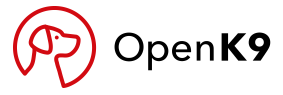
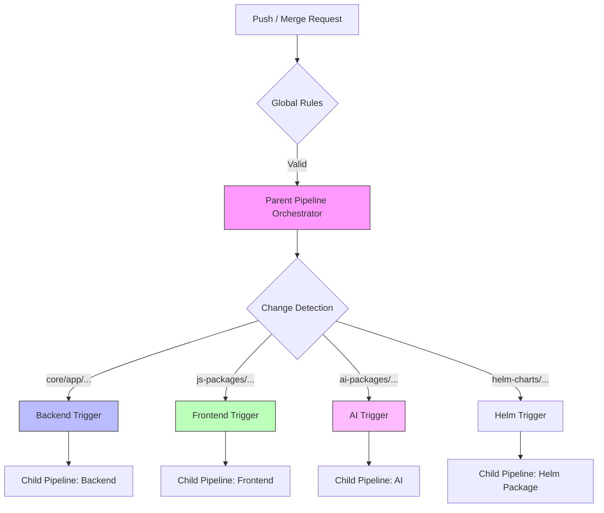
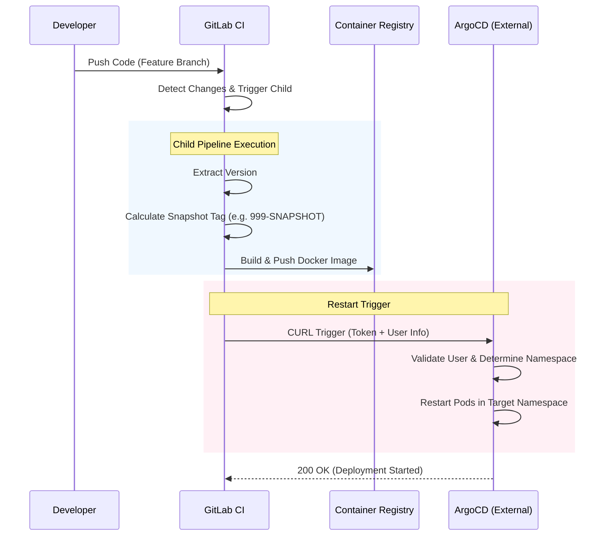

<p align="center">
  <a href="https://www.openk9.io/" rel="noopener" target="_blank"></a></p>
</p>

<h1 align="center">OpenK9</h1>

<div align="center">

OpenK9 is a new Cognitive Search Engine that allows you to build next generation search experiences. It employs a scalable architecture and machine learning to enrich unstructured data and give the best user experience possible.

[](https://github.com/smclab/OpenK9/blob/master/LICENSE)
[](https://github.com/smclab/OpenK9/releases)
[](https://twitter.com/K9Open)

</div>

## Quickstart

To make Openk9 run on your machine with latest stable release, you just need [docker](https://docs.docker.com/get-started/get-docker/) installed and run:

```bash
docker compose up -d
```

Monitor logs of *openk9-initializer* container to check when all is started:

```bash
docker logs -f openk9-initializer
```

Following message is displayed when all is started:

```bash
🚀 Starting Data Seeder...
1️⃣  Creating Tenant...
✅ 1/4 Tenant Created. Schema: grookey
🕵️  Hunting for password in logs...
🔎 Scanning logs for password (Attempt 1/10)...
2️⃣  Initializing Default Data...
✅ 2/4 Tenant Initialized.
3️⃣  Configures Connectors...
✅ 3/4 Web Connector configured.
✅ 4/4 Minio Connector configured.
🔐 FOUND PASSWORD: 52c1d7c5-2e50-471d-8b3f-12d286dafae3
🎉 Done.
```

After all components have been started, openk9 is runinng with initial configuration at address *https://demo.openk9.localhost*.

To access to admin panel go to [https://demo.openk9.localhost/admin](https://demo.openk9.localhost/admin). Access with username *k9admin* and using password founded in openk9-initizializer logs.

Search frontend is available here:

- [Standalone search frontend](http://demo.openk9.localhost) to test search on indexed data.

If you want to try Openk9 with also File Handling and Gen Ai components use [compose-all.yaml](compose-all.yaml) file:

```bash
docker compose -f compose.yaml -f compose-all.yaml up -d
```

To test conversational search:

- [Conversational search frontend](http://demo.openk9.localhost/chat) to chat with indexed data

Enjoy Openk9!

## Installation for production

To install Openk9 in production is advisable to deploy it in Kubernetes or Openshift environments.

You can find a complete guide to do it [here](./helm-charts/README.md) using Helm Charts.

## CI/CD Architecture

OpenK9 uses a **Modularized GitLab CI/CD** system designed for scalability, maintainability, and rapid development. The architecture follows a **Parent-Child Pipeline** pattern to optimize resource usage and isolate component builds.

### 🧩 Modular Structure

| Component | Logic File | Description |
|-----------|------------|-------------|
| **Orchestrator** | `.gitlab/.gitlab-ci.yaml` | Main entry point. Loads shared templates and triggers domain pipelines. |
| **Common Logic** | `.gitlab/.gitlab-templates.yaml` | Centralized build scripts (Maven/Yarn), rules, and variables. |
| **Backend** | `.gitlab/ci/backend.yaml` | Triggers for Java/Quarkus modules (Datasource, Ingestion, Searcher...). |
| **Frontend** | `.gitlab/ci/frontend.yaml` | Triggers for React/JS modules (Admin UI, Search Frontend...). |
| **AI Modules** | `.gitlab/ci/ai.yaml` | Triggers for AI/ML python components (RAG, Embeddings...). |
| **Helm & Conn.** | `.gitlab/ci/common.yaml` | Triggers for Helm Charts and Connectors (Main branch only). |

### 🔄 Pipeline Flow

The pipeline automatically detects changes in specific directories and triggers only the relevant child pipelines.



### 🚀 Build & Restart Strategy

We use a sophisticated build strategy that adapts to the branch type:

- **Main / Tag**: Builds **OFFICIAL** images and pushes them. Triggers deployment on **Production/Staging**.
- **Feature Branch**: Builds **SNAPSHOT** images (e.g., `999-SNAPSHOT`) for developer testing. Triggers restart on personal developer namespaces.
- **Merge Request**: Runs builds and tests **WITHOUT** pushing images, ensuring code quality before merge.



## Docs and Resources

- [Official Documentation](https://www.openk9.io/)


## License

Copyright (c) the respective contributors, as shown by the AUTHORS file.

This program is free software: you can redistribute it and/or modify
it under the terms of the GNU Affero General Public License as published
by the Free Software Foundation, either version 3 of the License, or
(at your option) any later version.

This program is distributed in the hope that it will be useful,
but WITHOUT ANY WARRANTY; without even the implied warranty of
MERCHANTABILITY or FITNESS FOR A PARTICULAR PURPOSE. See the
GNU Affero General Public License for more details.

You should have received a copy of the GNU Affero General Public License
along with this program. If not, see <http://www.gnu.org/licenses/>.
