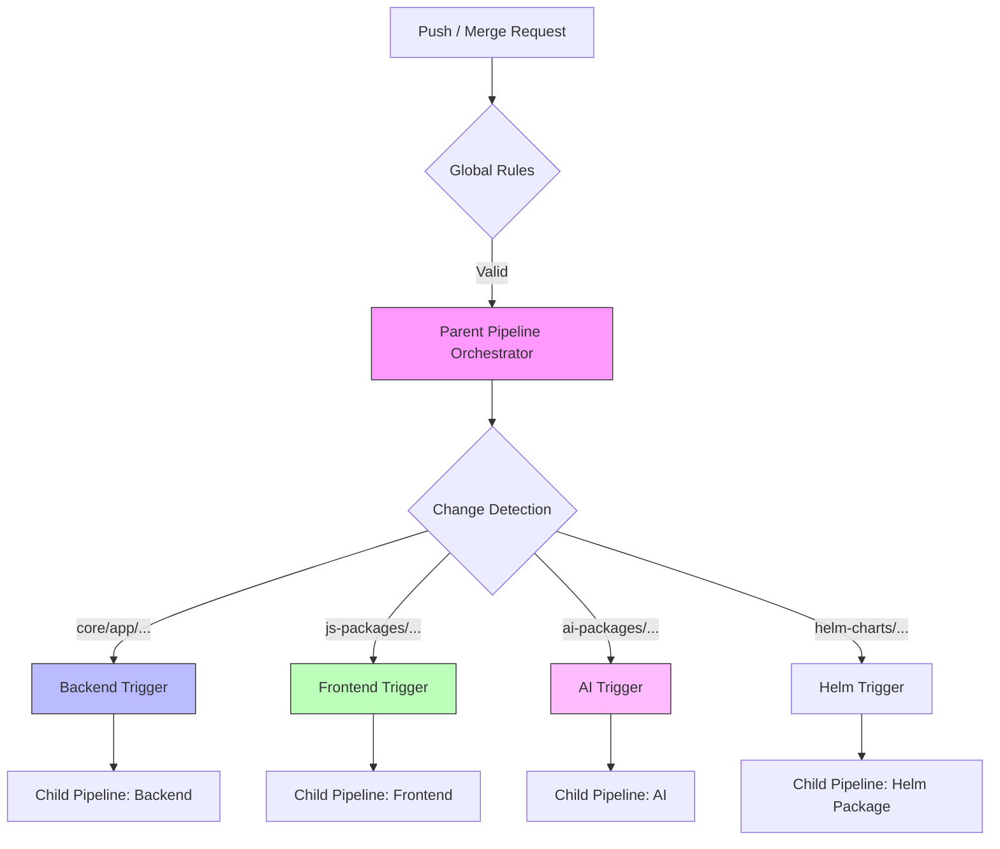
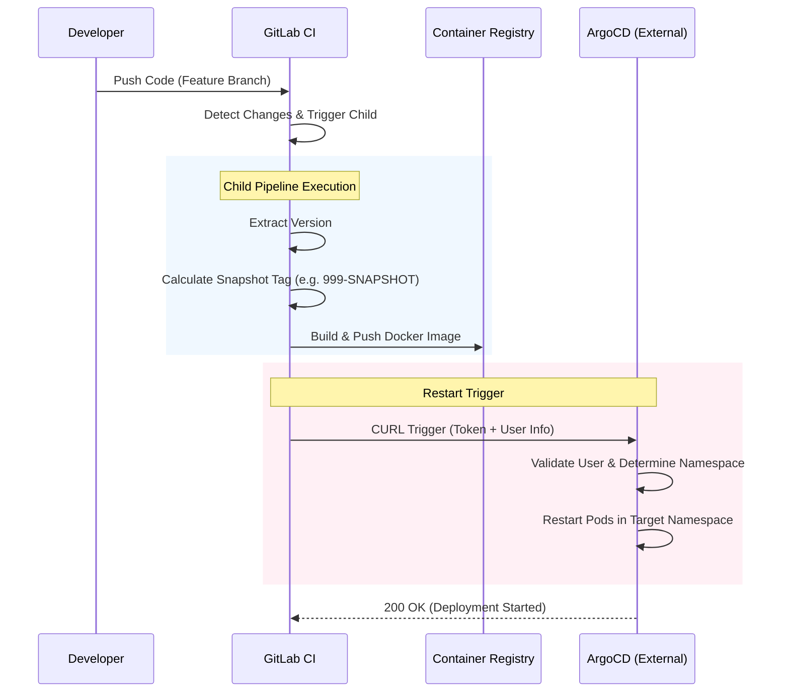

<p align="center">
  <a href="https://www.openk9.io/" rel="noopener" target="_blank"></a></p>
</p>

<h1 align="center">OpenK9</h1>

<div align="center">

OpenK9 is a new Cognitive Search Engine that allows you to build next generation search experiences. It employs a scalable architecture and machine learning to enrich unstructured data and give the best user experience possible.

[](https://github.com/smclab/OpenK9/blob/master/LICENSE)
[](https://github.com/smclab/OpenK9/releases)
[](https://twitter.com/K9Open)

</div>

## Quickstart

To run OpenK9 on your machine with the latest stable release, you just need [Docker](https://docs.docker.com/get-started/get-docker/) installed.

```bash
docker compose up -d
```

Once started, OpenK9 is running at **https://demo.openk9.localhost**.

### Access

| Panel | URL | Credentials |
|---|---|---|
| Admin UI | [https://demo.openk9.localhost/admin](https://demo.openk9.localhost/admin) | `admin` / `admin` |
| Tenant UI | [https://tenant-manager.openk9.localhost/admin](https://tenant-manager.openk9.localhost/admin) | `admin` / `admin` |
| Search | [https://demo.openk9.localhost](https://demo.openk9.localhost) | — |

All administration panels use **HTTP Basic Authentication** with `admin` / `admin`.

### Compose profiles

The default `compose.yaml` starts the core stack (PostgreSQL, OpenSearch,
RabbitMQ, API Gateway, backend services, frontends, and Caddy reverse
proxy). Additional capabilities are available as optional profiles:

| Profile | Compose file | What it adds |
|---|---|---|
| `file-handling` | `compose-with-file-handling.yaml` | MinIO, File Manager, Tika, MinIO Connector |
| `gen-ai` | `compose-with-gen-ai.yaml` | RAG module, Embedding module, Talk-To chat |
| `oauth2` | `compose-with-oauth2-server.yaml` | Keycloak identity provider |


```bash
# Core + File Handling + Gen AI
docker compose \
  -f compose.yaml \
  -f compose-with-file-handling.yaml \
  -f compose-with-gen-ai.yaml \
  up -d

# Everything (core + all overlays)
docker compose \
  -f compose.yaml \
  -f compose-with-file-handling.yaml \
  -f compose-with-gen-ai.yaml \
  -f compose-with-oauth2-server.yaml \
  up -d
```

With the Gen AI profile, conversational search is available at
[https://demo.openk9.localhost/chat](https://demo.openk9.localhost/chat).

## Development with k9.sh

For developers building from source, the `k9.sh` script wraps Maven,
Docker, and Docker Compose into a single CLI.

### Prerequisites

- Docker (with Compose v2 plugin or standalone `docker-compose`)
- Java 21+ (Maven not required — the bundled `mvnw` wrapper is used)
- Node.js ≥ 20 / Yarn (for frontend builds)
- Python 3.10+ (for AI service builds)

Run `./k9.sh doctor` to check all prerequisites at once (see below).

### Quick start

```bash
./k9.sh up                                 # Start core services (pulls images)
./k9.sh up --build                         # Build from source, then start
./k9.sh up --with=gen-ai --build           # Build and start with AI services
./k9.sh up --all                           # Start all profiles
```

### Common workflows

```bash
./k9.sh build datasource                   # Build a single service
./k9.sh build datasource searcher          # Build multiple (shared deps once)
./k9.sh build datasource --skip-shared-core  # Skip shared deps if unchanged
./k9.sh build --with=gen-ai                # Build core + AI images
./k9.sh build --tag=1.0.0                  # Build with a custom image tag
./k9.sh build datasource --platform=amd64 # Cross-compile for amd64 on arm64 host
./k9.sh restart datasource --build        # Rebuild and restart one service
./k9.sh logs tenant-manager               # Follow logs for a service
./k9.sh down                              # Stop containers (volumes preserved)
./k9.sh down -v                           # Stop containers and remove volumes
```

### Profiles

Profiles are additive. Core services are always included.

| Profile | Services added |
|---|---|
| `core` (default) | PostgreSQL, OpenSearch, RabbitMQ, API Gateway, Datasource, Tenant Manager, Ingestion, Searcher, frontends, Caddy |
| `file-handling` | MinIO, File Manager, Tika, MinIO Connector |
| `gen-ai` | RAG module, Embedding module, Talk-To |
| `oauth2` | Keycloak OAuth2/OIDC identity provider |

```bash
./k9.sh up --with=oauth2                   # Core + Keycloak
./k9.sh up --with=gen-ai --with=oauth2     # Core + AI + Keycloak
./k9.sh up --all                           # All profiles
```

### doctor — check prerequisites

```bash
./k9.sh doctor
```

Checks java, docker, docker compose, node, yarn, and python3.
Reports `OK` / `MISSING` / `WRONG_VERSION` for each tool with
platform-specific install hints. Exits non-zero if any check fails.

```
k9.sh — prerequisite check

  java (>= 21)           OK  (21.0.7)
  docker                 OK  (29.4.2)
  docker compose (v2)    OK  (2.35.1)
  node (>= 20)           OK  (22.14.0)
  yarn                   OK  (1.22.22)
  python3 (>= 3.10)      OK  (3.12.3)

✓ All prerequisites satisfied.
```

### push — publish images to a registry

```bash
OPENK9_REGISTRY=registry.example.com \
  ./k9.sh push datasource searcher --tag=1.0.0
```

Tags and pushes locally built images to `$OPENK9_REGISTRY/$GROUP/<service>:<tag>`. The registry
can also be set in `.env` (see below). Images must be built for
`linux/amd64` before pushing — if the local image is `arm64`, the
command refuses with a rebuild instruction:

```
✗ Image openk9/openk9-datasource:local-dev is arm64, not amd64.
  Rebuild for the correct platform before pushing:
  ./k9.sh build datasource --tag=local-dev --platform=amd64
```

> **Note:** cross-platform builds from arm64 to amd64 use QEMU emulation
> and can be significantly slower, especially for AI Python images.

### Configuration via .env

Create an `openk9/.env` file to persist local configuration.
Shell environment variables always take precedence over `.env` values.

```bash
# openk9/.env
TAG=local-dev
GROUP=openk9
OPENK9_REGISTRY=registry.example.com
```

Supported variables:

| Variable | Default | Purpose |
|---|---|---|
| `TAG` | `local-dev` | Docker image tag used by build/push |
| `GROUP` | `openk9` | Docker image group/org prefix (e.g. `smclab`) |
| `OPENK9_REGISTRY` | _(none)_ | Target registry hostname for `./k9.sh push` |

Run `./k9.sh` without arguments for full usage information.

## Installation for production

To install Openk9 in production is advisable to deploy it in Kubernetes or Openshift environments.

You can find a complete guide to do it [here](./helm-charts/README.md) using Helm Charts.

## CI/CD Architecture

OpenK9 uses a **Modularized GitLab CI/CD** system designed for scalability, maintainability, and rapid development. The architecture follows a **Parent-Child Pipeline** pattern to optimize resource usage and isolate component builds.

### 🧩 Modular Structure

| Component | Logic File | Description |
|-----------|------------|-------------|
| **Orchestrator** | `.gitlab/.gitlab-ci.yaml` | Main entry point. Loads shared templates and triggers domain pipelines. |
| **Common Logic** | `.gitlab/.gitlab-templates.yaml` | Centralized build scripts (Maven/Yarn), rules, and variables. |
| **Backend** | `.gitlab/ci/backend.yaml` | Triggers for Java/Quarkus modules (Datasource, Ingestion, Searcher...). |
| **Frontend** | `.gitlab/ci/frontend.yaml` | Triggers for React/JS modules (Admin UI, Search Frontend...). |
| **AI Modules** | `.gitlab/ci/ai.yaml` | Triggers for AI/ML python components (RAG, Embeddings...). |
| **Helm & Conn.** | `.gitlab/ci/common.yaml` | Triggers for Helm Charts and Connectors (Main branch only). |

### 🔄 Pipeline Flow

The pipeline automatically detects changes in specific directories and triggers only the relevant child pipelines.



### 🚀 Build & Restart Strategy

We use a sophisticated build strategy that adapts to the branch type:

- **Main / Tag**: Builds **OFFICIAL** images and pushes them. Triggers deployment on **Production/Staging**.
- **Feature Branch**: Builds **SNAPSHOT** images (e.g., `999-SNAPSHOT`) for developer testing. Triggers restart on personal developer namespaces.
- **Merge Request**: Runs builds and tests **WITHOUT** pushing images, ensuring code quality before merge.



## Docs and Resources

- [Official Documentation](https://www.openk9.io/)


## License

Copyright (c) the respective contributors, as shown by the AUTHORS file.

This program is free software: you can redistribute it and/or modify
it under the terms of the GNU Affero General Public License as published
by the Free Software Foundation, either version 3 of the License, or
(at your option) any later version.

This program is distributed in the hope that it will be useful,
but WITHOUT ANY WARRANTY; without even the implied warranty of
MERCHANTABILITY or FITNESS FOR A PARTICULAR PURPOSE. See the
GNU Affero General Public License for more details.

You should have received a copy of the GNU Affero General Public License
along with this program. If not, see <http://www.gnu.org/licenses/>.
