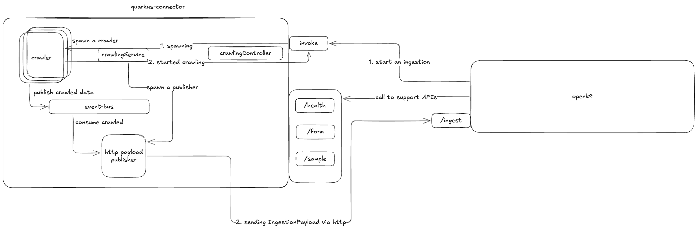

# Connettore Base Quarkus

Questo repository contiene lo starter di un connettore Openk9, implementato in Quarkus.

## Job Crawling

Il Job che fa partire il crawling dei dati viene creato nel momento in cui 
viene ricevuta una richiesta di Invoke. 
Alcune delle componenti individuate in questa fase sono:

1. **Interface Worker, void work(Promise<Void> promise, MessageProducer<IngestionDTO> producer)**:  
   Il worker che naviga nella sorgente dati, è l'interfaccia che il programmatore deve implementare
   per estrarre i documenti dalla sorgente, il lavoro viene eseguito in maniera asincrona.
   Invia un messaggio tramite il producer per ogni documento estratto dalla sorgente, con il metodo
   producer.write(); Il body del messaggio è un oggetto IngestionDTO.
   Quando termina il lavoro chiama promise.complete per terminare il crawler.

2. **Interface WorkerFactory, Worker createWorker(InvokeRequest invokeRequest)**:  
   È l'interfaccia che il programmatore implementa per creare un nuovo worker per ogni richiesta
   all'endpoint /invoke.

   
3. **HttpPublisherVerticle**:  
   È un verticle che registra un consumer di eventi sull'event-bus, il suo indirizzo può essere
   l'FQDN della classe. Nel costruttore viene passato il client http che viene usato per chiamare
   Openk9.
   Il client deve essere configurabile via property.
   Il consumer accetta dei messaggi con body di tipo IngestionDTO .
   Il consumer invoca il client http in POST, sull'endpoint /ingest, per inviare il payload.
   Il client viene invocato su un worker thread di Vertx.

   
4. **CrawlerVerticle**:  
   È un verticle che viene deployato per ogni InvokeRequest, il costruttore del verticle accetta un worker,
   cioè l'oggetto che il programmatore ha implementato per effettuare il lavoro di recupero dati.
   Il worker viene invocato su un worker thread di Vertx, all'interno di un future.
   Quando viene invocato il worker, il verticle deve fornire un messageProducer di IngestionDTO e la promise del future in cui viene eseguito.

5. **IngestionDTOCodec**:  
   È l'implementazione di un MessageCodec di Vertx che deve essere registrato nell'event bus e
   utilizzato dal producer nelle deliveryOptions. Per implementarlo usare JsonObjectMessageCodec
   come esempio. (length e pos)

6. **CrawlingService**:  
   Configura il client http che verra usato da HttpPublisherVerticle per comunicare con Openk9.
   Le configurazioni vengono prese da properties.
   Quando viene costruito, crea e deploya HttpPublisherVerticle.
   Inietta WorkerFactory.
   Espone il metodo crawling(InvokeRequest) che viene usato per creare una nuova istanza di worker,
   tramite la factory e una nuova istanza di CrawlerVerticle, che fa partire il worker.

## REST API

Il connettore espone delle API per poter interagire con Openk9.

Bisogna definire un OpenAPI, dal quale saranno generati i Controller che i connettori implementeranno. (Il file OpenAPI permettera' di autogenerare codice anche per altri linguaggi di programmazione)

### Invocation API 

- InvokeController: POST /invoke 

    body InvokeRequest

    Invoca CrawlingService per avviare il lavoro.

### Plugin API

I connettori devono esporre delle API che openk9 invoca quando vuole configurare un connettore:

- Health: GET /health

    Fornisce informazioni sullo stato di salute del connettore, se puo' essere utilizzato.

- Form: GET /form

    Usato per costruire l'interfaccia di configurazione di un connettore.

- Sample: GET /sample 

    Fornisce un esempio completo di quello che sara' il payload che il connettore manda ad openk9.
    Serve a generare il mapping da usare durante l'indicizzazione e la ricerca.

## Model

1. IngestionDTO

   È il DTO che Openk9 accetta quando riceve un documento.

   - **contentId**: unique contentId for data sent to Openk9
   - **datasourceId**: ID of Datasource (received in request and propagated for)
   - **scheduleId**: ID of Schedule (received in request and propagated for)
   - **tenantId**: ID of Tenant (received in request and propagated for)
   - **parsingDate**: date when data extraction starts
   - **rawContent**: raw text content of data
   - **datasourcePayload**: structured content of data
   - **resources**: resources attached to data (Optional)
   - **acl**: acl associated with data (Optional)
   - **type**: used to specify the type of message. (Optional)
   - **last**: boolean to indicates all data are sent to Openk9 (Deprecated, see `type` property)

2. InvokeRequest

   È il body della richiesta che invoca il connettore.

   - **datasourceId**: ID of Datasource
   - **scheduleId**: ID of Schedule
   - **tenantId**: ID of Tenant
   - **timestamp**: Timestamp relative to last ingestion date