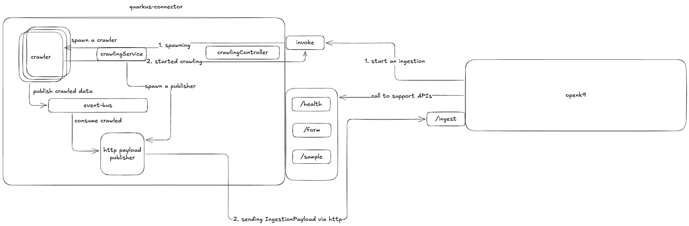

# Archetype

This Maven archetype generates a base connector for OpenK9, built with Quarkus.



It provides a custom library from **connector-openapi-server** module, to know what the library implements [click here](../connector-openapi-server).

## How to Develop a New Connector

There are some specifications you need to follow when developing a new OpenK9 Connector:

### Implementation of Library Classes

These classes implement the REST classes from the library and adapt their behavior for the connector.

- **HealthResourceImpl.java**   
   It exposes `/health` endpoint used from OpenK9 to get the status of connector.
   It is useful to verify if the connector is available or not during the datasource creation phase.
   ```json
   {
     "status": "UP"
   }
   ```


- **InvokeResourceImpl.java**  
   It exposes `/invoke` endpoint, it is invoked from OpenK9 to start the crawling of data.
  ```json
  {
    "datasourceId": 984573908,
    "scheduleId": "008f8ad6-884f-4ccd-8e6a-9772e407d325",
    "tenantId": "465bb95b-d6f0-48cf-8bfe-4d1bf366dbc7",
    "timestamp": 1753866303,
    "jsonConfig": {}
  }
  ```


- **FormResourceImpl.java**  
   It exposes `/form` endpoint that returns the connector configuration.
  ```json
  {
    "formFields": [
      {
        "info": "",
        "label": "Test Form",
        "name": "testForm",
        "type": "string",
        "size": 2,
        "required": false,
        "values": [
          {
            "isDefault": true
          }
        ],
        "validator": {
          "min": 0,
          "max": 10,
          "regex": "/[[:test]]"
        }
      },
      {
        "info": "",
        "label": "Main Object",
        "name": "mainObject",
        "type": "number",
        "size": 0.78,
        "required": true,
        "values": [
          {
            "isDefault": true,
            "value": "Value example"
          }
        ],
         "validator": {
           "min": 0,
           "max": 10,
           "regex": "/[[:test]]"
         }
       }
     ]
  } 
  ```


- **SampleResourceImpl.java**  
   It exposes `/sample` endpoint that returns an example of IngestionDTO object accepted by OpenK9.
   The content of the `datasourcePayload` field depends on the type of resource to be ingested.
   ```json
   {
    "datasourceId": 984573908,
    "tenantId": "c2812C58-2Fe5-A2Fa-BB4d-A41097cbfE3B",
    "contentId": "Bb9cA060-A8D4-9C1d-bDD2-7103f3FDaC2a",
    "parsingDate": "17053261",
    "rawContent": "test",
    "datasourcePayload": 
    {
      "uuid": "8c49e052-db30-4b7f-9566-2e5c0ed8e0e9",
      "title": "DatasourcePayload test"
    },
    "resources": {
      "binaries": [
        {
          "id": "a0Af6b58-E1FB-CbcD-135c-6927195c1aFf",
          "name": "example",
          "contentType": "application/json",
          "data": "<base64-string>",
          "resourceId": "3CB769de-1dEf-bc87-2aeE-Bacfe2FF5Df4"
        }
      ],
      "splitBinaries": true
    },
    "acl": {},
    "scheduleId": "66AeAFE8-0Ac3-34c4-4ADb-424ecB9AaCb8",
    "type": "DOCUMENT"
  }
  ```


### Connector Base Classes

These base classes are required in all connectors.
They are responsible for crawling data and sending them one by one to OpenK9 asynchronously.

- **HealthResourceTest.java**  
    A test class that verifies if the health endpoint responds correctly with HTTP status 200 and body status set to "UP".


- **Worker.java**  
    This interface is implemented by `WorkerImp.java`.


- **WorkerImpl.java**  
   It overrides _work_ method from `Worker` interface, it sends a message through the producer for each data retrieved from the source, using the `producer.write()` method.  
   The body of the message is an `IngestionDTO` object.  
   Once the process is complete, it calls `promise.complete()`.


- **WorkerFactory.java**  
   This interface is implemented by `WorkerFactoryImpl.java`.


- **WorkerFactoryImpl.java**  
   It overrides _createWorker_ method from `WorkerFactory` interface. It returns a new `Worker` instance each time an /invoke request is made.  
   This class **must be application scoped**, it means that Quarkus will create a single instance and reuse it for the entire application lifecycle.


- **CrawlingService.java**  
    It configures the HTTP client that will be used by `HttpPublisherVerticle` to communicate with OpenK9, the configuration is loaded from _application.properties_.  
    It deploys `HttpPublisherVerticle` and registers `IngestionDTOCodec` at startup.  
    For each /invoke request, it deploys a new `CrawlerVerticle`.  
    The `CrawlerVerticle` is initialized with a new Worker instance, which is created by the injected `WorkerFactoryImpl`.


- **IngestionDTOCodec.java**  
    This class implements `MessageProducer` and it is used by the producer in the _work_ method of `WorkerImpl` to send `IngestionDTO` objects through the event bus.  
    This implementation was created to allow the event bus to send `IngestionDTO` objects, since the event bus does not support sending messages of custom classes directly.


- **CrawlerVerticle.java**  
    This verticle is deployed for each `InvokeRequest`.  
    A `Worker` instance, created via `WorkerFactoryImpl` injected in `CrawlingService`, is passed to its constructor.  
    It sets up the producer using the IngestionDTOCodec to send data to `HttpPublisherVerticle`.  
    The _work_ method of `WorkerImpl` is executed on a worker thread via a promise.  
    If the promise completes successfully, the verticle is undeployed.


- **HttpPublisherVerticle**  
   A verticle responsible for consuming event bus messages and sending `IngestionDTO` objects one by one to OpenK9 using **_/ingest_** POST endpoint.  
   The HTTP client configuration is configured through `CrawlingService`.  
   The class name is used as the virtual address on the event bus to send messages to it.

---

## Install

To install the archetype and the custom library, go to the root of the project and write:

```shell
mvn install
```  

## Generate Connector

To generate the connector, write one of these commands:

### Linux

```shell  
mvn archetype:generate                      \
-DarchetypeGroupId=io.openk9.connectors     \
-DarchetypeArtifactId=archetype             \
-DarchetypeVersion=1.0.0-SNAPSHOT           \
-DgroupId=<my.groupId>                      \
-DartifactId=<my-artifactId>                \
-Dversion=<myVersion>                       
```

### Windows (PowerShell)

```shell  
mvn archetype:generate `
"-DarchetypeGroupId=io.openk9.connectors" `
"-DarchetypeArtifactId=archetype" `
"-DarchetypeVersion=1.0.0-SNAPSHOT" `
"-DgroupId=<my.groupId>" `
"-DartifactId=<my-artifactId>" `
"-Dversion=<myVersion>"
```

In these commands, you need to specify the full information about the archetype you want to use (its `groupId`, its `artifactId`, its `version`)
and the information about the new project you want to create (`artifactId`, `groupId` and `version`).

## Docker
The project includes an executable Dockerfile, you have just to build an image and run it:

### Build Image

```shell
# Create the jar file
mvn clean package
# Build the Docker image
docker build -f src/main/docker/Dockerfile.jvm -t <imageName> .
```

### Run Container
```shell
docker run -p 8080:8080 --name <containerName> <imageName> 
```

## Modify Connector

After generating it, changes need to be made to the connector to create a concrete implementation(**In these examples, snippets of Strapi connector code are used!**):

1. Update `FormResourceImpl` to get configuration from OpenK9 for your connector;
   ```java
      // Setting up a FormField example
      private List<FormField> getFormFieldList() {
          List<FormField> formFieldList = new ArrayList<>();

          FormField formField = new FormField();
          formField.setInfo("strapiData");
          formField.setName("Strapi-Data");
          formField.setLabel("Strapi Data");
          formField.setRequired(false);
          formField.setSize(1.0);
          formField.setType(FormField.Type.string);
          formField.setValidator(getValidator());
          formField.setValues(getFiledValueList());
          formFieldList.add(formField);
          return formFieldList;
      }

      private FormFieldValidator getValidator() {
          FormFieldValidator formFieldValidator = new FormFieldValidator();
          formFieldValidator.setMin(0L);
          formFieldValidator.setMax(50L);
          formFieldValidator.setRegex("/[[:strapi]]");
          return formFieldValidator;
      }

      private List<FieldValue> getFiledValueList() {
          List<FieldValue> formFieldValueList = new ArrayList<>();
          FieldValue formFieldValue = new FieldValue();
          formFieldValue.setIsDefault(false);
          formFieldValue.setValue("Strapi Data");
          formFieldValueList.add(formFieldValue);
          return formFieldValueList;
      }
   ```
2. Update Openk9 configuration in _application.properties_ to set the correct host and port for **_/ingest_** endpoint in `HttpPublisherVerticle`;
3. Update datasourcePayload field in `IngestionDTO` example within `SampleResourceImpl` to represent the data collected.
   Since this data varies depending on the connector implementation (e.g., a YouTube connector will have different data than a database connector), you have to modify this field to represent the specific data for your implementation;
   ```java
      // Setting an IngestionDTO example
      @Override
      public IngestionDTO sample() {
          IngestionDTO ingestionDTO = new IngestionDTO();
          DatasourcePayload datasourcePayload = getDatasourcePayload();
          ingestionDTO.setParsingDate("17053261");
          ingestionDTO.setContentId(UUID.randomUUID());
          ingestionDTO.setRawContent(mapDatasourcePayloadAsString());
          ingestionDTO.setDatasourcePayload(datasourcePayload);
          ingestionDTO.setDatasourceId(984573908L);
          ingestionDTO.setScheduleId(UUID.randomUUID());
          ingestionDTO.setTenantId(UUID.randomUUID());
          ingestionDTO.setAcl(null);
          ingestionDTO.setLast(true);
          return ingestionDTO;
      }

      private DatasourcePayload getDatasourcePayload() {
          DatasourcePayload datasourcePayload = new DatasourcePayload();
          Map<String, Object> data = new HashMap<>();
          Map<String, String> dataValues = new HashMap<>();
          data.put("id",1);
          dataValues.put("country", "Italy");
          dataValues.put("language", "Italian");
          dataValues.put("capital","Rome");
          dataValues.put("value", "Euro");
          data.put("attributes", dataValues);
          datasourcePayload.setAdditionalProperty("data", data);

          Map<String, Object> meta = new HashMap<>();
          Map<String, Integer> metaValues = new HashMap<>();
          metaValues.put("page",1);
          metaValues.put("pageSize",10);
          metaValues.put("pageCount",1);
          metaValues.put("total", 1);
          meta.put("pagination", metaValues);
          datasourcePayload.setAdditionalProperty("meta", meta);
          return datasourcePayload;
      }

      private String mapDatasourcePayloadAsString() {
          DatasourcePayload datasourcePayload = getDatasourcePayload();
          ObjectMapper mapper = new ObjectMapper();
          try {
              return mapper.writeValueAsString(datasourcePayload);
          } catch (JsonProcessingException e) {
              throw new RuntimeException(e);
          }
      }
   ```
4. Implement a class to retrieve data from the source, since this connector is a base project, it does not have an implementation for crawling data;
   ```java
    @ApplicationScoped
    public class StrapiImpl {

      private static final Logger LOGGER = Logger.getLogger(StrapiImpl.class);

      @ConfigProperty(name = "strapi.port")
      private int port;
      @ConfigProperty(name = "strapi.host")
      private String host;
      @ConfigProperty(name = "strapi.path")
      private String path;

      @Inject
      Vertx vertx;

      public Future<JsonObject> getStrapiData() {
          WebClient client = WebClient.create(vertx);
          return client
                  .get(port, host, path)
                  .as(BodyCodec.jsonObject())
                  .send()
                  .map(HttpResponse::body)
                  .onSuccess(res -> {
                      if (LOGGER.isDebugEnabled())
                          LOGGER.debug(res.encodePrettily());
                  })
                  .onFailure(res -> LOGGER.error("Error: " + res.getMessage()));
      }
   }
   ```
5. Update _work_ method in `WorkImpl` to implement the creation of the `IngestionDTO` using the collected data.  
   You have to transform raw data retrieved into structured `IngestionDTO` instances to send via `IngestionDTOCodec` to `HttpPublisherVerticle`;
   ```java
   @Override
    public void work(Promise<?> promise, MessageProducer<IngestionDTO> producer) {
        strapi.getStrapiData()
                .onComplete(res -> {
                    JsonObject jsonObject = res.result();
                    JsonArray strapiData = jsonObject.getJsonArray("data");

                    // Setting up IngestionDTO instance for each DatasourcePayload (strapiData) received
                    for (int i = 0; i < strapiData.size(); i++) {
                        JsonObject singleStrapiData = strapiData.getJsonObject(i);
                        IngestionDTO ingestionDTO = new IngestionDTO();
                        DatasourcePayload datasourcePayload = new DatasourcePayload();

                        ingestionDTO.setContentId(UUID.randomUUID());
                        ingestionDTO.setDatasourceId(invokeRequest.getDatasourceId());
                        ingestionDTO.setScheduleId(UUID.fromString(invokeRequest.getScheduleId()));
                        ingestionDTO.setTenantId(UUID.fromString(invokeRequest.getTenantId()));
                        ingestionDTO.setParsingDate(invokeRequest.getTimestamp().toString());
                        ingestionDTO.setRawContent(singleStrapiData.toString());
                        datasourcePayload.setAdditionalProperty("data", singleStrapiData);
                        datasourcePayload.setAdditionalProperty("meta", jsonObject.getValue("meta"));
                        ingestionDTO.setDatasourcePayload(datasourcePayload);
                        ingestionDTO.setType(PayloadType.DOCUMENT);
                        ingestionDTO.setLast(i == strapiData.size() - 1);
                        producer.write(ingestionDTO);
                    }
                    promise.complete();
                });
    }
   ```

