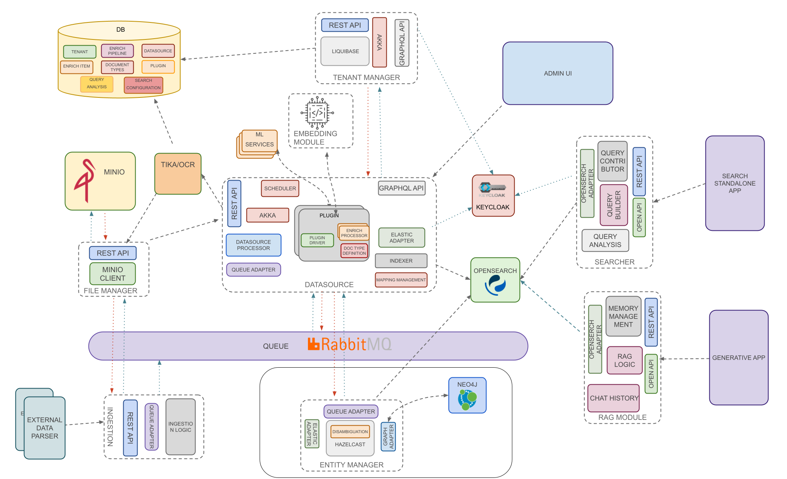

Openk9's architecture is composed by multiple components. Components can be splitted in third-party components and
custom components.

### Third-party components

- [**Opensearch**](https://opensearch.org/): open source search and analytics engine.
- [**RabbitMQ**](https://www.rabbitmq.com/): open source message broker.
- [**Keycloak**](https://www.keycloak.org/): open source identity and access management.
- [**MinIo**](https://min.io/): high-performance, S3 compatible object storage.

### Custom components

Custom components can be divided in three different blocks:

- **Core components**: necessary components to install Openk9 in its core search features
- **Gen Ai components**: necessary components to add generative ai features to product
- **File Handling components**: necessary components to add features to handle and analyze binaries

Core components are:

- [**Ingestion**](ingestion): is the component that handles data ingestion logic.
- [**Datasource**](datasource): is the component that handles data source and enrich pipeline management logic .
- [**Tenant Manager**](tenant-manager): is the component that handles tenant management activities.
- [**Searcher**](searcher): is the component that defines search logic.

Gen Ai components are:

- [**Rag Module**](rag-module): is the component that implements Retrieval Augmented Generation logic. 
- [**Embedding Module**](embedding-module): is the component that performs data vectorization.

File handlign components are:

- [**File Manager**](file-manager): is the component that handles binary files management logic.
- [**Tika**](file-manager): is the component that performs data parsing.

 
 

