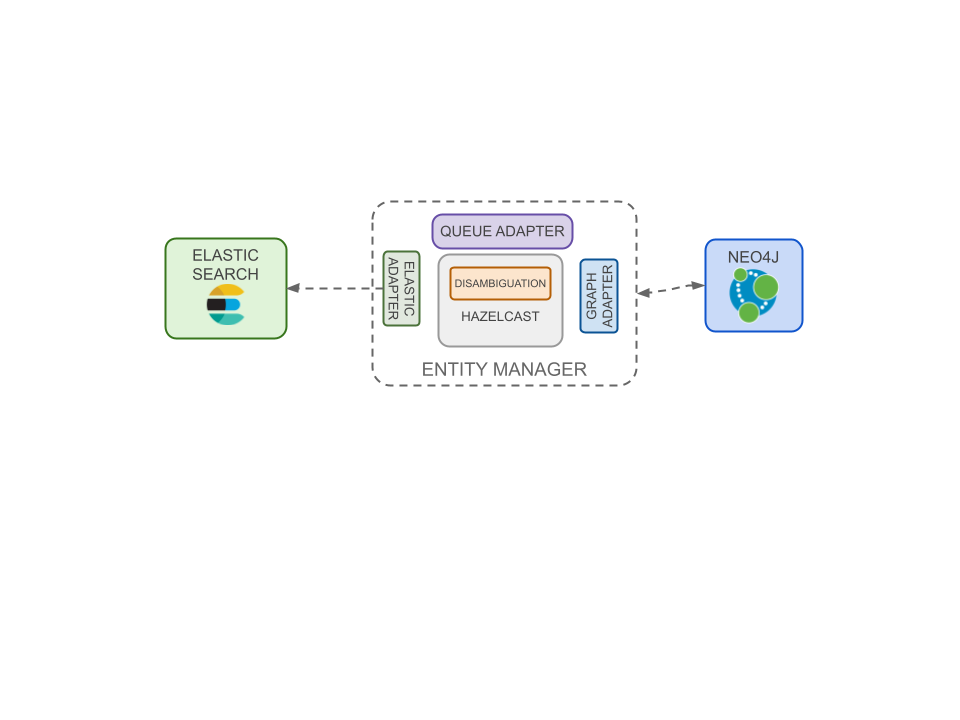

Entity Manager is the component delegated to manage entities and ontologie extracted from ingestioned contents. In particular it
analyzes entities, disambiguate them using graph algorithms and add them on Graph database (with their relations) and on Elasticsearch.

### Graph Adapter

Graph adapter defines the communication logic with graph database. Openk9 basically uses Neo4j as graph Database and graph
adapter maps Neo4j Apis.

### Disambiguation

Disambiguation component defines the logic under which entities are disambigued. For every entity a set of possible elegible
candidates is returned. Graph algorithms and Machine Learning techniques, using entity context, are applied to recognize
if one of the candidate, already present in knowledge base, corresponds to the current analyzed entity. If not, a new entity
is created.

### Hazelcast

[Hazelcast](https://hazelcast.com/) is used to distribute entity management logic in a cluster,
in order to be able to scale and parallelize the disambiguation process.

### Elastic Adapter

Elastic maps Elasticsearch APIs to be used in Openk9. See
[client documentation](https://www.elastic.co/guide/en/elasticsearch/client/index.html) to realize adapter.

### Queue Adapter

Adapter to send data on queuing system. It is developed for the message broker used. Openk9 uses RabbitMQ
as message broker. See [client documentation](https://www.rabbitmq.com/clients.html) to realize adapter.
