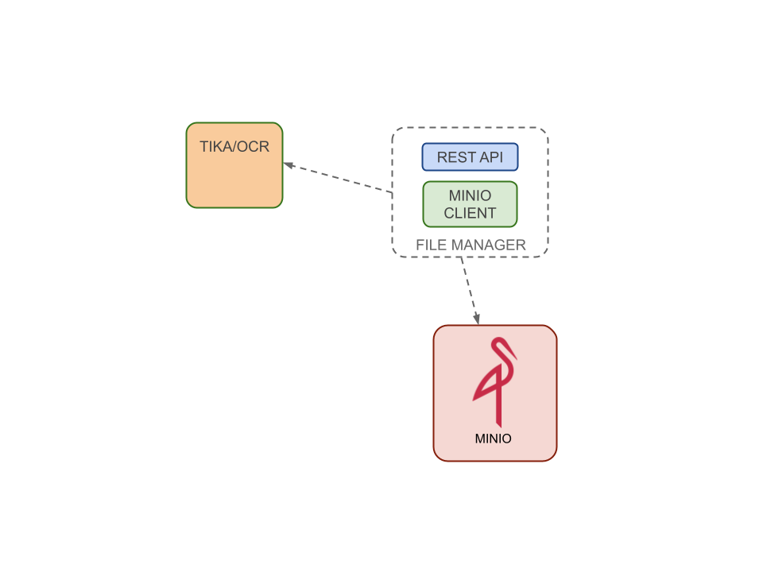

File Manager is delegated to handle binary files management.

### Minio Client

Read data from queue and adds on them context information. In particular it recovers tenant and datasource information,
as well as enrich pipeline and enrich item definition, based on tenantId and datasourceId present on ingestion payload,
and links these to the data. Then send again data to queuing system.

### Rest Api

See more on [Openk9 Api Documentation](../api/api-file-manager.md)
