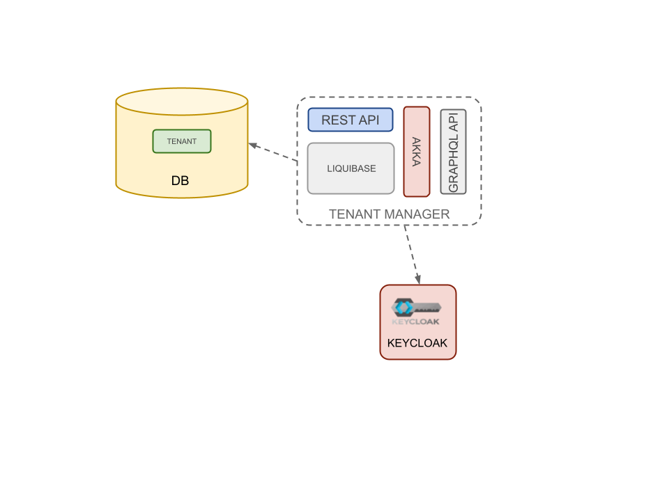

Tenamnt Manager is the component delegated to manage creation and management of tenants.

### Akka

It uses Akka actors mechanism to handle logic of tenant creation. 
During tenant creation different actions (database populating, realm creation, ...) must be performed.
Using Akka actors become easily to perform rollback in error cases.

### Liquibase

It uses Liquibase as library to handle database populating and schema versioning.

### Rest Api

See more on [Api Documentation](../api/api-tenant-manager.md)
