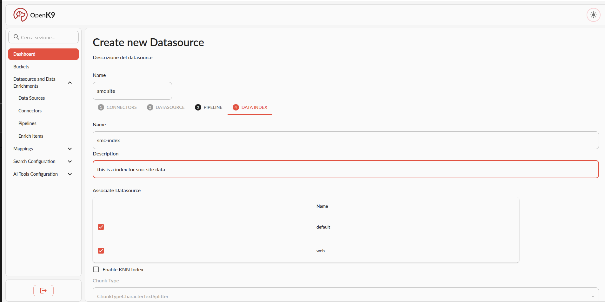

Once logged in, go to *Datasource and Data Enrichments > Data Sources* and click on *create new datasource* button.

In this example we configure datasource using sitemap connector and hooking up web site. If you want to get data from other sources choose another connector from available [universal connectors](/plugins) or [create your connector](./plugins/connectors-requirements.md).

In the first step of datasource creation you can choose from preconfigured connectors or configure your custom connector.
We choose previous configured sitemap connector.

In the second step we first configured how to perform crawling. We hook up data from Smc public site.

The we confire scheduling logic to define if autotically get or reindex data from site and with which period.

In third step you can configure enrich pipeline. We skip this step choosing to configure *no pipeline* at the moment. Go to [advenced configuration section](./configuration/overview.md) to have more information on how configure enrich pipeline for data.

In the last step we define name and mapping of data index. We choose not to enable knn feature for index.

Then proceed to recap and create datasource.

Now wait for scheduler for first data indexing or enter in view in just created datasource and trigger reindex manually.

To monitor scheduling activities use monitoring tab in datasource detail view.

Add datasource to bucket using *add* button from datasource listing or enter in edit in active bucket.

Now yoy can perform search on your data using search frontend.