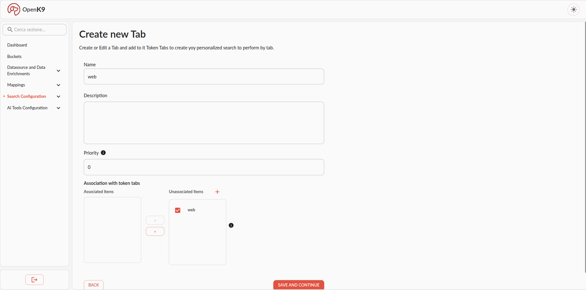

This is the procedure to create and use new tab in Openk9.

To crete a new tab in Openk9:

1. Go to tabs section under search config in left side menu
2. Click on *create new tab* button in tabs listing view
3. Insert into form correct informations, save and continue until filter is correctly created.

In following image there is an example of form correctly compilated.

To create new tab you must insert:

- name
- optional description
- priority: is the priority to return list of filters to frontend
- multiSelect: if is a multi select filter or not
- associated token tabs: token tabs associated with tab

Once tab is created, you can add it to your active bucket in following ways:

- using add shorcut present in tabs listing view
- editing your active bucket associating new tab

If the tab to be associated is not present in the list, you can leave tab creation and go to tab creation using apposite shortcut in tab.

