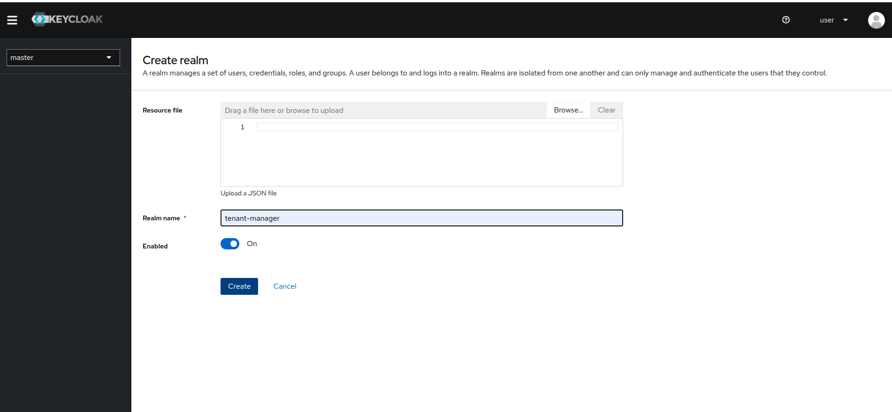
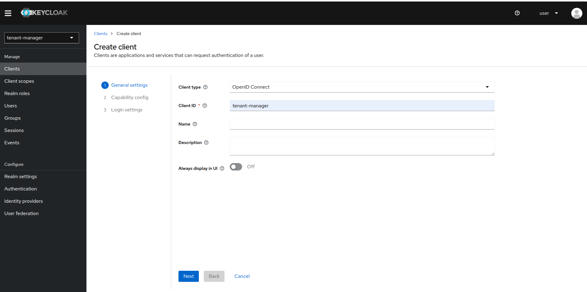
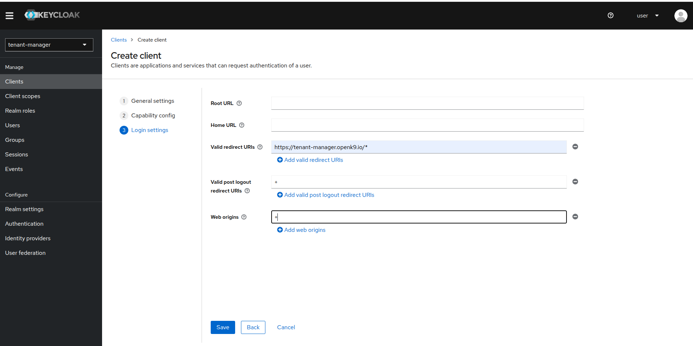
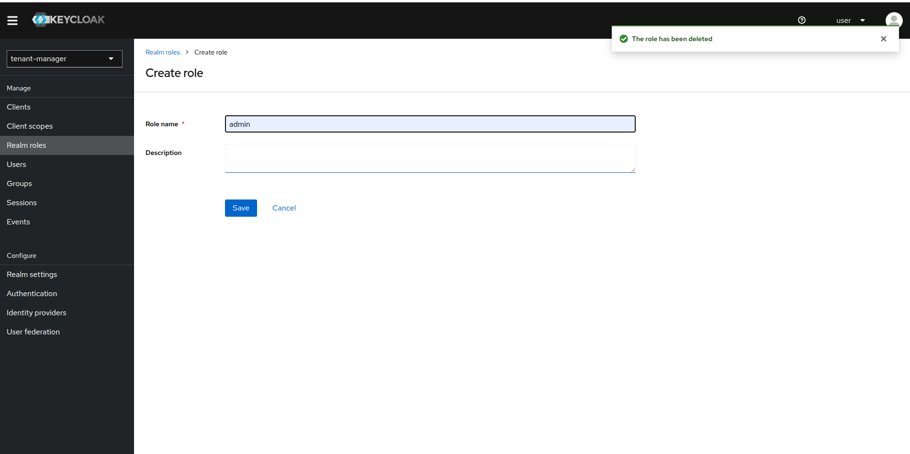
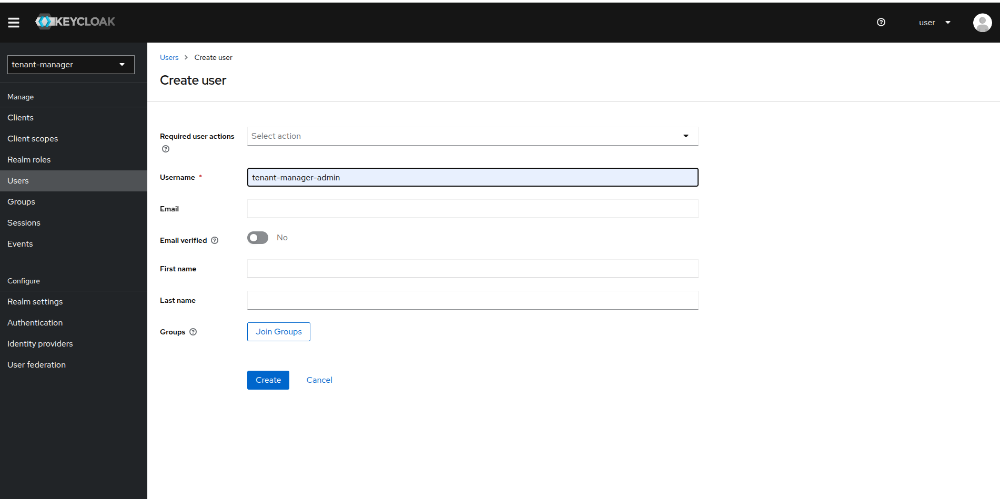
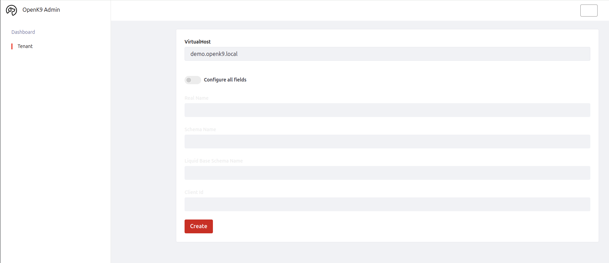
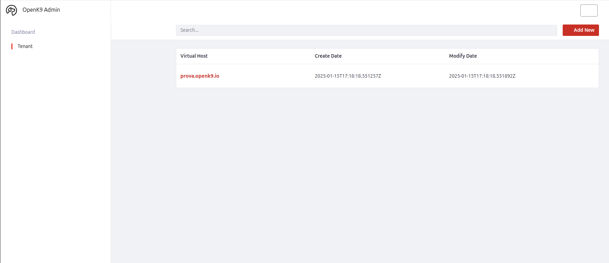

This is the procedure to perform first configuration of Openk9.

When Openk9 is installed, you need to:

1. Configure realm on Keycloak for Tenant Manager Admin UI
2. Create your first tenant
3. Configure your first datasource

For Advanced configuration go to [related section](./configuration/overview.md)

### Tenant Manager Keycloak Configuration

Acces Keycloak Admin console and create new realm. Call it *tenant-manager*.

Then create a new client and call it *tenant-manager*. If you named differently when installed Openk9, call it with same name.

Mantains default choices in section *Capability config* and proceed to *login settings* section.

Set *Valid redirect URIs* with url configured for tenant manager.

Create then a new role *admin*.

After this, create a new user *tenant-manager-admin* and set password for this user.

When create, add *admin* role to *tenant-manager-admin* user.

Keycloak configuration is completed and now you can access to Tenant Manager Admin UI to create your first tenant.

### First tenant creation

Access to Tenant Manager Admin UI with user previously created. It is accessible to url https:://tenant-manager-url/admin. use

When accessed, go to Tenants section to create your first tenant and click on *add new* button.

Insert virtualhost for tenant and click on create.

Wait until tenant is created. When created you view it on tenant list recap.

Now you can proceed to Admin Ui to connect your first datasource.

### Configure and start your first datasource

