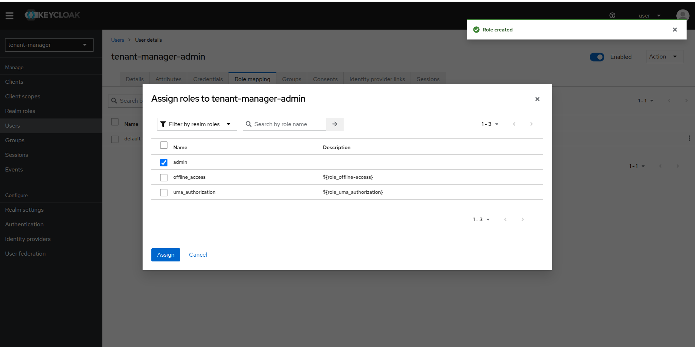

This is the procedure to perform first configuration of Openk9.

When Openk9 is installed, you need to:

1. Configure realm on Keycloak for Tenant Manager Admin UI
2. Create your first tenant
3. Configure your first datasource

For Advanced configuration go to [related section](./configuration/overview.md).

### Tenant Manager Keycloak Configuration

Acces Keycloak Admin console and create new realm. Call it *tenant-manager*.

Then create a new client and call it *tenant-manager*. If you named differently when installed Openk9, call it with same name.

Mantains default choices in section *Capability config* and proceed to *login settings* section.

Set *Valid redirect URIs* with url configured for tenant manager.

Create then a new role *admin*.

After this, create a new user *tenant-manager-admin* and set password for this user.

When create, add *admin* role to *tenant-manager-admin* user.

Keycloak configuration is completed and now you can access to Tenant Manager Admin UI to create your first tenant.

### First tenant creation

Access to Tenant Manager Admin UI with user previously created. It is accessible to url https:://tenant-manager-url/admin. use

When accessed, go to Tenants section to create your first tenant and click on *add new* button.

Insert virtualhost for tenant and click on create.

Wait until tenant is created. When created you view it on tenant list recap.

You can enter in tenant detail view clicking on *view* button.

From detail you can *initialize* your tenant and install universal connectors.

Get tenant password reading in tenant manager logs and proceed to Admin Ui clicking on "View Admin Host" button.

### Configure and start your first datasource

Login into Admin ui with user *k9admin* and the password recovered from logs. During the first login you can reset your password if necessary.

Once logged in, click *create first datasource* button on dashboard.

In this example we configure datasource using sitemap connector and hooking up web site. If you want to get data from other sources choose another connector from available [universal connectors](/plugins) or [create your connector](./plugins/connectors-requirements.md).

In the first step of datasource creation you can choose from preconfigured connectors or configure your custom connector.
We choose previous configured sitemap connector.

In the second step we first configured how to perform crawling. We hook up data from Smc public site.

The we confire scheduling logic to define if autotically get or reindex data from site and with which period.

In third step you can configure enrich pipeline. We skip this step choosing to configure *no pipeline* at the moment. Go to [advenced configuration section](./configuration/overview.md) to have more information on how configure enrich pipeline for data.

In the last step we define name and mapping of data index. We choose not to enable knn feature for index.

Then proceed to recap and create datasource.

Now wait for scheduler for first data indexing or enter in view in just created datasource and trigger reindex manually.

To monitor scheduling activities use monitoring tab in datasource detail view.

Add datasource to bucket using *add* button from datasource listing or enter in edit in active bucket.

Now yoy can perform search on your data using search frontend.

For advanced configurations for search, data enrichment and generative ai featured go to [related section](./configuration/overview.md)