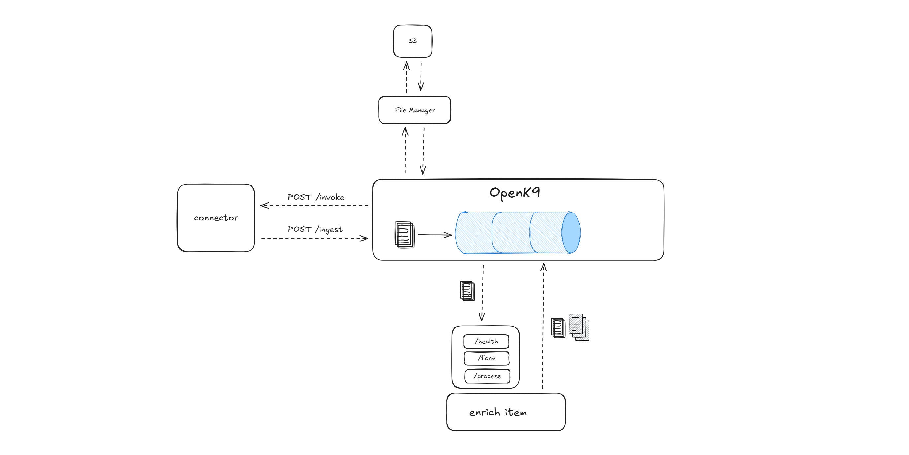

# Archetype

This Maven archetype generates a base enricher for OpenK9, built with Quarkus.



It provides a custom library from **enricher-openapi-server** module, to know what the library implements [click here](../enricher-openapi-server).

## How to Develop a New Enricher

There are some specifications you need to follow when developing a new OpenK9 Enricher:

### Implementation of Library Classes

These classes implement the REST classes from the library and adapt their behavior for the enricher.

- **HealthResourceImpl.java**   
  It exposes `/health` endpoint used from OpenK9 to get the status of enricher.
   ```json
   {
     "status": "UP"
   }
   ```


- **ProcessResourceImpl.java**  
  It exposes `/process` endpoint, it is invoked from OpenK9 to start the enrichment of data.
  ```json
  {
    "payload": {},
    "enrichItemConfig": {},
    "replyTo": "1577489"
  }
  ```


- **FormResourceImpl.java**  
  It exposes `/form` endpoint that returns the form representation of the enricher configuration.
  ```json
  {
    "fields": [
      {
        "info": "",
        "label": "Test Form",
        "name": "testForm",
        "type": "text",
        "size": 2,
        "required": false,
        "values": [
          {
            "isDefault": true
          }
        ],
        "validator": {
          "min": 0,
          "max": 10,
          "regex": "/[[:test]]"
        }
      },
      {
        "info": "",
        "label": "Main Object",
        "name": "mainObject",
        "type": "number",
        "size": 0.78,
        "required": true,
        "values": [
          {
            "isDefault": true,
            "value": "Value example"
          }
        ],
         "validator": {
           "min": 0,
           "max": 10,
           "regex": "/[[:test]]"
         }
       }
     ]
  } 
  ```

### Enricher Base Classes

These base classes are required in all enrichers.

- **CallBackClient.java**  
Class used to send the enriched data when asynchronous approach is set during the enricher configuration.  
It must use the token received in `ProcessResourceImpl` to notify OpenK9 which payload the enriched data refers to.

- **Base64Client.java**  
Class used to get the binary payload as base 64 format.  
It must use a `resourceId` and a `schemaName` to get the correct payload.

- **ByteArrayClient.java**  
Class used to get the binary payload as byte array format.  
It must use a `resourceId` and a `schemaName` to get the correct payload.
  
---

## Install

To install the archetype and the custom library, go to the root of the project and write:

```shell
./mvnw -f quarkus-base-enricher/pom.xml install
```  

## Generate Enricher

To generate the enricher, write one of these commands:

### Linux

```shell  
mvn archetype:generate                      \
-DarchetypeGroupId=io.openk9.enrichers      \
-DarchetypeArtifactId=archetype             \
-DarchetypeVersion=1.0.0-SNAPSHOT           \
-DgroupId=<my.groupId>                      \
-DartifactId=<my-artifactId>                \
-DimplementationType=<async|sync>           \
-Dversion=<myVersion>                       
```

### Windows (PowerShell)

```shell  
mvn archetype:generate `
"-DarchetypeGroupId=io.openk9.enrichers" `
"-DarchetypeArtifactId=archetype" `
"-DarchetypeVersion=1.0.0-SNAPSHOT" `
"-DgroupId=<my.groupId>" `
"-DartifactId=<my-artifactId>" `
"-DimplementationType=<async|sync>" `
"-Dversion=<myVersion>"
```

In these commands, you need to specify the full information about the archetype you want to use (its `groupId`, its `artifactId`, its `version`)
and the information about the new project you want to create (`artifactId`, `groupId`, `implementationType` and `version`).

## Docker
The project includes an executable Dockerfile, you have just to build an image and run it:

### Build Image

```shell
# Create the jar file
mvn clean package
# Build the Docker image
docker build -f src/main/docker/Dockerfile.jvm -t <imageName> .
```

### Run Container
```shell
docker run -p 8080:8080 --name <containerName> <imageName> 
```

## Modify Enricher

After generating it, changes need to be made to the enricher to create a concrete implementation:

1. Update `FormResourceImpl` to get configuration from OpenK9 for your enricher;
   ```java
      // Setting up a FormField example
      private List<FormField> getFormFieldList() {
          List<FormField> formFieldList = new ArrayList<>();

          FormField formField = new FormField();
          formField.setInfo("Read and reply to datasource messages");
          formField.setName("readAndReply");
          formField.setLabel("Read and Reply");
          formField.setRequired(true);
          formField.setSize(6.0);
          formField.setType(FormField.Type.text);
          formField.setValidator(getValidator());
          formField.setValues(getFiledValueList());
          formFieldList.add(formField);
          return formFieldList;
      }

      private FormFieldValidator getValidator() {
          FormFieldValidator formFieldValidator = new FormFieldValidator();
          formFieldValidator.setMin(0L);
          formFieldValidator.setMax(100L);
          formFieldValidator.setRegex("/[[:datasource]]");
          return formFieldValidator;
      }

      private List<FieldValue> getFiledValueList() {
          List<FieldValue> formFieldValueList = new ArrayList<>();
          FieldValue formFieldValue = new FieldValue();
          formFieldValue.setIsDefault(false);
          formFieldValue.setValue("datasource1");
          formFieldValueList.add(formFieldValue);
          return formFieldValueList;
      }
   ```
2. Update Openk9 configurations in _application.properties_ to set the correct host and port;
3. If you use an async implementation, update `ProcessResourceImpl` to set your logic implementation and then call `CallBackClient`;
   ```java
    @Inject
    CallBackClient callBackClient;
   
    @Override
    public ProcessResponseDTO process(@NotNull OpenK9Input data) {
        if (data.getReplyTo() != null && !data.getReplyTo().isEmpty()) {
            ProcessResponseDTO responseDTO = new ProcessResponseDTO();
            LOGGER.info("Starting enrichment of data...");
            // Simulate call back endpoint
            EnrichData enrichData = readAndReply(data);
            callBackClient.callback(enrichData, data.getReplyTo());
            responseDTO.setPayload("OK");
            return responseDTO;
        }
        else {
            throw new IllegalArgumentException("replyTo is null or empty");
        }
    }

    private EnrichData readAndReply(OpenK9Input data) {
        EnrichData enrichData = new EnrichData();
        enrichData.setPayload(data.getPayload());
        enrichData.setEnrichData("reply", "Hi, I have received your payload. Thanks for using me!");
        return enrichData;
    }
   ```
4. If you use a sync implementation, update `ProcessResourceImpl` to set your logic implementation;
   ```java
    @Override
    public ProcessResponseDTO process(@NotNull OpenK9Input data) {
        ProcessResponseDTO responseDTO = new ProcessResponseDTO();
        // Simulate sync operations
        EnrichData enrichData = readAndReply(data);
        responseDTO.setPayload(enrichData);
        return responseDTO;
    }

    private EnrichData readAndReply(OpenK9Input data) {
        EnrichData enrichData = new EnrichData();
        enrichData.setPayload(data.getPayload());
        enrichData.setEnrichData("reply", "Hi, I have received your payload. Thanks for using me!");
        return enrichData;
    }
   ```
5. Update `onSuccess` callback to set a concrete implementation for getting binaries from `Base64Client` and `ByteArrayClient`;
   ```java
    public Future<String> getBase64(String resourceId, String schemaName) {
        WebClient client = WebClient.create(vertx);
        return client
                .get(port, host, path + resourceId + "/" + schemaName)
                .as(BodyCodec.string())
                .send()
                .map(HttpResponse::body)
                .onSuccess(res -> {
                    LOGGER.info("Result from base64 endpoint: " + res);
                    // Add here your implementation
                })
                .onFailure(res -> LOGGER.error("Error requesting base64 binaries: " + res.getMessage()));
    }
   ```

   ```java
    public Future<Buffer> getByteArray(String resourceId, String schemaName) {
        WebClient client = WebClient.create(vertx);
        return client
                .get(port, host, path + resourceId + "/" + schemaName)
                .as(BodyCodec.buffer())
                .send()
                .map(HttpResponse::body)
                .onSuccess(res -> {
                    LOGGER.info("Result from byte array endpoint: " + res.getBytes());
                    // Add here your implementation
                })
                .onFailure(res -> LOGGER.error("Error requesting byte array binaries: " + res.getMessage()));
    }
   ```