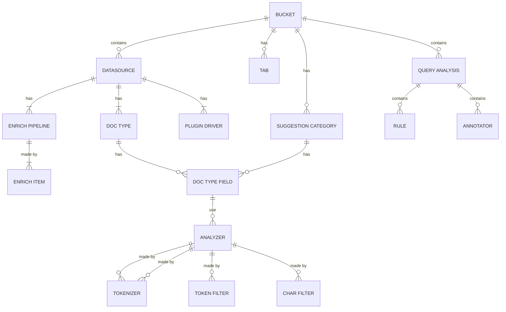

```mermaid
erDiagram
    BUCKET ||--o{ DATASOURCE : contains
    DATASOURCE ||--|{ "ENRICH PIPELINE" : has
    DATASOURCE ||--|{ "DOC TYPE" : has
    DATASOURCE ||--|{ "PLUGIN DRIVER" : has
    "ENRICH PIPELINE" ||--|{ "ENRICH ITEM" : "made by"
    BUCKET ||--o{ "SUGGESTION CATEGORY" : has
    BUCKET ||--o{ TAB : has
    "DOC TYPE" ||--o{ "DOC TYPE FIELD" : has
    "DOC TYPE FIELD" ||--o{ "ANALYZER": use
    "ANALYZER" ||--o{ "TOKENIZER": "made by"
    "ANALYZER" ||--o{ "TOKENIZER": "made by"
    "ANALYZER" ||--o{ "TOKEN FILTER": "made by"
    "ANALYZER" ||--o{ "CHAR FILTER": "made by"
    "SUGGESTION CATEGORY" ||--o{ "DOC TYPE FIELD" : has
    BUCKET ||--o{ "QUERY ANALYSIS" : contains
    "QUERY ANALYSIS" ||--o{ "RULE" : contains
    "QUERY ANALYSIS" ||--o{ "ANNOTATOR" : contains
```