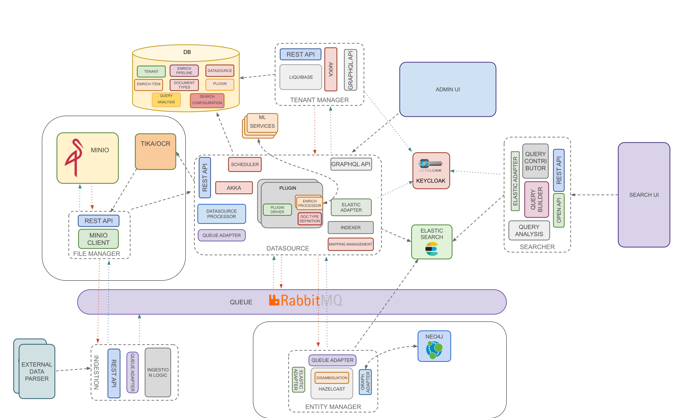

Openk9's architecture is composed by multiple components. Components can be splitted in third-party components and
custom components.

### Custom components

- [**Ingestion**](ingestion): is the component that handles data ingestion logic.
- [**Datasource**](datasource): is the component that handles data source management logic.
- [**Plugin Driver Manager**](plugin-driver-manager): is the component that handles plugin management logic and enrichment activity.
- [**Indexer**](indexer): is the component which manages the writing of data on elastic.
- [**Entity Manager**](entity-manager): is the component that handles entities and ontologies extracted from data.
- [**Searcher**](searcher): is the component that defines search logic.

### Third-party components

- [**Elasticsearch**](https://www.elastic.co/): open source search and analytics engine.
- [**Neo4j**](https://neo4j.com/): open source graph database.
- [**RabbitMQ**](https://www.rabbitmq.com/): open source message broker.
- [**Consul**](https://www.consul.io/): service networking solution to automate network configurations,
discover services, and enable secure connectivity across any cloud or runtime.
- [**Keycloak**](https://www.keycloak.org/): open source identity and access management.

 
 

