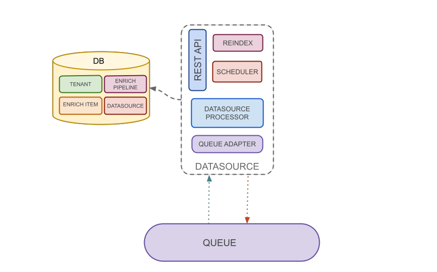

Datasource component defines datasource and tenant configuration on database. Furthermore handles reindex and scheduling
operations.

### Datasource Processor

Read data from queue and adds on them context information. In particular it recovers tenant and datasource information,
as well as enrich pipeline and enrich item definition, based on tenantId and datasourceId present on ingestion payload,
and links these to the data. Then send again data to queuing system.

### Reindex

Defines the logic to launch a reindex of specific datasource. A reindex action deletes data from elasticsearch index,
reset last ingestion date information and starts a new data ingestion flow from external data parser.

### Scheduler

Is the delegated component to trigger new data ingestion from external data parser. It is regulated through a scheduling
chrono expression, which defines how often a new ingestion is started. The new ingestion will extract only the data
added or changed after the last ingestion date.

### Queue Adapter

Adapter to send data on queuing system. It is developed for the message broker used. Openk9 uses RabbitMQ
as message broker. See [client documentation](https://www.rabbitmq.com/clients.html) to realize adapter.

### Rest Api

See more on [Openk9 Api Documentation](/docs/api/datasource-api-overwiew)
