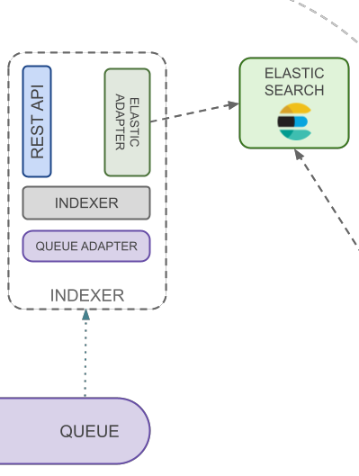

Index-writer is component delegated to index data in Elasticsearch.

### Indexer

Defines logic to index data and mappings to Elasticsearch

### Mapping Management

Handles mapping definitions received from Plugin Driver Manager

### Elastic Adapter

Elastic maps Elasticsearch APIs to be used in Openk9. See
[client documentation](https://www.elastic.co/guide/en/elasticsearch/client/index.html) to realize adapter.

### Queue Adapter

Adapter to send data on queuing system. It is developed for the message broker used. Openk9 uses RabbitMQ
as message broker. See [client documentation](https://www.rabbitmq.com/clients.html) to realize adapter.

### Rest Api

See more on [Api Documentation](/docs/api/index-writer-api)

