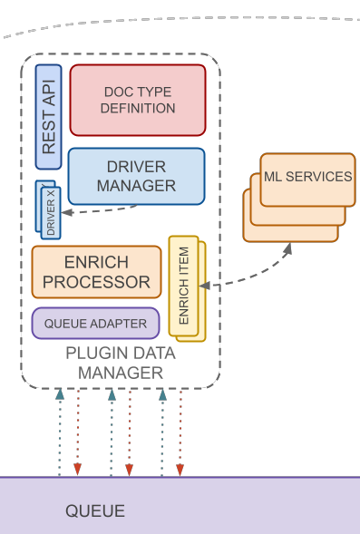

Plugin driver manager handles plugin management logic and enrichment activity. Every new plugin can be hot-deployed inside
this component. After deploy Openk9 is able to start new data ingestion flow from new external data source.

### Driver Manager

Manages the plugins release and installation logic. Every plugin inside into Openk9 contain different parts,
that need to be managed appropriately. It is task of Driver Manager.

### Plugin

New plugins can be realized for new data sources to make capable Openk9 to get data from new data source. In particular when
a new plugin is created, different elements can be defined on it. See more on how to create a new plugin on specific
[Openk9 Documentation](how-to-create-a-plugin)

#### Plugin Driver

Defines how to connect to external data source to trigger a new data ingestion. Normally it matches with a rest call to an
external parser.

#### Doc Type Definition

Related to document types definition. A Document type is the mapping configuration for data on elasticsearch.

#### Enrich Processor

An enrich processor handles how to enrich data with new information. A common way to enrich data is send to some available
Machine Learning services, which extract new information and link these to data payload. More enrich processor can be defined
for a single plugin. Then a new enrich pipeline in datasource configuration can be created with one or more plugins in sequence.

### Queue Adapter

Adapter to send data on queuing system. It is developed for the message broker used. Openk9 uses RabbitMQ
as message broker. See [client documentation](https://www.rabbitmq.com/clients.html) to realize adapter.

### Rest Api

See more on [Api Documentation](/docs/api/plugin-driver-manager-api)
