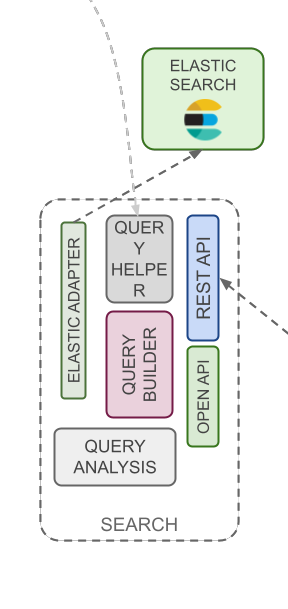

Searcher is the component delegated to perform every search action in Openk9 indexes. It exposes headless api,
which can be used to perform searches and other actions on indexed data

### Query Builder

Defines, based on criteria, the set of contributor queries to apply to the search query

### Query Contributor

Pieces that deal with intercepting search tokens and transforming them into elastic queries.
They can be of different types(DOCTYPE, TEXT, DATASOURCE, ENTITY,...)

### Query Analisys

Query analisys perfoms an understanding analysis on natural language query. In particular it returns a list of
search tokens based on different concepts and meanings founded in query. It is developed using a modern technique
called [Semantic Parsing](https://en.wikipedia.org/wiki/Semantic_parsing)

### Elastic Adapter

Elastic maps Elasticsearch APIs to be used in Openk9. See
[client documentation](https://www.elastic.co/guide/en/elasticsearch/client/index.html) to realize adapter.

### Rest Api

See more on [Api Documentation](/docs/api/searcher-api)
