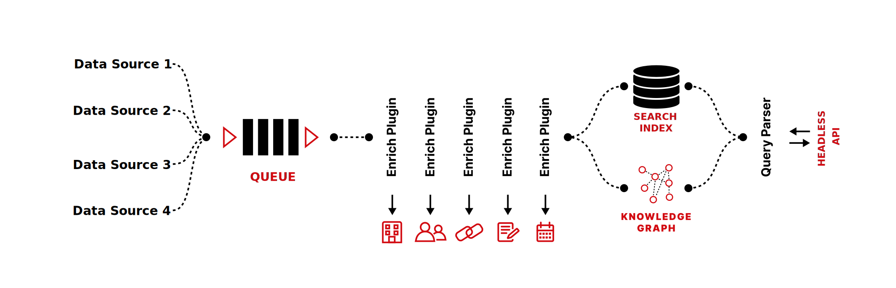

OpenK9 is a powerful open source, enterprise search system, enhanced through AI and Machine Learning.

Using the best ML state-of-art alghoritms, OpenK9 is able, to enrich and index data from different data sources.

Then with a great and efficient UI experience, is possible, to perform multi-source, semantic, token-based searches,
thanks to a mechanism based on progressive fuzzy filters.

OpenK9 is extremely modular and easily extensible. A new data source can be connected quickly and efficiently.

Furthermore, openK9 is easily manageable: through the administration panel, it is very easy to create and configure a new search environment for a new data source.

Then go to Getting Started section and test the system directly on your machine. Enjoy!
