Keycloak is used as a perimeter authentication and authorization system for both the API and the UserInterface.
Before proceeding with the installation of the core component we must prepare the Realm which will then be used to
verify and use this installation. Or rather to manage the Tenant of this installation

### Realm creation

Acces Keycloak "[http://keycloak.demo.openk9.local](http://keycloak.demo.openk9.local)" with user "admin" with password "openk9"

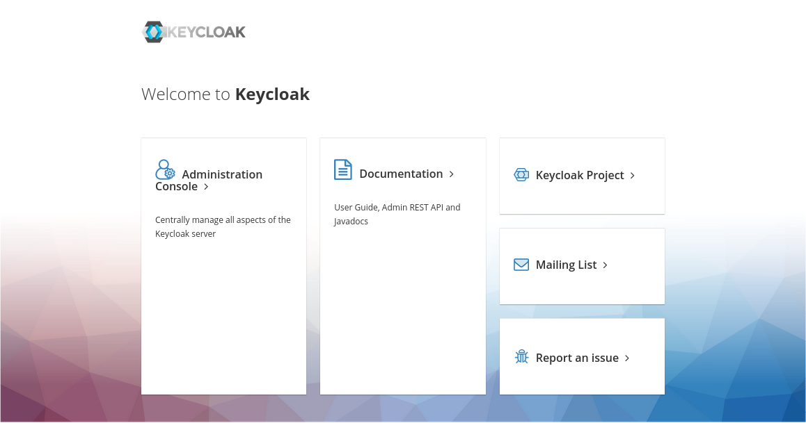

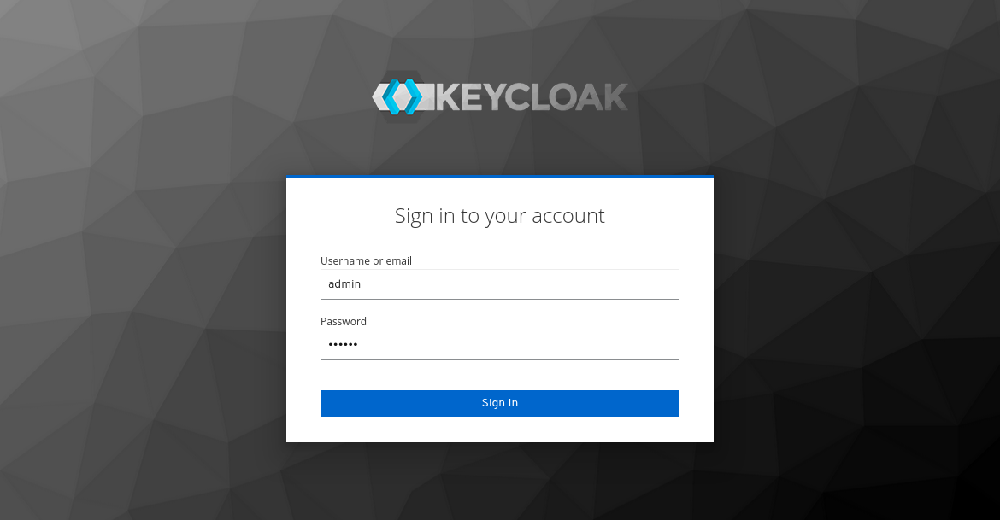

Entered the console to add a new Realm you have to use the appropriate button that
appears when you move the mouse over the drop-down menu of realms.

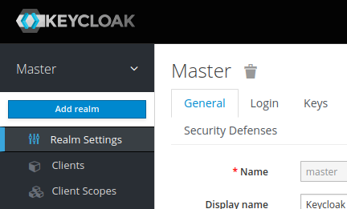

The realm **must coincide** with the FQDN with which I want to provide access to this OpenK9 installation.

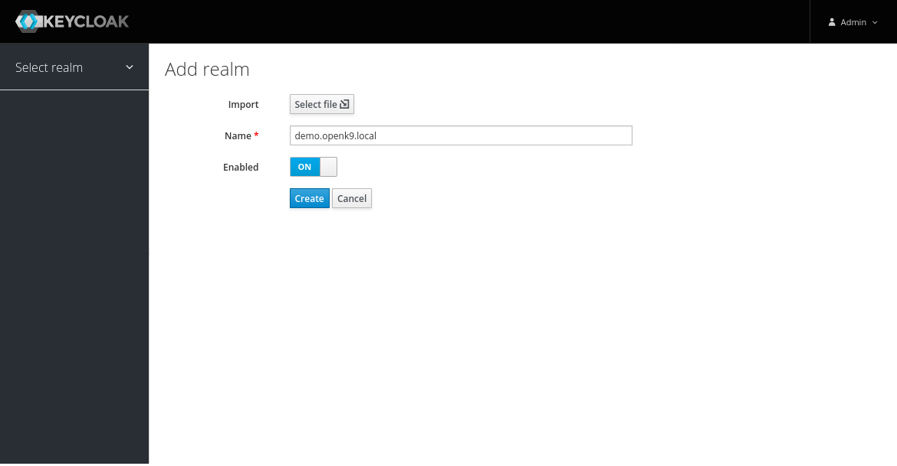

Then go to "Clients" section and creat a Client using "Create" button.

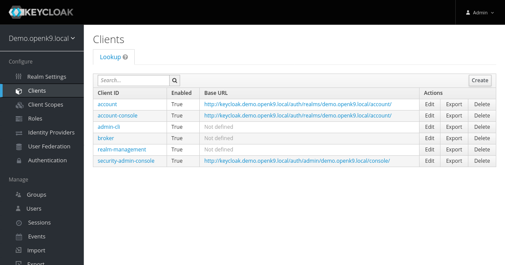

Client will have "openk9" as name e will be of "openid-connect" type.

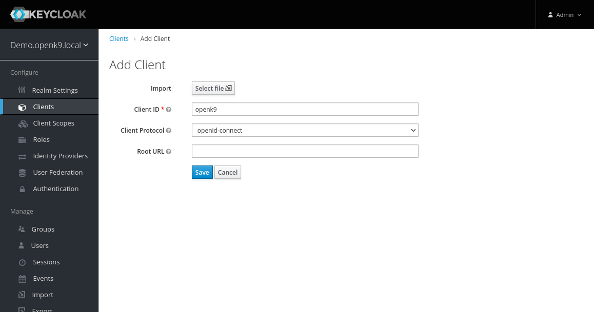

Once the element has been created, I can refine its configuration by indicating

*  "confidential" in field "Access Type
* "*" in field "Valid Redirect URIs"

So "Save"  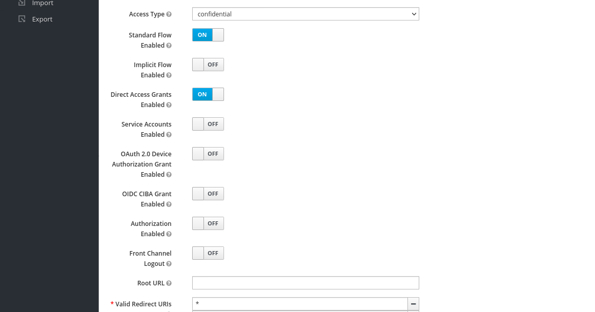

At saving will be visible card "Credentials" with "Client Secret"

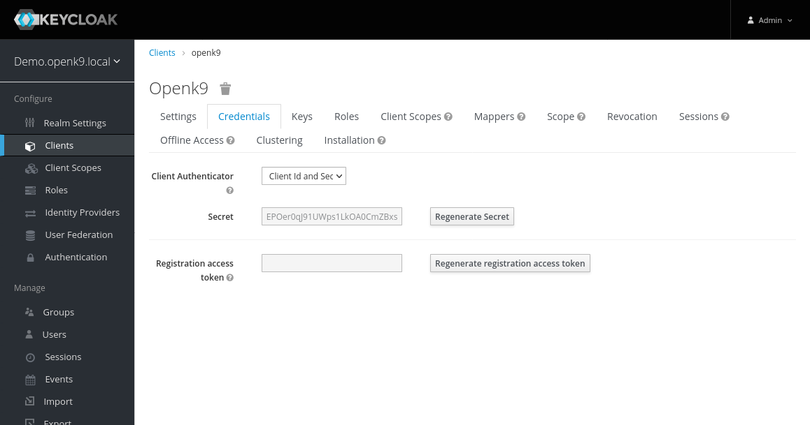

### Tenant census

Using "Adminer" or other client SQL we have to register the newly created Realm/Tenant in the PostgreSQL database used by OpenK9.

In our case it will be

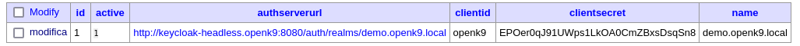

which is equivalent to

```sql
INSERT INTO security_tenant (
    "id", "active", "authserverurl", "clientid", "clientsecret", "name")
 VALUES(
     1, true, "http://keycloak-headless.openk9:8080/auth/realms/demo.openk9.local",
     "openk9", "EPOer0qJ91UWps1LkOA0CmZBxsDsqSn8", "demo.openk9.local")
```

where is it:

* in "authServerURL" I indicate the access URL (internal to the Kubernetes cluster) to the created realm
* in "clientSecret" I indicate the secret created in the previous chapter
* in "name" I indicate the FQDN or the name of the realm


### Roles and Authorizations Census

To complete the preparation of the Tenant, I have to register the roles and the relative authorizations.
Operation that I am going to perform as an administrator user from the Keycloak administrative console.

I then access the "Roles" section and use the "Add Role" button to create the necessary roles
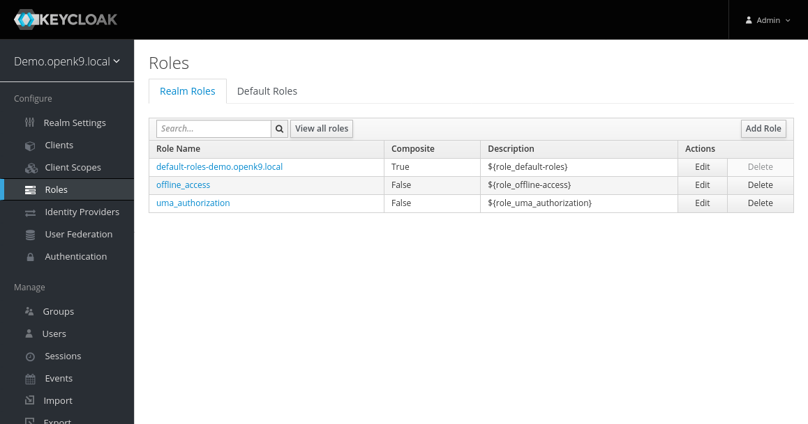

The roles that I will have to create do not require complex information, the name is enough for me (which must be written all in lowercase)
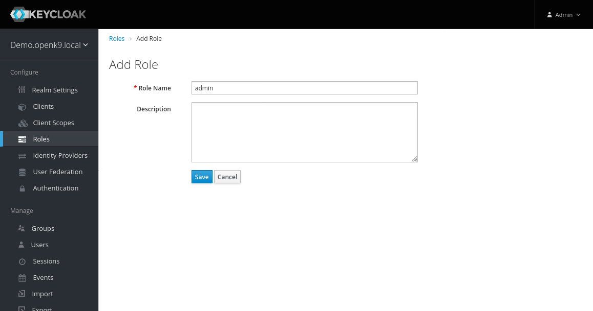

 Specifically, I have to create the following (non-composite) roles:

| Nome                        | Descrizione |
| --------------------------- | ----------- |
| admin                       |             |
| datasource-read             |             |
| datasource-reindex          |             |
| datasource-write            |             |
| plugin-driver-manager-read  |             |
| plugin-driver-manager-write |             |


Then I go to the "Client Scopes" section to associate the permissions to the roles thanks to the "Create" button at the top right
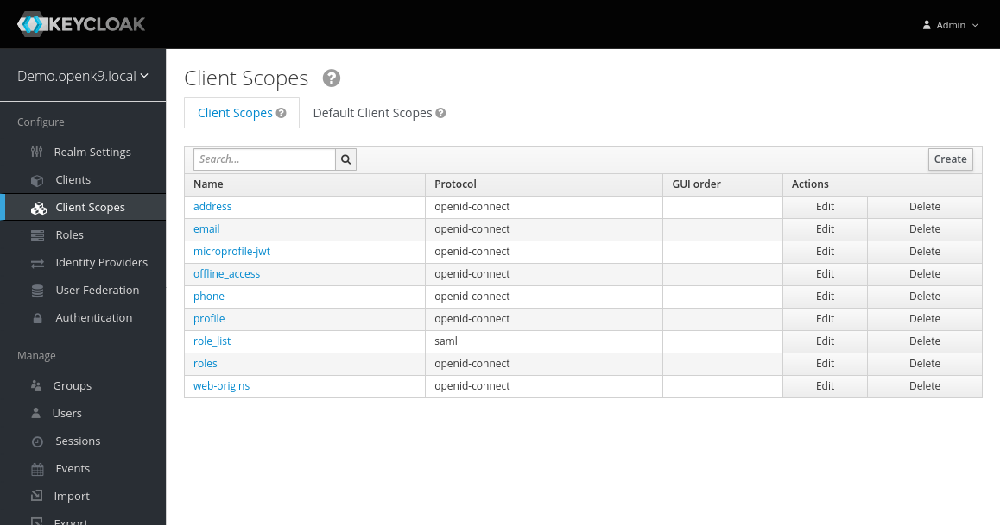

When creating the Client Scoper it is enough to indicate the name, then "Save"


Then I go to the "Scope" tab where I go to complete the mapping by associating the role
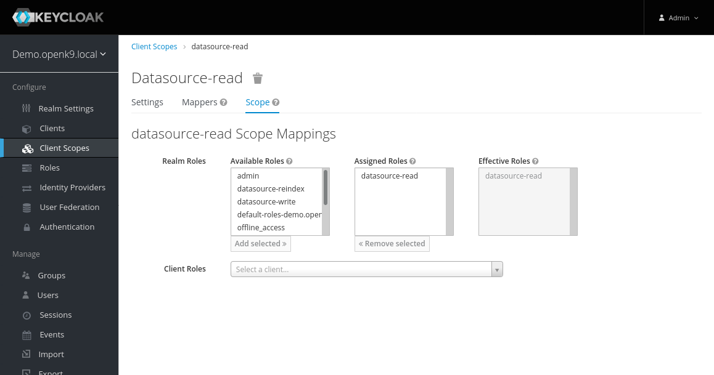

I need to create the following Client Scope

| Name                        | Assigned Roles              |
| --------------------------- | --------------------------- |
| datasource-read             | datasource-read             |
| datasource-reindex          | datasource-reindex          |
| datasource-write            | datasource-write            |
| plugin-driver-manager-read  | plugin-driver-manager-read  |
| plugin-driver-manager-write | plugin-driver-manager-write |


### Censimento Utenti

Procedo quindi al censimento degli utenti. Per questo ambiente demo locale è possibile avere un solo utente con privilegi amministrativi.

Nella sezione "Users" procedo alla creazione dell'utente "test" indicando solo il campo obbligatorio "username". Quindi "Save"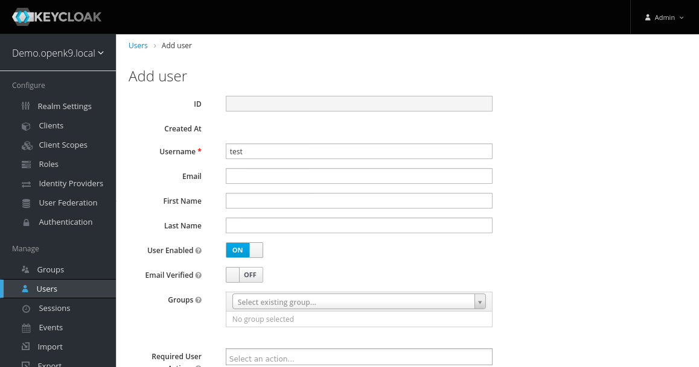

Quindi passo alla scheda "Credentials" per impostare una password non temporanea, ad esempio "test" 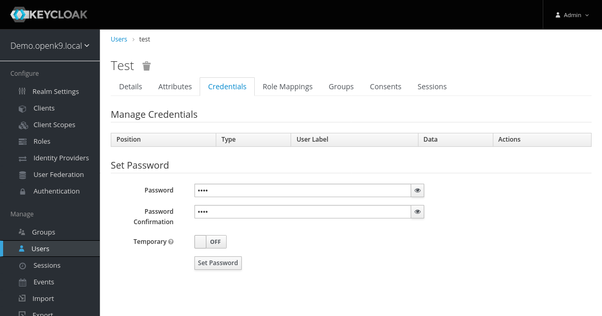

Quindi passo alla scheda "Role Mappings" per associare l'utente ai ruoli "admin", "datasource-read", "offline_access" e "uma_authorization"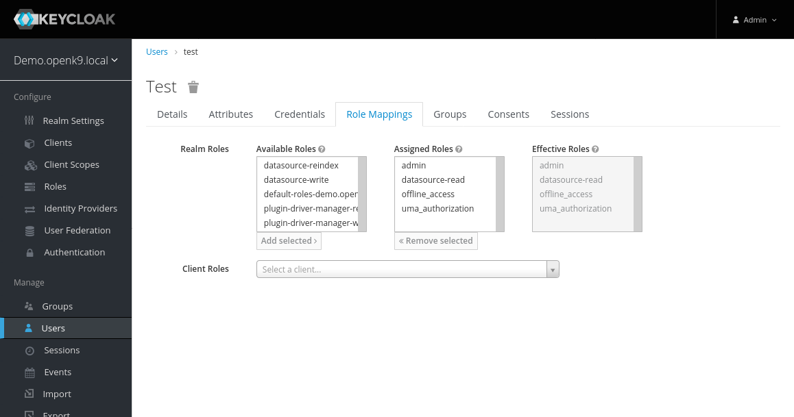


### Perfezionamento Client

Ritorno nella sezione "Clients" in modifica del client "OpenK9".

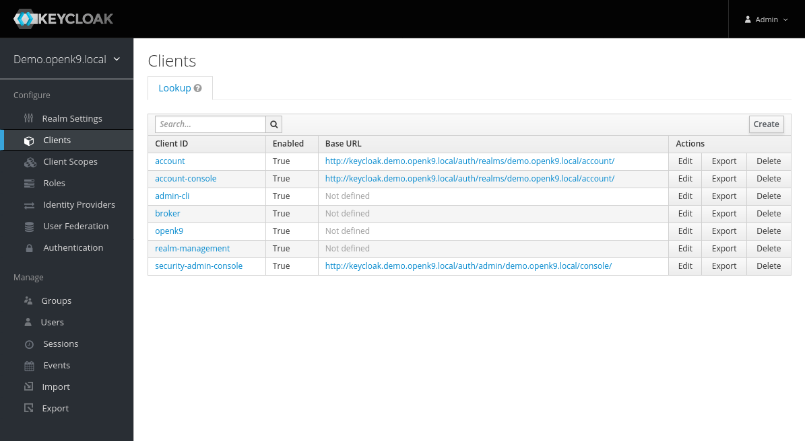

Mi sposto nella scheda "Roles" ed aggiungo il ruolo "uma_protection" (mi basta il nome)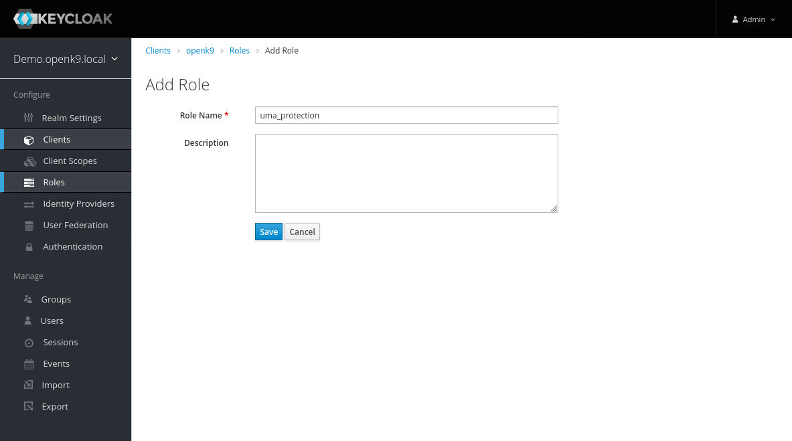

Nella scheda "Client Scopes" ed aggiungo i nuovi "Client Scope" all'elenco "Assigned Default Client Scopes"

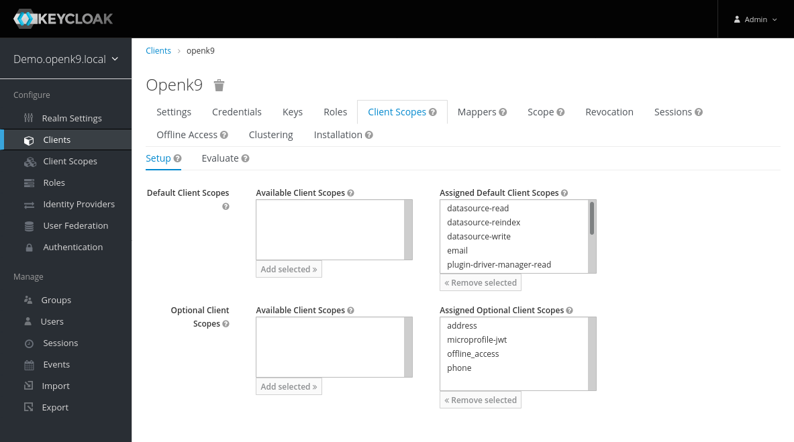


Nella scheda "Mappers" devo "Creare" 3 elementi

| Attributo                        | Elemento 1        | Elemento 2        | Elemento 3        |
| -------------------------------- | ----------------- | ----------------- | ----------------- |
| Name                             | Client IP Address | Client Host       | Client ID         |
| Mapper Type                      | User Session Note | User Session Note | User Session Note |
| User Session Note                | clientAddress     | clientHost        | clientId          |
| Token Claim Name                 | clientAddress     | clientHost        | clientId          |
| Claim JSON Type                  | String            | String            | String            |
| Add to ID Token                  | ON                | ON                | ON                |
| Add to access token              | ON                | ON                | ON                |
| include in Access Token Response | OFF               | OFF               | OFF               |
