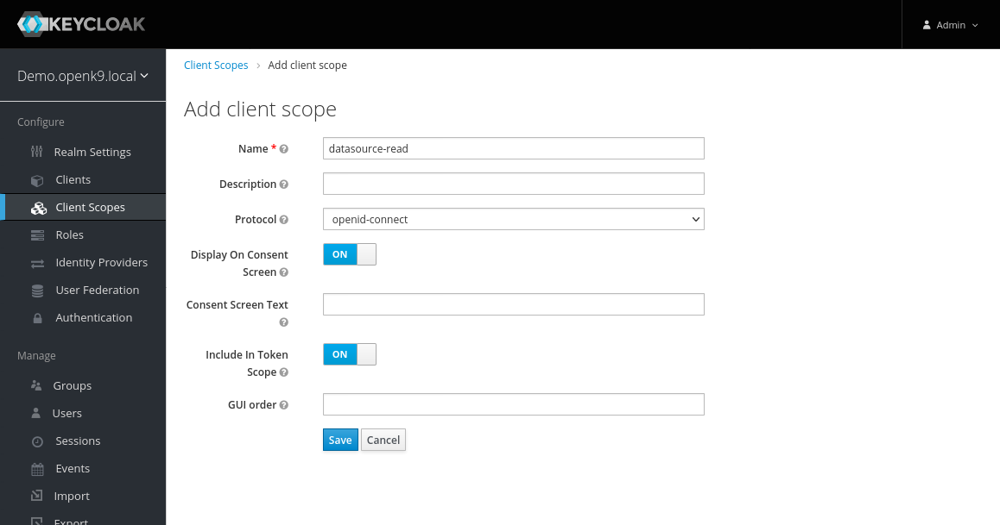

Keycloak is used as a perimeter authentication and authorization system for both the API and the UserInterface.
Before proceeding with the installation of the core component we must prepare the Realm which will then be used to
verify and use this installation. Or rather to manage the Tenant of this installation.

### Realm creation

Acces Keycloak "[http://keycloak.demo.openk9.local](http://keycloak.demo.openk9.local)" with user *admin* with password *openk9*.


Entered the console to add a new Realm you have to use the appropriate button that
appears when you move the mouse over the drop-down menu of realms.


The realm **must coincide** with the FQDN with which you want to provide access to this OpenK9 installation.


Then go to *Clients* section and creat a Client using *Create* button.


Client will have *openk9* as name e will be of *openid-connect* type.


Once the element has been created, you can refine its configuration by indicating

-  "confidential" in field "Access Type
- "*" in field "Valid Redirect URIs"

So "Save"


At saving will be visible card *Credentials* with *Client Secret*


### Adding tenant

Using *Adminer* or other client SQL you have to register the newly created Realm/Tenant in the PostgreSQL database used by OpenK9.

In our case it will be


which is equivalent to

```sql
INSERT INTO security_tenant (
    "id", "active", "authserverurl", "clientid", "clientsecret", "name")
 VALUES(
     1, true, "http://keycloak-headless.openk9:8080/auth/realms/demo.openk9.local",
     "openk9", "EPOer0qJ91UWps1LkOA0CmZBxsDsqSn8", "demo.openk9.local")
```

where is it:

* in *authServerURL* indicate the access URL (internal to the Kubernetes cluster) to the created realm
* in *clientSecret* indicate the secret created in the previous chapter
* in *name* indicate the FQDN or the name of the realm

### Roles and Authorizations Census

To complete the preparation of the Tenant, you have to register the roles and the relative authorizations.

I then access the *Roles* section and use the *Add Role* button to create the necessary roles


Specifically, you have to create the following (non-composite) roles:

| Name                        | Description |
| --------------------------- | ----------- |
| admin                       |             |
| datasource-read             |             |
| datasource-reindex          |             |
| datasource-write            |             |
| plugin-driver-manager-read  |             |
| plugin-driver-manager-write |             |


Then go to the *Client Scopes* section to associate the permissions to the roles thanks to the *Create* button at the top right


When creating the Client Scoper it is enough to indicate the name, then *Save*


Then go to the *Scope* tab where I go to complete the mapping by associating the role


You need to create the following Client Scope

| Name                        | Assigned Roles              |
| --------------------------- | --------------------------- |
| datasource-read             | datasource-read             |
| datasource-reindex          | datasource-reindex          |
| datasource-write            | datasource-write            |
| plugin-driver-manager-read  | plugin-driver-manager-read  |
| plugin-driver-manager-write | plugin-driver-manager-write |


### Adding Users

Then proceed to add the users. For this local demo environment it is possible to have only one user with administrative privileges.

In the *Users* section proceed to create the *test* user indicating only the mandatory *username* field.
So *Save*


Then switch to the *Credentials* tab to set a non-temporary password, for example *test*


Then switch to the *Role Mappings* tab to associate the user with the *admin*, *datasource-read*, *offline_access* and *uma_authorization* roles


### Client Enhancement

Return to the *Clients* section in editing the *OpenK9* client.


Move to the *Roles* tab and add the role *uma_protection*


In the *Client Scopes* tab and add the new *Client Scopes* to the "Assigned Default Client Scopes" list


In the *Mappers* tab Create 3 elements

| Attribute                        | Element 1         | Element 2         | Element 3         |
| -------------------------------- | ----------------- | ----------------- | ----------------- |
| Name                             | Client IP Address | Client Host       | Client ID         |
| Mapper Type                      | User Session Note | User Session Note | User Session Note |
| User Session Note                | clientAddress     | clientHost        | clientId          |
| Token Claim Name                 | clientAddress     | clientHost        | clientId          |
| Claim JSON Type                  | String            | String            | String            |
| Add to ID Token                  | ON                | ON                | ON                |
| Add to access token              | ON                | ON                | ON                |
| include in Access Token Response | OFF               | OFF               | OFF               |
