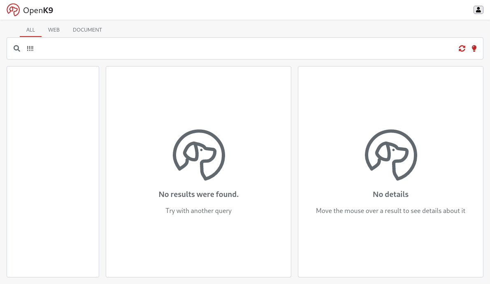

Is required to configure Keycloak before install Admin e access through credentials.
So, if not already done go to the appropriate [section](keycloak-configuration) and configure keycloak.


## Search Admin

Search Admin component represents an admin ui to handle configuration aspects of Openk9.

Install using the local chart, which is already set up to use the latest stable version of the component,
and the configuration file that *adapts* it to the chosen scenario.

```bash
helm install search-admin 01-core-charts/openk9-search-admin \
  -n openk9 \
  -f 01-core-charts/openk9-search-admin/scenarios/local-runtime.yaml
```

### Verify installation

Check the pod startup logs for the absence of serious errors

```bash
kubectl -n openk9 logs $(kubectl -n openk9 get pod --selector="app.kubernetes.io/name=openk9-search-admin" -o name)
```

### Access Console

Access to Openk9 admin console using url [http://demo.openk9.local/admin](http://demo.openk9.local/admin)


Log in with credentials ("test:test")


## Search Frontend

Search FrontEnd represents search standalone frontend for Openk9.

Install using the local chart, which is already set up to use the latest stable version of the component,
and the configuration file that *adapts* it to the chosen scenario

```bash
helm install search-frontend 01-core-charts/openk9-search-frontend \
  -n openk9 \
  -f 01-core-charts/openk9-search-frontend/scenarios/local-runtime.yaml
```


### Verify installation

Check the pod startup logs for the absence of serious errors

```bash
kubectl -n openk9 logs $(kubectl -n openk9 get pod --selector="app.kubernetes.io/name=openk9-query-frontend" -o name)
```

### Access UI

Access to Openk9 frontend Ui using url [http://demo.openk9.local/](http://demo.openk9.local/)


