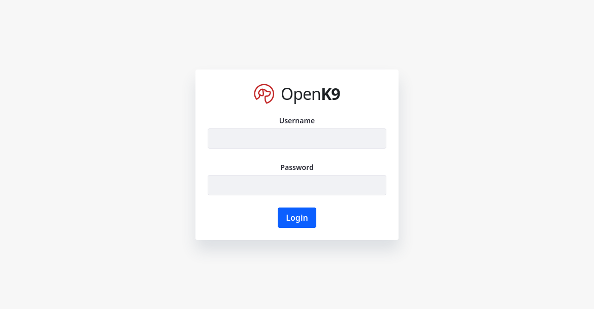
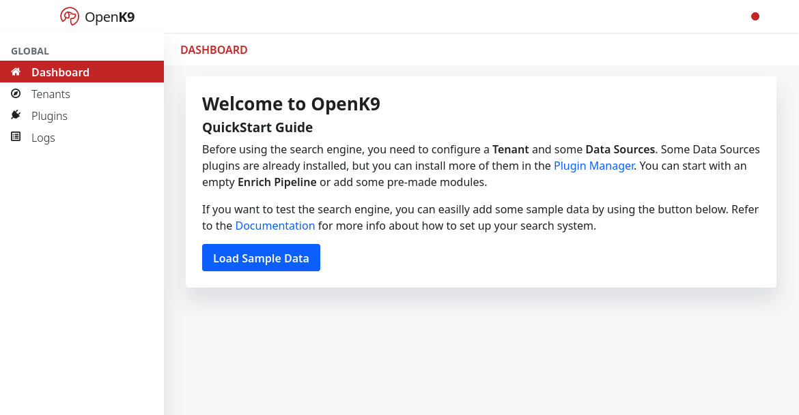

In this section is described how to install Openk9 core components. To install components helm charts are used.

Every Helm chart used in this guide is present on [openk9-kubernetes github repository](https://github.com/smclab/openk9-kubernetes).
So clone this repository before start to install.

## Ingestion

See architecture [Ingestion](ingestion) documentation to go into detail.

Install using the local chart, which is already set up to use the latest stable version of the component,
and the configuration file that *adapts* it to the chosen scenario.

```bash
helm install ingestion 01-core-charts/openk9-ingestion \
  -n openk9 \
  -f 01-core-charts/openk9-ingestion/scenarios/local-runtime.yaml
```

### Verify installation

Check the pod startup logs for the absence of serious errors

```bash
kubectl -n openk9 logs $(kubectl -n openk9 get pod --selector="app.kubernetes.io/name=openk9-ingestion" -o name)
```

Port forward the pod or service and request "http://localhost:8080/q/openapi" to get the api's yaml

## Datasource

See architecture [Datasource](ingestion) documentation to go into detail.

Install using the local chart, which is already set up to use the latest stable version of the component,
and the configuration file that *adapts* it to the chosen scenario.

```bash
helm install datasource 01-core-charts/openk9-datasource \
  -n openk9 \
  -f 01-core-charts/openk9-datasource/scenarios/local-runtime.yaml
```

### Verify installation

Check the pod startup logs for the absence of serious errors.

```bash
kubectl -n openk9 logs $(kubectl -n openk9 get pod --selector="app.kubernetes.io/name=openk9-datasource" -o name)
```

"Dashboard" component self-registers within Consul.
By accessing the [dashboard](#consul-dashboard) we should see our component among the services.


## Entity Manager

See architecture [Entity Manager](ingestion) documentation to go into detail.

Install using the local chart, which is already set up to use the latest stable version of the component,
and the configuration file that *adapts* it to the chosen scenario.

```bash
helm install entitymanager 01-core-charts/openk9-entity-manager \
  -n openk9 \
  -f 01-core-charts/openk9-entity-manager/scenarios/local-runtime.yaml
```


### Verify installation

Check the pod startup logs for the absence of serious errors.

```bash
kubectl -n openk9 logs $(kubectl -n openk9 get pod --selector="app.kubernetes.io/name=openk9-entity-manager" -o name)
```

## Index writer

See architecture [Index writer](ingestion) documentation to go into detail.

Install using the local chart, which is already set up to use the latest stable version of the component,
and the configuration file that *adapts* it to the chosen scenario.

```bash
helm install indexwriter 01-core-charts/openk9-index-writer \
  -n openk9 \
  -f 01-core-charts/openk9-index-writer/scenarios/local-runtime.yaml
```


### Verify installation

Check the pod startup logs for the absence of serious errors.

```bash
kubectl -n openk9 logs $(kubectl -n openk9 get pod --selector="app.kubernetes.io/name=openk9-index-writer" -o name)
```

## Plugin Driver Manager

See architecture [Plugin Driver Manager](ingestion) documentation to go into detail.

Install using the local chart, which is already set up to use the latest stable version of the component,
and the configuration file that *adapts* it to the chosen scenario.

```bash
helm install pdm 01-core-charts/openk9-plugin-driver-manager \
  -n openk9 \
  -f 01-core-charts/openk9-plugin-driver-manager/scenarios/local-runtime.yaml
```

### Verify installation

Check the pod startup logs for the absence of serious errors

```bash
kubectl -n openk9 logs $(kubectl -n openk9 get pod --selector="app.kubernetes.io/name=openk9-plugin-driver-manager" -o name)
```

Plugin Driver Manager component self-registers within Consul.
By accessing the [dashboard](#consul-dashboard) we should see our component among the services.


## Searcher

See architecture [Searcher](ingestion) documentation to go into detail.

Install using the local chart, which is already set up to use the latest stable version of the component,
and the configuration file that *adapts* it to the chosen scenario.

```bash
helm install searcher 01-core-charts/openk9-searcher \
  -n openk9 \
  -f 01-core-charts/openk9-searcher/scenarios/local-runtime.yaml
```

### Verify installation

Check the pod startup logs for the absence of serious errors

```bash
kubectl -n openk9 logs $(kubectl -n openk9 get pod --selector="app.kubernetes.io/name=openk9-searcher" -o name)
```

Searcher component self-registers within Consul.

Access the [dashboard](http://consul.demo.openk9.local) we should see our component among the services.

## Api Aggregator

See architecture [Api Aggregator](ingestion) documentation to go into detail.

Install using the local chart, which is already set up to use the latest stable version of the component,
and the configuration file that *adapts* it to the chosen scenario.

```bash
helm install api-aggregator 01-core-charts/openk9-api-aggregator \
  -n openk9 \
  -f 01-core-charts/openk9-api-aggregator/scenarios/local-runtime.yaml
```

In the `local-runtime` context the component exposes an Ingress on "http: //demo.openk9.local".


### Verify installation

Check the pod startup logs for the absence of serious errors

```bash
kubectl -n openk9 logs $(kubectl -n openk9 get pod --selector="app.kubernetes.io/name=openk9-api-aggregator" -o name)
```

Go to "[http: //demo.openk9.local/q/swagger-ui](http://demo.openk9.local/q/swagger-ui)"
to access the Swagger UI with the description of the exposed APIs

## Search Admin

Search Admin component represents an admin ui to handle configuration aspects of Openk9.

Install using the local chart, which is already set up to use the latest stable version of the component,
and the configuration file that *adapts* it to the chosen scenario.

```bash
helm install search-admin 01-core-charts/openk9-search-admin \
  -n openk9 \
  -f 01-core-charts/openk9-search-admin/scenarios/local-runtime.yaml
```

### Verify installation

Check the pod startup logs for the absence of serious errors

```bash
kubectl -n openk9 logs $(kubectl -n openk9 get pod --selector="app.kubernetes.io/name=openk9-search-admin" -o name)
```

### Access Console

Access to Openk9 admin console using url "[http://demo.openk9.local/admin](http://demo.openk9.local/admin)"



Log in with credentials ("test:test")




## Search Frontend

Search FrontEnd represents search standalone frontend for Openk9.

Install using the local chart, which is already set up to use the latest stable version of the component,
and the configuration file that *adapts* it to the chosen scenario

```bash
helm install query-frontend 01-core-charts/openk9-search-frontend \
  -n openk9 \
  -f 01-core-charts/openk9-search-frontend/scenarios/local-runtime.yaml
```


### Verify installation

Check the pod startup logs for the absence of serious errors

```bash
kubectl -n openk9 logs $(kubectl -n openk9 get pod --selector="app.kubernetes.io/name=openk9-query-frontend" -o name)
```

