## Tenant Configuration

After having prepared the *core* component of OpenK9, you can proceed with the creation of an example Tenant,
connected to the Realm previously registered in Keycloak, to test the product.

Access to [administration console](http://demo.openk9.local/admin) e goes to *Tenants* section.

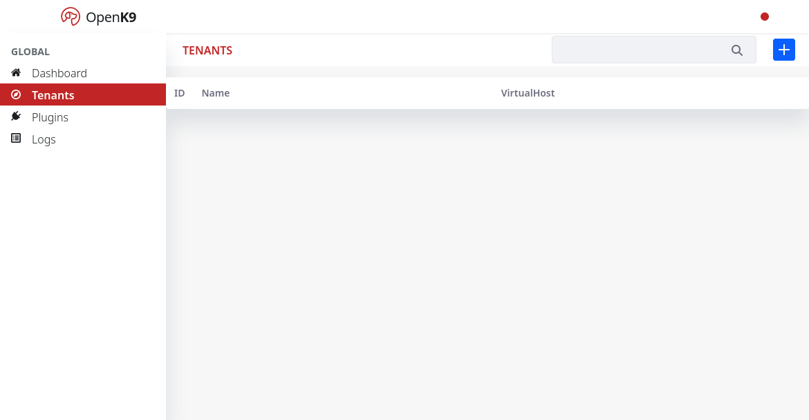

Add new tenant with name *demo.openk9.local*(use both as name and virtualHost)

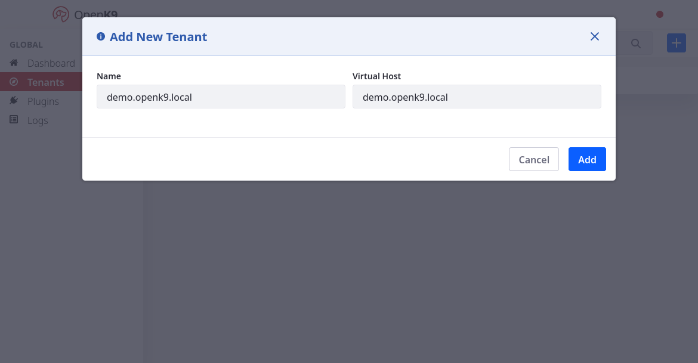

Modify tenant Json configuration adding following and save:

```json
{
    "querySourceBarShortcuts": [
        {
            "id": "web",
            "text": "web"
        },
        {
            "id": "document",
            "text": "document"
        }
    ]
}
```

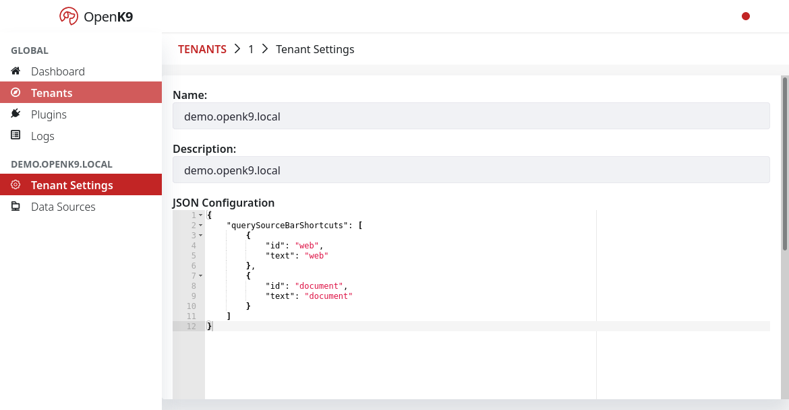

## Datasource configuration

Now create new *Datasource*.

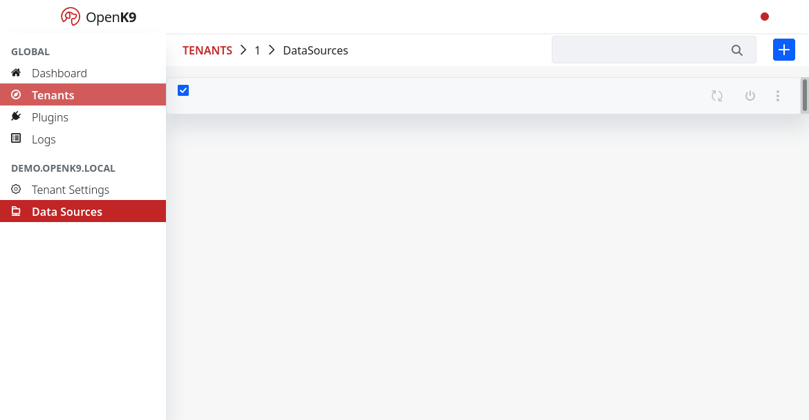

The information present in the *datasource* is acquired through a plugin.
Basically, only a few generic plugins are available; to see how to create new plugin goes to apposite section.
As *Driver Service Name* choose `SitemapWebPluginDriver` to acquire the contents of a website using a crawler that relies on its sitemap.

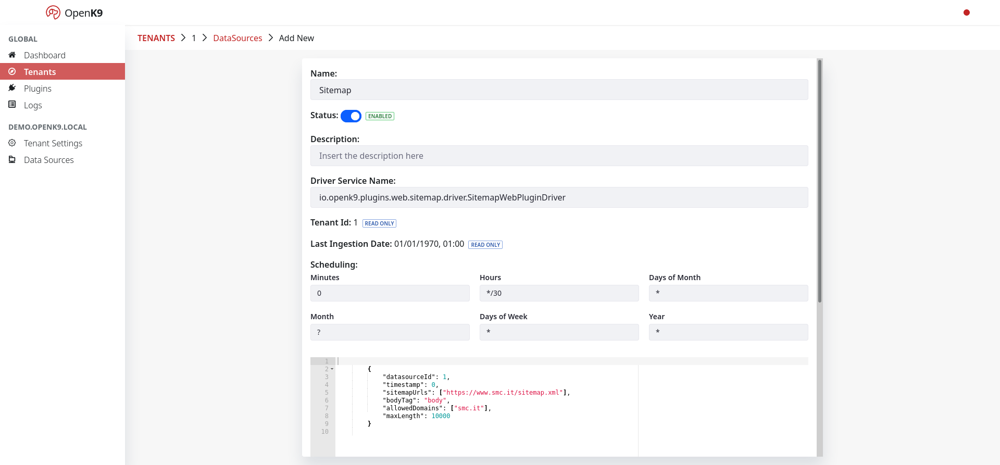

The basic configuration proposes the scan of the SMC official website with a schedule of 30
minutes from the beginning of the hour. Accept the defaults or change them. Then Save.

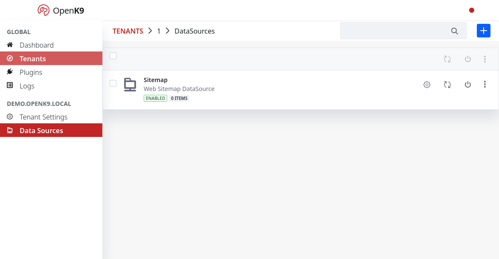

Go inside datasource detail and click on *Enrich* card.

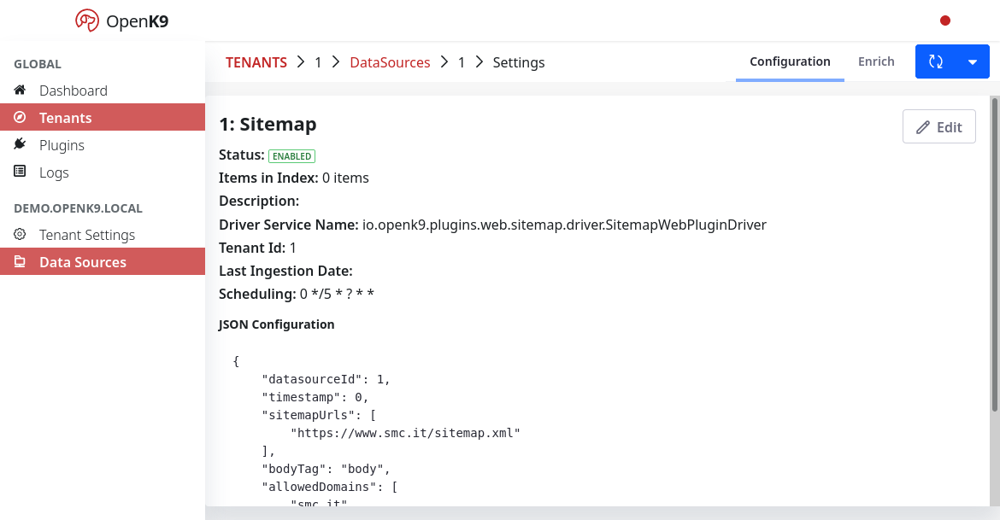

## Enrich Pipeline configuration

Now create a new Enrich Pipeline

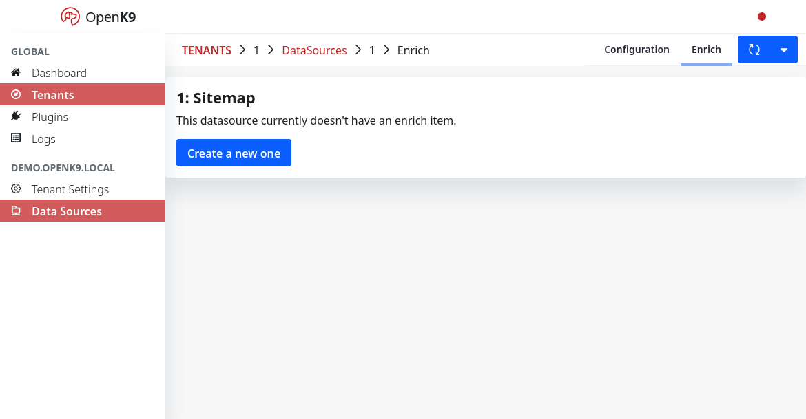

Use ADD button to create new Enirch Item.

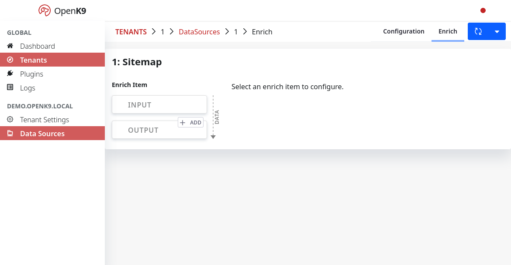

A Named Entity Recognition Enrich Item is used in this example,
using the *AsyncWebNerEnrichProcessor* component which contains logic to asynchronously
process information from a website, through a Lite Named Entity Recognition service.
Then Save to accept the default values.

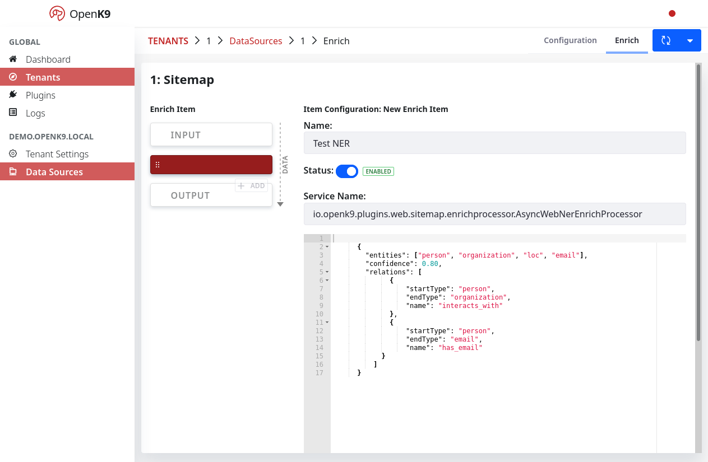

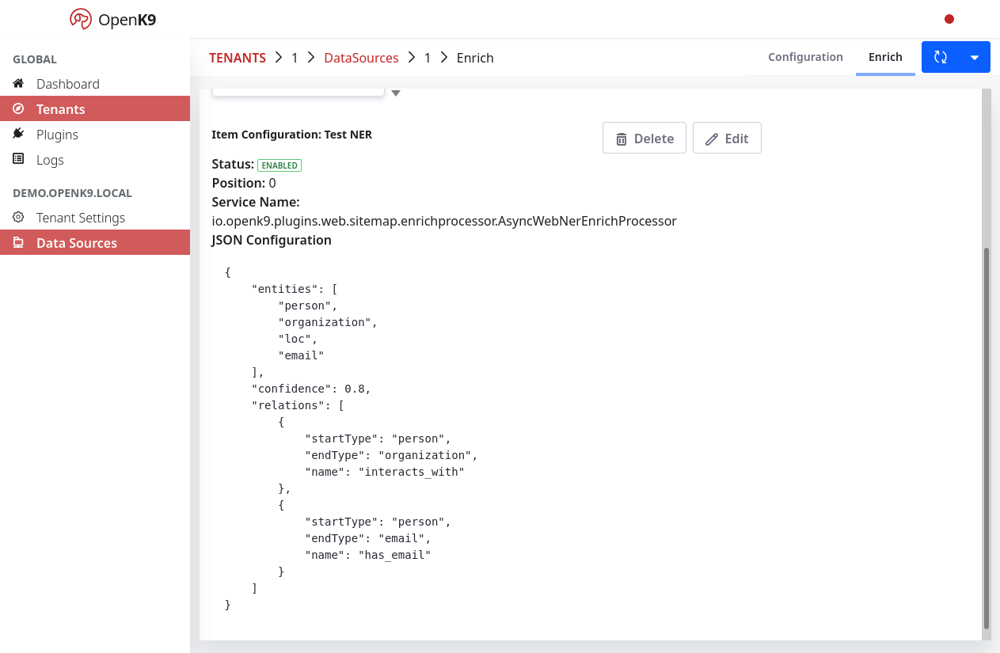

Return to Enrich Pipeline detail to see a graphic representation of pipeline.

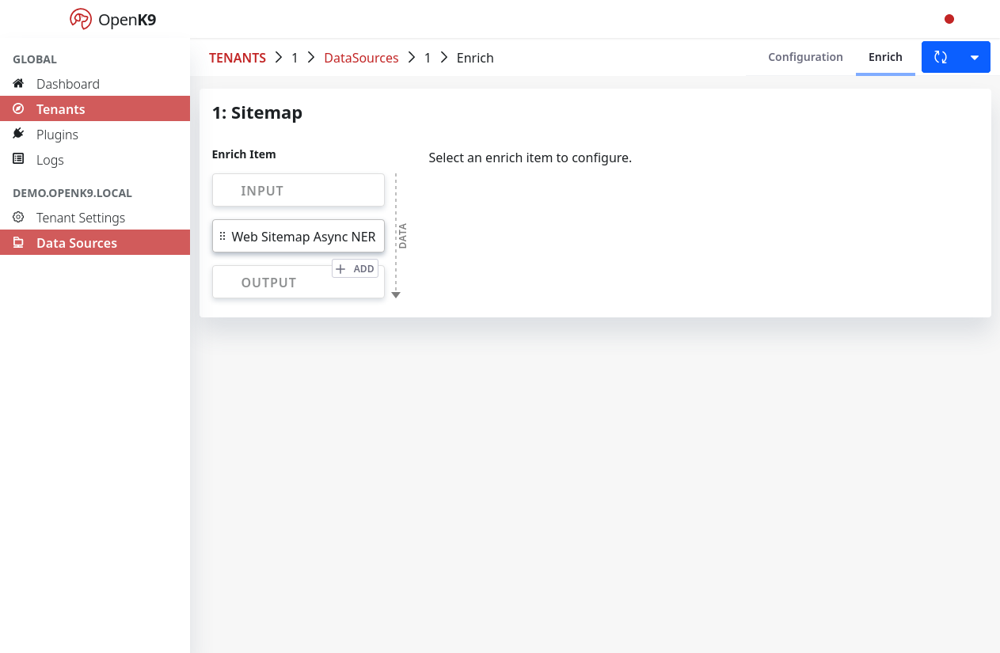

Now is time to start first data ingestion.

## First data ingestion

To start first data ingestion you can wait for the scheduler to trigger ingestion, based on configured scheduling expression.

Another option is to trigger a reindex manually. To do this you can click on reindex tab for a specific datasource.


Now go to Openk9 frontend using url [http://demo.openk9.local/](http://demo.openk9.local/) and you can see your data arriving.
