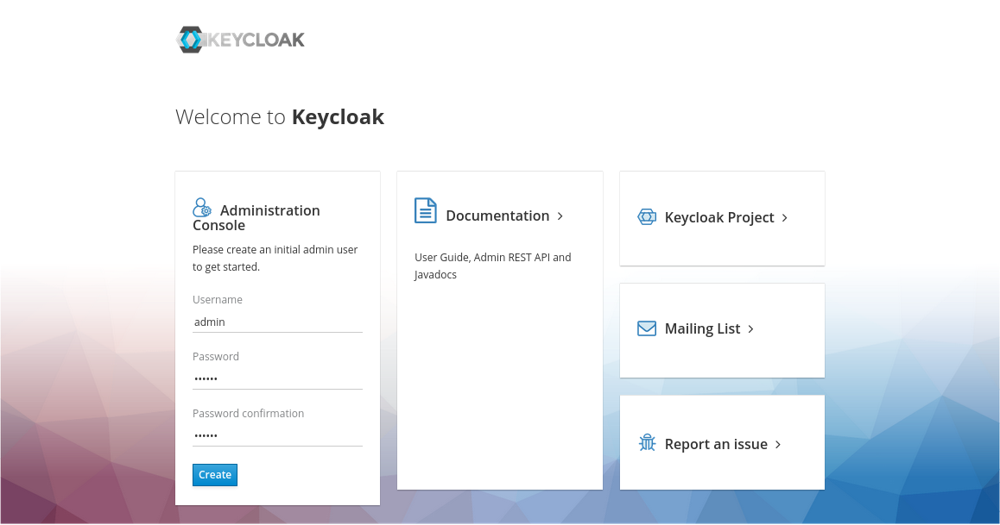
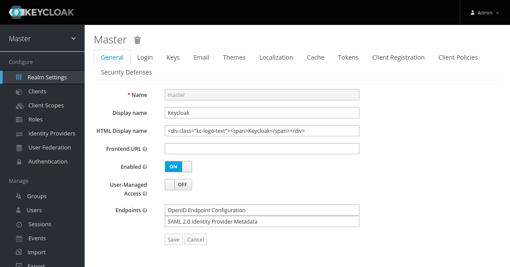

In this guide we'll see how to install Openk9 prerequisites on K3s server.

## Intro

This guide assumes the presence of a server [K3s](https://k3s.io/) also in configuration
[single node] where the "control plane" and "worker" roles coexist on the same server.

All operations can be carried out from your workstation as indicated in [Kubernetes from PC Host].

## Namespace

Even if you have an entire dedicated kubernetes, it is a good idea to install OpenK9 in its own namespace.

``bash
kubectl create namespace openk9
``

Attention, the use of a namespace other than `default` requires that in every `kubectl` or `helm` command
there is the indication of the namespace to use: `-n openk9`.
To get around this *inconvenience* it is possible to make "openk9" the default namespace

``bash
kubectl config set-context --current --namespace = openk9
``

## Dns resolution

Inside the pods created in the `openk9` namespace the `/etc/resolv.conf` file contains the indications for resolving DNS names.
The file is populated with

``
search openk9.svc.cluster.local svc.cluster.local cluster.local localdomain
nameserver x.x.x.x
``

Therefore, although it is always preferable to indicate a service with ``<name>.<namespace>``,
if the service is within the same namespace it will also be found by indicating only its name.


## Ingress and tls

OpenK9 is a headless solution and the interfaces provided are built with client technologies (eg: ReactJS) that use the
API on `http` or `https`(better).

Furthermore, the various third-party products used have dashboards or similar that it would be useful to be able to use
externally to Kuberertes in the contexts of development or search for errors.

Before proceeding with the installation, it is therefore necessary to define:

* the Full Qualified Domain Name through which the OpenK9 solution will be accessible from outside the Kubernetes cluster

* how the x509 certificate used by Ingress will be provided.


### Certificate for "openk9.local"

Thanks to the presence of the **cert-manager** within our K3s, we are autonomous in creating a start certificate for "openk9.local".

We prepare the `star-openk9-local-certs.yaml` file with the definition of the certificate and its Issuer

```yaml
apiVersion: cert-manager.io/v1
kind: Certificate
metadata:
  name: selfsigned-ca
spec:
  isCA: true
  commonName: "* .openk9.local"
  secretName: selfsigned-ca-secret
  dnsNames:
    - "* .openk9.local"
    - ".openk9.local"
    - "openk9.local"
  privateKey:
    algorithm: RSA
    size: 2048
  issuerRef:
    name: selfsigned-cluster-issuer
    kind: ClusterIssuer
---
apiVersion: cert-manager.io/v1
kind: Issuer
metadata:
  name: openk9-ca-issuer
spec:
  ca:
    secretName: selfsigned-ca-secret
```

and we apply it

``
kubectl apply -n openk9 -f star-openk9-local-certs.yaml
``

and I verify it is created

``
kubectl -n openk9 describe secret selfsigned-ca-secret
``

## Installation pre-requirements

### Preparing the installation

OpenK9 uses established products for some aspects/functionality. These products must be present in Kubernets
before installing OpenK9. Currently installing through [Helm Charts] (https://helm.sh/docs/topics/charts/) is the best choice.

Inside the "<mark> TODO </mark>" repository there is the `kubernetes/00-requirements` folder where, for each product,
there are configuration files for the different installation scenarios.

Cloning or exporting the repository locally makes it easier to use these files.

Before proceeding with the installation of the chart it is necessary to refine some parameters present in the configuration
file [values.yaml](https://github.com/elastic/helm-charts/blob/v7.15.0/elasticsearch/values.yaml) for a local development
scenario (as per `00-requirements/00-elasticsearch/local-runtime.yaml`)

```yaml
# This scenario creates a single-instance standalone ElasticSearch
# machine, with the most basic configuration and limited
# resource to be fit in a local K8s/K3s/Minukube environment

# Permit co-located instances for solitary k3s virtual machines.
antiAffinity: "soft"

# Shrink default JVM heap (values have to be the same)
esJavaOpts: "-Xmx512m -Xms512m"

# ElasticSearch Version
imageTag: 7.15.0

# Only a single pod for this development enviroment
replicas: 1

# Allocate smaller chunks of memory per pod.
resources:
  requests:
    cpu: "400m"
    memory: "512Mi"
  limits:
    cpu: "1000m"
    memory: "1Gi"

# Request smaller persistent volumes. In a cloud environment small
# volume means low IOPS
volumeClaimTemplate:
  accessModes: [ "ReadWriteOnce" ]
  resources:
    requests:
      storage: 5Gi
```

### Install ElasticSearch

```bash
helm install elasticsearch elastic/elasticsearch \
  -n openk9 \
  -f 00-requirements/00-elasticsearch/local-runtime.yaml
```

### Verify installation

To verify correct installation:

- make port 9200 visible from the local station

```bash
kubectl port-forward -n openk9 svc/elasticsearch-master 9200
```

- openk browser on "http://localhost:9200" to get the informational JSON

```
{
  "name" : "elasticsearch-master-0",
  "cluster_name" : "elasticsearch",
  "cluster_uuid" : "nnIJtp_KRtSX8bExBtNJ8Q",
  "version" : {
    "number" : "7.15.0",
    "build_flavor" : "default",
    "build_type" : "docker",
    "build_hash" : "79d65f6e357953a5b3cbcc5e2c7c21073d89aa29",
    "build_date" : "2021-09-16T03:05:29.143308416Z",
    "build_snapshot" : false,
    "lucene_version" : "8.9.0",
    "minimum_wire_compatibility_version" : "6.8.0",
    "minimum_index_compatibility_version" : "6.0.0-beta1"
  },
  "tagline" : "You Know, for Search"
}
```

### elastic.demo.openk9.local

If you want to expose ElasticSearch outside Kubernetes you need to configure an **Ingress**,
preferably in https.
The chart allows me to do this using "nginx-controller" as a backend while my K3s cluster has "traefik".

Create Ingress

```bash
cat <<_EOF_ | kubectl apply -n openk9 -f -
apiVersion: networking.k8s.io/v1
kind: Ingress
metadata:
  name: elasticsearch-master
  annotations:
    kubernetes.io/ingress.class: traefik
spec:
  rules:
    - host: "elastic.demo.openk9.local"
      http:
        paths:
          - path: /
            pathType: Prefix
            backend:
              service:
                name:  elasticsearch-master-headless
                port:
                  number: 9200
  tls:
    - hosts:
        - "elastic.demo.openk9.local"
      secretName: selfsigned-ca-secret
_EOF_
```

where:

* expose ElasticSearch as "elastic.demo.openk9.local". In order to use this hostname I have to register it in my hosts file

* provide both http and https access (using the self-signed certificates produced by the cert-manager)

* use the headless service to get the IPs of the pods and allow Traefik to apply its load-balancing logics.

At this point, after updating the hosts file, if you open a browser on "http: //elastic.demo.openk9.local" you should
get the json with the server info.


## Kibana v7.15.0

### Preparing the installation

Kibana is not a fundamental component for a local environment; if you don't need to directly access data on
Elasticsearch you can skip this step.
Also for Kibana you can use the official [Helm Charts](https://github.com/elastic/helm-charts).

I add to helm the repository that contains the charts(if not already done)

```bash
helm repo add elastic https://helm.elastic.co
```

Before proceeding with the installation of the chart, it is necessary to refine some parameters present in the configuration
file [values.yaml](https://github.com/elastic/helm-charts/blob/v7.15.0/kibana/values.yaml) for a local development
scenario (as per `00-requirements/01-kibana/local-runtime.yaml`)

```yaml
---
# ElasticSearch Kibana Version
imageTag: 7.15.0

# ElasticSearch server (dns resolution needs namespace)
elasticsearchHosts: "http://elasticsearch-master.openk9:9200"

# Only a single pod for this development enviroment
replicas: 1

# Allocate smaller chunks of memory per pod.
resources:
  requests:
    cpu: "100m"
    memory: "256M"
  limits:
    cpu: "1000m"
    memory: "512M"
```

### Install Kibana

```bash
helm install kibana elastic/kibana \
  -n openk9 \
  -f 00-requirements/01-kibana/local-runtime.yaml
```

### Verify installation

To verify correct installation:

- verify that pod is available

```bash
kubectl get pod -n openk9
```

```
NAME                             READY   STATUS    RESTARTS   AGE
elasticsearch-master-0           1/1     Running   0          24m
kibana-kibana-759bc99675-qt4n9   1/1     Running   0          67s
```

- make the Kibana port usable outside the virtual machine

```
kubectl port-forward -n openk9 deployment/kibana-kibana 5601
```

- from local open "http://localhost:5601"


### kibana.demo.openk9.local


If you want to expose Kibana outside of Kubernetes you need to configure an **Ingress**, preferably in https.
The chart allows me to do this using "nginx-controller" as a backend while my K3s cluster has "traefik".

Create Ingress

```bash
cat <<_EOF_ | kubectl apply -n openk9 -f -
apiVersion: networking.k8s.io/v1
kind: Ingress
metadata:
  name: kibana-master
  annotations:
    kubernetes.io/ingress.class: traefik
spec:
  rules:
    - host: "kibana.demo.openk9.local"
      http:
        paths:
          - path: /
            pathType: Prefix
            backend:
              service:
                name:  kibana-master-headless
                port:
                  number: 5601
  tls:
    - hosts:
        - "kibana.demo.openk9.local"
      secretName: selfsigned-ca-secret
_EOF_
```

where:

* I expose the Kibana console as "kibana.demo.openk9.local". In order to use this hostname you have to register it in my hosts file

* I provide both http and https access (using the self-signed certificates produced by the cert-manager)

* I use the headless service to get the IPs of the pods and allow Traefik to apply its load-balancing logics.


At this point, after updating the hosts file, if I open a browser on "http: //kibana.demo.openk9.local" you should access the console.


## RabbitMQ v3.8

### Preparing the installation

[RabbitMQ](https://www.rabbitmq.com/) is another fundamental element of OpenK9 as it allows asynchronous
dialogue between the different components of the solution.

To install RabbitMQ I use the helm Chart created by [Bitnami](https://github.com/bitnami/charts/tree/master/bitnami/rabbitmq)
which manages in an excellent way the different needs both for stand-alone installation both for cluster installation.

I add to helm the repository that contains the charts

`` '' bash
helm repo add bitnami https://charts.bitnami.com/bitnami
``

Before proceeding with the installation of the chart it is necessary to refine some parameters present in the configuration file
[values.yaml](https://github.com/bitnami/charts/blob/master/bitnami/rabbitmq/values.yaml) for one local development scenario
(as per `00-requirements/02-rabbitmq/local-runtime.yaml`)

```yaml
# This scenario creates a single-instance standalone RabbitMQ
# machine, with the most basic configuration and limited
# resource to be fit in a local K8s/K3s/Minukube environment

image:
  tag: 3.8

auth:
  username: "openk9"
  password: "openk9"

extraPlugins: "rabbitmq_amqp1_0"

clustering:
  enabled: false

replicaCount: 1

terminationGracePeriodSeconds: 30

resources:
  limits:
    cpu: "500m"
    memory: "512M"
  requests:
    cpu: "100m"
    memory: "256M"

persistence:
  size: 1Gi
```

### Install RabbitMQ

```yaml
helm install rabbitmq bitnami/rabbitmq \
  -n openk9 \
  -f 00-requirements/02-rabbitmq/local-runtime.yaml
```

```
....

Credentials:
    echo "Username      : openk9"
    echo "Password      : $(kubectl get secret --namespace openk9 rabbitmq -o jsonpath="{.data.rabbitmq-password}" | base64 --decode)"
    echo "ErLang Cookie : $(kubectl get secret --namespace openk9 rabbitmq -o jsonpath="{.data.rabbitmq-erlang-cookie}" | base64 --decode)"

Note that the credentials are saved in persistent volume claims and will not be changed upon upgrade or reinstallation unless the persistent volume claim has been deleted. If this is not the first installation of this chart, the credentials may not be valid.
This is applicable when no passwords are set and therefore the random password is autogenerated. In case of using a fixed password, you should specify it when upgrading.
More information about the credentials may be found at https://docs.bitnami.com/general/how-to/troubleshoot-helm-chart-issues/#credential-errors-while-upgrading-chart-releases.

RabbitMQ can be accessed within the cluster on port  at rabbitmq.openk9.svc.

To access for outside the cluster, perform the following steps:

To Access the RabbitMQ AMQP port:

    echo "URL : amqp://127.0.0.1:5672/"
    kubectl port-forward --namespace openk9 svc/rabbitmq 5672:5672

To Access the RabbitMQ Management interface:

    echo "URL : http://127.0.0.1:15672/"
    kubectl port-forward --namespace openk9 svc/rabbitmq 15672:15672

WARNING: Rolling tag detected (bitnami/rabbitmq:3.8), please note that it is strongly recommended to avoid using rolling tags in a production environment.
+info https://docs.bitnami.com/containers/how-to/understand-rolling-tags-containers/
```

### Verify Installation

As suggested by the installation notes

* I expose the Management interface on the host PC

``bash
kubectl port-forward -n openk9 svc/rabbitmq 15672:15672
``

* open a browser on "http: // localhost: 15672"

* log in with the user and password declared in `00-requirements/02-rabbitmq/local-devel.yaml`.

I use CTRL-C to stop port forward.


### rabbitmq.demo.openk9.local

If you want to expose the RabbitMQ console outside Kubernetes it is necessary to configure an **Ingress**, preferably in https.
The chart allows me to do this using "nginx-controller" as a backend while my K3s cluster has "traefik".

Create Ingress

`` '' bash
cat << _ EOF_ | kubectl apply -n openk9 -f -
apiVersion: networking.k8s.io/v1
kind: Ingress
metadata:
  name: rabbitmq
  annotations:
    kubernetes.io/ingress.class: traefik
spec:
  rules:
    - host: "rabbitmq.demo.openk9.local"
      http:
        paths:
          - path: /
            pathType: Prefix
            backend:
              service:
                name: rabbitmq-headless
                port:
                  number: 15672
  tls:
    - hosts:
        - "rabbitmq.demo.openk9.local"
      secretName: selfsigned-ca-secret
_EOF_
``

where:

* expose the RabbitMQ console as "rabbitmq.demo.openk9.local". In order to use this hostname you have to register it in my hosts file

* provide both http and https access (using the self-signed certificates produced by the cert-manager)

* use the headless service to get the IPs of the pods and allow Traefik to apply its load-balanciong logics.


At this point, after updating the hosts file, if you open a browser on "http://rabbitmq.demo.openk9.local" you should access the console.

## PostgreSQL v13.x

### Preparing the installation

Different elements of OpenK9 needs relational database. [PostgreSQL](https://www.postgresql.org/) represents best solution.

To install PostgreSQL use helm chart by [Bitnami](https://github.com/bitnami/charts/tree/master/bitnami/postgres).

Add to helm repository that contains chart.

```bash
helm repo add bitnami https://charts.bitnami.com/bitnami
```

Before chart installation is necessary to refine some parameters present in the configuration file
[values.yaml](https://github.com/bitnami/charts/blob/master/bitnami/postgresql/values.yaml)
for a local development scenario (`00-requirements/03-postgresql/local-runtime.yaml`)

```yaml
# This scenario creates a single-instance standalone RabbitMQ
# machine, with the most basic configuration and limited
# resource to be fit in a local K8s/K3s/Minukube environment


image:
  # We want latest PostgreSQL 13.x
  tag: 13

auth:
  # enable default "postgres" admin user
  enablePostgresUser: true
  # password for default postgres admin user
  postgresPassword: "system"
  # custom user to create
  username: "openk9"
  # custom user password
  password: "openk9"
  # custom database
  database: "openk9"

architecture: standalone

primary:
  initdb:
    args: "--no-locale --encoding=UTF8"
  resources:
    limits:
      memory: 256Mi
      cpu: 250m
    requests:
      memory: 256Mi
      cpu: 250m

persistence:
  size: 2Gi
```

### Install PostgreSQL

```bash
helm install postgresql bitnami/postgresql \
  -n openk9 \
  -f 00-requirements/03-postgresql/local-runtime.yaml
```

```
...

** Please be patient while the chart is being deployed **

PostgreSQL can be accessed via port 5432 on the following DNS names from within your cluster:

    postgresql.openk9.svc.cluster.local - Read/Write connection

To get the password for "postgres" run:

    export POSTGRES_ADMIN_PASSWORD=$(kubectl get secret --namespace openk9 postgresql -o jsonpath="{.data.postgres-password}" | base64 --decode)

To get the password for "openk9" run:

    export POSTGRES_PASSWORD=$(kubectl get secret --namespace openk9 postgresql -o jsonpath="{.data.password}" | base64 --decode)

To connect to your database run the following command:

    kubectl run postgresql-client --rm --tty -i --restart='Never' --namespace openk9 --image docker.io/bitnami/postgresql:13 --env="PGPASSWORD=$POSTGRES_PASSWORD" \
      --command -- psql --host postgresql -U openk9 -d openk9 -p 5432

To connect to your database from outside the cluster execute the following commands:

    kubectl port-forward --namespace openk9 svc/postgresql 5432:5432 &
    PGPASSWORD="$POSTGRES_PASSWORD" psql --host 127.0.0.1 -U openk9 -d openk9 -p 5432
WARNING: Rolling tag detected (bitnami/postgresql:13), please note that it is strongly recommended to avoid using rolling tags in a production environment.
+info https://docs.bitnami.com/containers/how-to/understand-rolling-tags-containers/
```

### Verify installation

you can use kubectl to activate a temporary pod with psql command

```bash
$ export POSTGRES_PASSWORD=$(kubectl get secret --namespace openk9 postgresql -o jsonpath="{.data.password}" | base64 --decode)
$ kubectl run postgresql-client --rm --tty -i --restart='Never' \
   -n openk9 \
   --image docker.io/bitnami/postgresql:13 \
   --env="PGPASSWORD=$POSTGRES_PASSWORD" \
   --command -- psql --host postgresql -U openk9 -d openk9 -p 5432
```

When `If you don't see a command prompt, try pressing enter.` message appears, bisogna inserire la password dell'utente `openk9` e quindi premere invio.

Da `psql` posso usare il comando `\l` per vedere i database ed i template presenti.

```
If you don't see a command prompt, try pressing enter.

psql (13.5)
Type "help" for help.

openk9=> \l
                             List of databases
   Name    |  Owner   | Encoding | Collate | Ctype |   Access privileges
-----------+----------+----------+---------+-------+-----------------------
 openk9    | openk9   | UTF8     | C       | C     | =Tc/openk9           +
           |          |          |         |       | openk9=CTc/openk9
 postgres  | postgres | UTF8     | C       | C     |
 template0 | postgres | UTF8     | C       | C     | =c/postgres          +
           |          |          |         |       | postgres=CTc/postgres
 template1 | postgres | UTF8     | C       | C     | =c/postgres          +
           |          |          |         |       | postgres=CTc/postgres
(4 rows)

openk9=> \q
pod "postgresql-client" deleted
```

## Neo4J v4.2.6

### Preparing the installation

[Neo4J](https://neo4j.com/) is used by OpenK9 to manage/describe the relationships between indexed items.

To install Neo4J I use the [Helm Chart](https://github.com/neo4j-contrib/neo4j-helm) made available by the community.

> For Neo4J version 4.3 and later, the official [Helm Charts] (https://neo4j.com/labs/neo4j-helm/1.0.0/) are available

Before proceeding with the installation of the chart it is necessary to refine some parameters present in the configuration file
[values.yaml](https://github.com/neo4j-contrib/neo4j-helm/blob/4.2.6-1/values. yaml) for a local development scenario
(as per `00-requirements/04-neo4j/local-runtime.yaml`

```yaml
# This scenario creates a single-instance standalone Neo4j
# machine, with the most basic configuration and limited
# resource to be fit in a local K3s/Minukube environment
###############################################################

core:
  standalone: true
  numberOfServers: 1
  persistentVolume:
    size: 4Gi
  resources:
    limits:
      cpu: "500m"
      memory: 2Gi
    requests:
      cpu: "100m"
      memory: 512Mi

dbms:
    memory:
        use_memrec: false
        heap:
            initial_size: 1024m
            max_size: 1024m
        pagecache:
            size: 123m
        transaction:
            memory_allocation: ON_HEAP
            max_size: 60m
            global_max_size: 200m


acceptLicenseAgreement: "yes"
neo4jPassword: openk9
defaultDatabase: "neo4j"
```


From chart:

- default user is `neo4j`

- default database will be `neo4j`

- APOC plugin, needed for OpenK9, is already included in image

- volumes "conf", "plugin", etc. are handles as directories in volume "data"

Quindi installo il chart referenziandolo attraverso la Release URL in github

### Install Neo4j

```bash
helm install neo4j \
   https://github.com/neo4j-contrib/neo4j-helm/releases/download/4.2.6-1/neo4j-4.2.6-1.tgz \
   -n openk9 \
   -f  00-requirements/04-neo4j/local-runtime.yaml
```

...

Your cluster is now being deployed, and may take up to 5 minutes to become available.
If you'd like to track status and wait on your rollout to complete, run:

```bash
$ kubectl rollout status \
    --namespace openk9 \
    StatefulSet/neo4j-neo4j-core \
    --watch
```

You can inspect your logs containers like so:

We can see the content of the logs by running the following command:

```bash
$ kubectl logs --namespace openk9 -l \
    "app.kubernetes.io/instance=neo4j,app.kubernetes.io/name=neo4j,app.kubernetes.io/component=core"
```

We can now run a query to find the topology of the cluster.

```bash
export NEO4J_PASSWORD=$(kubectl get secrets neo4j-neo4j-secrets --namespace openk9 -o jsonpath='{.data.neo4j-password}' | base64 -d)
kubectl run -it --rm cypher-shell \
    --image=neo4j:4.2.6-enterprise \
    --restart=Never \
    --namespace openk9 \
    --command -- ./bin/cypher-shell -u neo4j -p "$NEO4J_PASSWORD" -a neo4j://neo4j-neo4j.openk9.svc.cluster.local "call dbms.routing.getRoutingTable({}, 'system');"
```

This will print out the addresses of the members of the cluster.

Note:
You'll need to substitute *password* with the password you set when installing the Helm package.
If you didn't set a password, one will be auto generated.
You can find the base64 encoded version of the password by running the following command:

```
kubectl get secrets neo4j-neo4j-secrets -o yaml --namespace openk9
```

### Verify installation

Wait a couple of minutes for all the resources to be installed then use when indicated
by the installation notes to verify the correct activation of the service.

```bash
$ export NEO4J_PASSWORD=$(kubectl get secrets neo4j-neo4j-secrets --namespace openk9 -o jsonpath='{.data.neo4j-password}' | base64 -d)
$ kubectl run -it --rm cypher-shell \
    --image=neo4j:4.2.6-enterprise \
    --restart=Never \
    --namespace openk9 \
    --command -- ./bin/cypher-shell -u neo4j -p "$NEO4J_PASSWORD" -a neo4j://neo4j-neo4j.openk9.svc.cluster.local "call dbms.routing.getRoutingTable({}, 'system');"
```

```
If you don't see a command prompt, try pressing enter.
+----------------------------------------------------------------------------------------------------------------------------------------------------------------------------------------------------------------------------------------------------------------------------------------------------+
| ttl | servers                                                                                                                                                                                                                                                                                      |
+----------------------------------------------------------------------------------------------------------------------------------------------------------------------------------------------------------------------------------------------------------------------------------------------------+
| 300 | [{addresses: ["neo4j-neo4j-core-0.neo4j-neo4j.openk9.svc.cluster.local:7687"], role: "WRITE"}, {addresses: ["neo4j-neo4j-core-0.neo4j-neo4j.openk9.svc.cluster.local:7687"], role: "READ"}, {addresses: ["neo4j-neo4j-core-0.neo4j-neo4j.openk9.svc.cluster.local:7687"], role: "ROUTE"}] |
+----------------------------------------------------------------------------------------------------------------------------------------------------------------------------------------------------------------------------------------------------------------------------------------------------+

1 row available after 451 ms, consumed after another 9 ms
pod "cypher-shell" deleted
```

### Neo4j Browser

Neo4j disposes of a web console to perform queries on data. We need to expose this console.

 ```bash
 kubectl -n openk9 port-forward svc/neo4j-neo4j 7474:7474 7687:7687
 ```

Then you can access to [http://localhost:7474/browser](http://localhost:7474/browser):

 * as URL Connect uso "bolt://localhost:7687"
 * as username use "neo4j"
 * as password use password specified in `00-requirements/04-neo4j/local-runtime.yaml`

Then you can perform queries using Cypher Query Language.


## Consul v1.11.2

### Preparing the installation

[Consul](https://www.consul.io/) is a product developed by HashiCorp and provides "Service Discovery" and "KeyValue Store" features.

To install Consul use [Helm Chart](https://github.com/hashicorp/consul-k8s/tree/main/charts/consul)
provided by HashiCorp.

Add to helm repository:

```bash
helm repo add hashicorp https://helm.releases.hashicorp.com
```

Before chart installation is necessary to change some parameters in
[values.yaml](https://github.com/hashicorp/consul-k8s/blob/v0.40.0/charts/consul/values.yaml)
for local development (as in `00-requirements/05-consul/local-runtime.yaml`)

```yaml
# This scenario creates a single-instance standalone Consul
# machine, with the most basic configuration and limited
# resource to be fit in a local K3s/Minukube environment
###############################################################

global:
  name: consul

  # The name of the datacenter that the agents should
  # register as. This can't be changed once the Consul cluster is up and running
  # since Consul doesn't support an automatic way to change this value currently:
  # https://github.com/hashicorp/consul/issues/1858.
  datacenter: dc1

  # The domain Consul will answer DNS queries for
  # (see `-domain` (https://consul.io/docs/agent/options#_domain)) and the domain services synced from
  # Consul into Kubernetes will have, e.g. `service-name.service.consul`.
  domain: consul

server:
  replicas: 1
  storage: 1Gi

ui:
  enabled: true
  service:
    type: 'NodePort'

# Configures the automatic Connect sidecar injector.
connectInject:
  # True if you want to enable connect injection. Set to "-" to inherit from
  # global.enabled.
  enabled: true

  # The number of deployment replicas.
  replicas: 1

  # If true, the injector will inject the
  # Connect sidecar into all pods by default. Otherwise, pods must specify the
  # injection annotation (https://consul.io/docs/k8s/connect#consul-hashicorp-com-connect-inject)
  # to opt-in to Connect injection. If this is true, pods can use the same annotation
  # to explicitly opt-out of injection.
  default: false

controller:
  enabled: true
```

### Install Consul

Install Consul in ad-hoc namespace


```bash
helm install consul hashicorp/consul \
  --namespace consul --create-namespace \
  -f 00-requirements/05-consul/local-runtime.yaml
```

### Verify installation


Acces to `consul` inside pod and get list of registered nodes

```bash
kubectl -n consul exec -it consul-server-0 -- consul members
```


```
Node                 Address         Status  Type    Build   Protocol  DC   Partition  Segment
consul-server-0      10.85.0.8:8301  alive   server  1.11.2  2         dc1  default    <all>
k3s-master.vm.local  10.85.0.6:8301  alive   client  1.11.2  2         dc1  default    <default>

### Consul Dashboard

Installation contains also a dashboard. We can do port-forward to connect locally to it.

```
kubectl -n consul port-forward consul-server-0 8500:8500
```

Then access to url "http://localhost:8500/"

### consul.demo.openk9.local

Eventually I can permanently export, through an Ingress, the Consul console outside of Kubernetes

```bash
cat <<_EOF_ | kubectl apply -n consul -f -
apiVersion: networking.k8s.io/v1
kind: Ingress
metadata:
  name: consul-openk9
  annotations:
    kubernetes.io/ingress.class: traefik
spec:
  rules:
    - host: "consul.demo.openk9.local"
      http:
        paths:
          - path: /
            pathType: Prefix
            backend:
              service:
                name:  consul-server
                port:
                  number: 8500
  tls:
    - hosts:
        - "consul.demo.openk9.local"
      secretName: selfsigned-ca-secret
_EOF_
```

In practice:

* expose the Consul console as "consul.demo.openk9.local". In order to use this hostname I have to register it in my hosts file

* provide both http and https access (using the self-signed certificates produced by the cert-manager)

* use the headless service to get the IPs of the pods and allow Traefik to apply its load-balanciong logics.

At this point, after updating the hosts file, if you open a browser on "http://consul.demo.openk9.local" you should access the console

## Keycloak

### Preparing the installation

For its installation within K3s we will use the [Helm Charts](https://github.com/codecentric/helm-charts/tree/master/charts/keycloak) provided by CodeCentric.

Add to helm the repository that contains the charts

```bash
helm repo add codecentric https://codecentric.github.io/helm-charts
```

Before proceeding with the installation of the chart it is necessary to refine some parameters present in the configuration file
[values.yaml](https://github.com/codecentric/helm-charts/blob/master/charts/keycloak/values.yaml)
for a local development scenario (as per `00-requirements/06-keycloak/local-runtime.yaml`)

```yaml
# This scenario creates a single-instance standalone Keycloak
# machine, with the most basic configuration and limited
# resource to be fit in a local K3s/Minukube environment
###############################################################

# Number of Keycloak replicas to deploy
replicaCount: 1

# Keycloak image version. The preferred way is to install the chart
# version with the desired app version
# images:
#   tag: 16.1.1

# Disable PostgreSQL dependency
postgresql:
  enabled: false

# Set existing PostgreSQL
extraEnv: |
  - name: DB_VENDOR
    value: postgres
  - name: DB_ADDR
    value: postgresql.openk9
  - name: DB_PORT
    value: "5432"
  - name: DB_DATABASE
    value: keycloak
  - name: DB_USER_FILE
    value: /secrets/db-creds/username
  - name: DB_PASSWORD_FILE
    value: /secrets/db-creds/password
  - name: JAVA_OPTS
    value: >-
      -XX:+UseContainerSupport
      -XX:MaxRAMPercentage=70.0
      -Djava.net.preferIPv4Stack=true
      -Djboss.modules.system.pkgs=$JBOSS_MODULES_SYSTEM_PKGS
      -Djava.awt.headless=true

extraVolumeMounts: |
  - name: db-creds
    mountPath: /secrets/db-creds
    readOnly: true

extraVolumes: |
  - name: db-creds
    secret:
      secretName: postgresql-keycloak-secret

# Keycloak resource requests and limits
resources:
  limits:
    cpu: 1000m
    memory: 1Gi
  requests:
    cpu: 250m
    memory: 1Gi

extraInitContainers: |
  - name: keycloak-to-rabbit
    image: busybox
    command: ['sh', '-c', 'mkdir -p /opt/jboss/keycloak/standalone/deployments; wget https://github.com/aznamier/keycloak-event-listener-rabbitmq/blob/target/keycloak-to-rabbit-1.0.jar?raw=true -O /opt/jboss/keycloak/standalone/deployments/keycloak-to-rabbit-1.0.jar']

ingress:
  enabled: true
  annotations:
    kubernetes.io/ingress.class: traefik
  rules:
    - host: "keycloak.demo.openk9.local"
      paths:
        - path: /
          pathType: Prefix
  tls:
    - hosts:
        - "keycloak.demo.openk9.local"
      secretName: selfsigned-ca-secret
```

### Install Keycloak

```bash
helm install keycloak codecentric/keycloak \
  -n openk9 \
  --version 17.0.2 \
  -f 00-requirements/06-keycloak/local-runtime.yaml
```


I have to log in to the console to create the admin user and to interact with the Keycloak console.
Do port-forward to acces to console:

```bash
kubectl -n openk9 port-forward svc/keycloak-http 8280:80
```

The access to console using url "http://localhost:8280" and define admin user "<u>admin</u>" with password "<u>openk9</u>"



After creation click on "Administration Console" to access on console with just created user



### keycloak.demo.openk9.local

The chart made available by CodeCentric provides the possibility to create an Ingress using Traefik
as seen from the `local-runtime.yaml`. It is therefore advisable to exploit the potential of
the chart rather than create an ad-hoc Ingress.

## Adminer v4.8.1

Adminer (also known as phpMinAdmin) is a database management tool written in PHP.
The supported engines are MySQL, PostgreSQL, SQLite, MS SQL, Oracle, Firebird, SimpleDB, Elasticsearch and MongoDB.

This is an ** optional ** requirement: in local scenarios I prefer to use "port-forwards" and access databases with desktop
tools like [DBeaver](https://dbeaver.io/).
However, it is true that in a cloud or non-local context,
the availability of a tool that communicates with the DB without network latencies is an important help.

For installation we use the chart prepared by us

```bash
helm install adminer 00-requirements/07-adminer -n openk9
```

### Verify installation

To verify installation:

* active port-forward from local:

```bash
kubectl -n openk9 port-forward svc/adminer 18080:8080
```

* access to url "[httpd://localhost:18080](httpd://localhost:18080)" and authenticate with PostgreSQL credentials.


