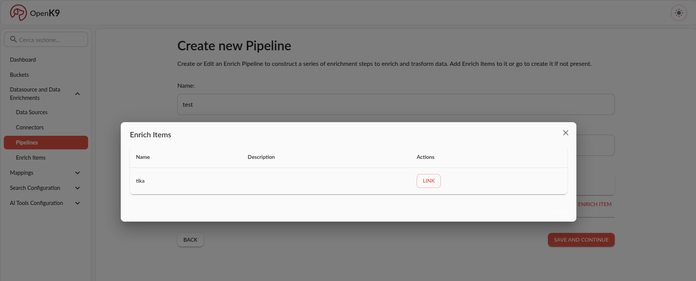
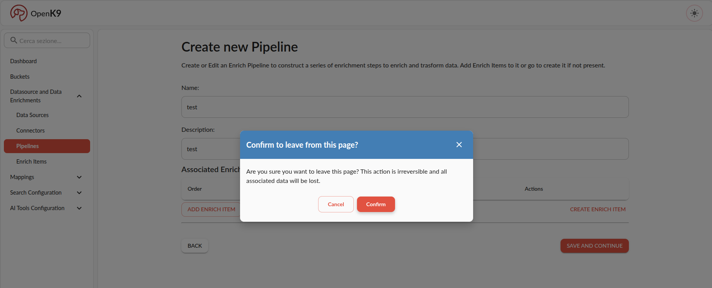

This is the procedure to create and use new enrich pipeline to Openk9.

To create a new enrich pipeline in Openk9, you can:

1. Go to connectors section under Datasource and Data enrichments in left side menu
2. Click on *create new pipeline* button in pipelines listing view
3. Insert into form correct informations, save and continue until pipelione is correctly created.

In following image there is an example of pipeline correctly compilated.

To connect new pipeline you must insert:

- name
- optional description
- associate and ling enrich item to pipeline

If the enrich item to be associated is not present in the list, you can leave enrich pipeline creation and go to enrich item creation using *create enrich item* shortcut.

