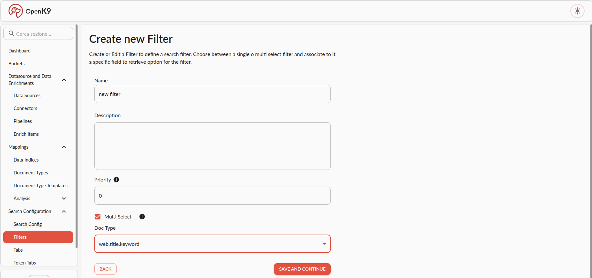

This is the procedure to create and use new filter in Openk9.

To crete a new filter in Openk9:

1. Go to filters section under search config in left side menu
2. Click on *create new filter* button in filter listing view
3. Insert into form correct informations, save and continue until filter is correctly created.

In following image there is an example of form correctly compilated.

To create new filter you must insert:

- name
- optional description
- priority: is the priority to return list of filters to frontend
- multiSelect: if is a multi select filter or not
- doc type field: doc type field associated with filter

Once filter is created, you can add it to your active bucket in following ways:

- using add shorcut present in filters listing view
- editing your active bucket associating new filter

