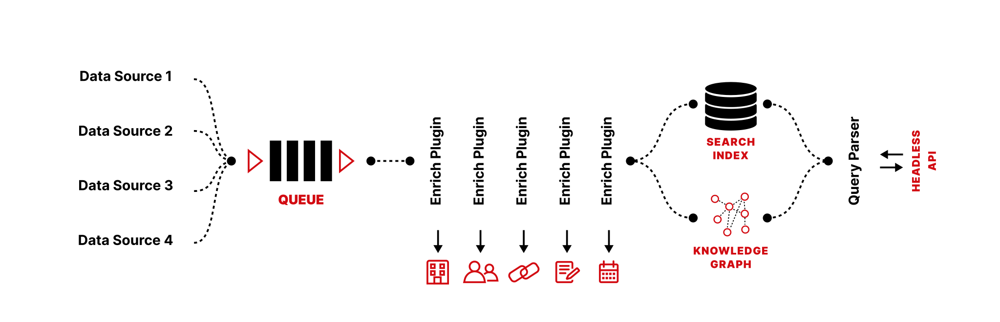

OpenK9 is a powerful modular Open Source Cognitive Enterprise Search System, enhanced through AI and Machine Learning. Using state-of-art Information Retrieval and Machine Learning algorithms, OpenK9 is able to enrich and index data from different data sources.

From version 2.0.0 Generative Ai features have been added.

## How It Works

The system is composed by several modules that make up a data processing pipeline.

- [**Data Source**](datasource) plugins are called from a scheduler, and they are responsible for fetching new data and put it into the Queue
- A MQTT **Queue** handles ingestion backpressure, splitting the processing workload into a pool of workers for enrichment
- Several [**Enrich**](enrich) plugins process the data from the queue and extract info using AI
- The enriched document are then saved and indexed into a **Search Index**
- The entities found by the enrich pipeline are also persisted into a **Knowledge Graph**
- A **Query Parser** is able to convert complex queries into the language used to query the Search Index and the Knowledge Graph
- Dedicated **modules** implements generative ai experience to search and chat with indexed data using external LLMs

OpenK9 is extremely modular and easily extensible. A new data source can be connected quickly and efficiently.

Furthermore, OpenK9 is easily manageable: through the administration panel, it is very easy to create and configure a new search environment for a new data source. Check more on [configuration section](./configuration/overview.md)

Once the data has been indexed we provide several ways to search into it.

- **[Headless API](headless-api)**: OpenK9 exposes several REST endpoints that allow you to to search into entities and data using HTTP.
- **[Standalone Search App](standalone-app)**: we provide a standalone ready to use frontend to search into data;
- **[Generative Ai Search App](./ai/gen-ai-search.md)**: we provide a standalone ready to use frontend to chat with your data;